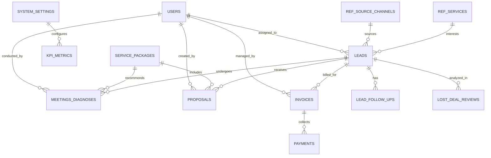

# PRD (Product Requirement Document) & Rancangan Database System
## ASABISA CRM, Tax & Accounting Operations Management System

---

## 1. DOKUMEN OVERVIEW & EXECUTIVES SUMMARY

* **Nama Produk**: ASABISA CRM & Operations Management System (ACOMS)
* **Versi Dokumen**: V1.0
* **Tanggal**: 25 Juli 2026
* **Penulis / Arsitek**: Lead Product & System Architect
* **Status**: Ready for Development
* **Target Pengguna**: Sales Executive, CS Team, Tax Consultant / Specialist, Finance Admin, Marketing Manager, CEO / Management.

### Executive Summary
ASABISA Tax & Accounting Services adalah penyedia layanan konsultasi dan jasa profesional di bidang perpajakan, akuntansi, dan legalitas bisnis. Sebelumnya, alur operasional sales, diagnosis kebutuhan klien, pengiriman proposal, hingga penagihan invoice dikelola menggunakan lembar kerja terpisah (Excel/Spreadsheet).

Dokumen ini mendefinisikan **Product Requirement Document (PRD)** dan **Rancangan Database (Database Schema & ERD)** untuk membangun aplikasi web terintegrasi. Sistem baru ini akan mengotomatiskan tracking SLA (Service Level Agreement), automatisasi estimasi revenue/forecast, pengelolaan penagihan, mitigasi lost deal, serta menyediakan **Executive Sales Dashboard** dengan perhitungan skor KPI secara real-time.

---

## 2. LATAR BELAKANG, TUJUAN & LOGIKA BISNIS

### 2.1. Latar Belakang & Masalah Utama
1. **Risiko SLA Follow-up Terlewati**: Lead yang masuk dari berbagai *Source Channel* (Instagram, Meta Ads, Referral) lambat direspons tanpa adanya alert otomatis.
2. **Proses Diagnosis & Proposal Tidak Terstandar**: Informasi kebutuhan/risiko pajak klien sering tercecer antara tim Sales dan Tim Konsultan.
3. **Keterlambatan Pengiriman Proposal**: Proposal tidak terukur kecepatannya setelah dokumen/data klien lengkap.
4. **Pencatatan Revenue & Invoice Terpisah**: Adanya risiko *double counting* antara nilai invoice dan pembayaran aktual (DP + Pelunasan).
5. **Evaluasi Lost Deal Pasif**: Kurangnya *action improvement* yang terpantau secara disiplin saat penawaran gagal (Closing Lost).

### 2.2. Tujuan Sistem
* **Automasi Tracking SLA**: Mengukur kepatuhan SLA Follow-up (maksimal 24 jam) dan SLA Proposal (maksimal 24 jam setelah data lengkap) secara presisi.
* **Integrasi End-to-End Pipeline**: Menghubungkan alur Lead Intake $\rightarrow$ Meeting Diagnose $\rightarrow$ Proposal $\rightarrow$ Invoice & Payment $\rightarrow$ Review Lost Deal.
* **Akurasi Pengakuan Revenue**: Memisahkan nilai komitmen invoice dengan *Nominal Dibayar* (cash-in aktual).
* **Monitoring KPI Terbobot (Weighted Scorecard)**: Menampilkan performa sales secara otomatis berdasarkan 6 indikator utama dengan bobot terukur.

---

## 3. USER PERSONAS & ROLE-BASED ACCESS CONTROL (RBAC)

| Role | Tanggung Jawab Utama | Akses Fitur Utama |
| :--- | :--- | :--- |
| **Customer Service (CS)** | Handling chat harian, rekap harian lead masuk, dan log aktivitas harian. | Daily Report Tracking, Daily Job Activity. |
| **Sales Executive** | Follow-up lead, penjadwalan meeting, input diagnosis, buat proposal, update pipeline. | CRM Pipeline, Meeting & Diagnose, Proposal Tracker, Lost Deal Review. |
| **Finance / Admin** | Penerbitan invoice, pencatatan DP & Pelunasan, verifikasi pembayaran. | Revenue & Invoice Tracker, Customer Billing Database. |
| **Sales/Marketing Manager** | Assign lead, evaluasi SLA, analisis lost deal, kelola Paket Layanan. | Master Data, Paket Layanan, Lost Deal Review, Sales Analytics. |
| **CEO / Management** | Monitoring KPI perusahaan, keputusan strategis paket & harga, audit operasional. | Dashboard Sales & KPI Scorecard, Master Parameter Settings. |

---

## 4. KEBUTUHAN FUNGSIONAL (FUNCTIONAL REQUIREMENTS)

### F-01: Master Data & Pengaturan Sistem
* **F-01.1 Parameter Global**: Sistem harus memungkinkan admin mengatur Target Revenue Tahunan (default: Rp2.000.000.000), SLA Follow-up Lead (jam), Batas Update Pipeline (hari), dan SLA Proposal (jam).
* **F-01.2 Master Reference**: Pengelolaan data acuan seperti *Source Channel* (Instagram, Meta Ads, Google Ads, DLL), *Layanan* (Laporan Keuangan, Akuntansi Bulanan, Pajak Bulanan, SPT Tahunan, DLL), *Grade Lead* (A, B, C, Not Qualified), *Status Pipeline*, dan *Lost Reasons*.
* **F-01.3 Master Paket Layanan Siap Jual**: Modul kelola paket tiered (misal: Starter, Professional, Enterprise) dengan atribut harga, benefit, deliverables, ketentuan layanan, link proposal, dan status siap jual (Siap Jual, Draft, Review, Nonaktif).

### F-02: CRM & Sales Pipeline Management
* **F-02.1 Lead Intake**: Form pendaftaran lead baru yang mencetak `Lead ID` unik (format: `LD-YYYYMMXXXX`).
* **F-02.2 Auto Deadline & SLA Follow-up**: Saat lead di-assign ke PIC Sales, sistem secara otomatis menghitung `Deadline Follow-up` = `Tanggal Assign` + `SLA Follow-up (Jam)`.
* **F-02.3 SLA Tracking**: Ketika `Tanggal Follow-up Pertama` diisi, sistem otomatis membandingkan dengan Deadline Follow-up. Jika $\le$ Deadline $\rightarrow$ `TEPAT WAKTU`, jika $>$ Deadline atau belum diisi setelah lewat deadline $\rightarrow$ `TERLAMBAT`.
* **F-02.4 Pipeline Stages & Revenue Forecast**: Tahapan pipeline: `New Lead` $\rightarrow$ `Contacted` $\rightarrow$ `Qualified` $\rightarrow$ `Meeting Scheduled` $\rightarrow$ `Diagnosed` $\rightarrow$ `Proposal Sent` $\rightarrow$ `Negotiation` $\rightarrow$ `Closing Won` / `Closing Lost`.
* **F-02.5 Automatic Calculations**:
  * $\text{Forecast Revenue} = \text{Nilai Potensi} \times \text{Probabilitas Closing (\%)}$.
  * $\text{Status Update Pipeline} = \text{UPDATE}$ jika $(\text{Today} - \text{Last Update Date}) \le \text{Batas Hari}$, else $\text{LEWAT UPDATE}$.

### F-03: Meeting & Tax Diagnose
* **F-03.1 Diagnosis Record**: Input hasil meeting/tax diagnose mencakup kondisi saat ini, masalah utama, risiko pajak/akuntansi, tujuan klien, budget range, decision maker, urgency, dan objection utama.
* **F-03.2 Service Recommendation**: Memilih paket layanan rekomendasi dari Master Paket Layanan.
* **F-03.3 Sync to CRM**: Status meeting (`Completed`, `Rescheduled`, `Cancelled`, `No Show`) otomatis memperbarui tahapan pada CRM Pipeline.

### F-04: Proposal Tracker
* **F-04.1 Proposal SLA Calculation**: Saat `Tanggal Data Lengkap` diinput, sistem menghitung `Deadline Proposal` = `Tanggal Data Lengkap` + 24 Jam.
* **F-04.2 SLA Status Proposal**: Mengomparasi `Tanggal Dikirim` dengan `Deadline Proposal` (Status: `TEPAT WAKTU` / `TERLAMBAT`).
* **F-04.3 Proposal Revision Control**: Tracing jumlah revisi proposal, link dokumen (Google Drive / Cloud PDF), dan status penawaran (`Draft`, `Sent`, `Negotiation`, `Accepted`, `Rejected`, `Expired`).

### F-05: Revenue, Invoice & Payment Tracker
* **F-05.1 Invoice Generation**: Penerbitan invoice berbasis Lead ID yang telah `Closing Won`.
* **F-05.2 Multi-Stage Payment**: Pencatatan DP (Down Payment) beserta tanggal bayar, dan Pelunasan beserta tanggal pelunasan.
* **F-05.3 Financial Formula**:
  * $\text{Nominal Dibayar} = \text{DP} + \text{Pelunasan}$.
  * $\text{Outstanding} = \text{Nominal Invoice} - \text{Nominal Dibayar}$.
  * Status Invoice: `Draft` $\rightarrow$ `Sent` $\rightarrow$ `Partial Paid` $\rightarrow$ `Paid` / `Overdue` / `Cancelled`.
* **F-05.4 Actual Revenue Recognition**: Revenue aktual pada dashboard mengambil sum nilai `Nominal Dibayar` untuk mencegah *double counting* piutang/invoice yang belum lunas.

### F-06: Lost Deal Review & Continuous Improvement
* **F-06.1 Auto Trigger Lost Deal**: Klien dengan status `Closing Lost` otomatis masuk ke antrean Lost Deal Review.
* **F-06.2 Failure Analysis**: Menangkap Alasan Utama, Detail Alasan, Kompetitor yang dipilih klien, dan Objection Utama.
* **F-06.3 Action Plan Improvement**: Pencatatan pembelajaran, action plan perbaikan, penunjukan PIC Action, deadline action, dan tracking status perbaikan (`Draft`, `Review`, `In Progress`, `Completed`).

### F-07: CS Operational Tracking & Daily Job Log
* **F-07.1 CS Daily Traffic Tracker**: Rekap harian jumlah chat, klasifikasi lead (`Cold`, `Warm`, `Hot`), jumlah respon, new customer vs repeat customer per channel.
* **F-07.2 CS Activity Log**: Log aktivitas harian CS mencakup total chatting, follow-up, arrival, broadcast, komen status, laporan, dan waktu belajar/pelatihan.

### F-08: Executive Dashboard & KPI Scorecard
Sistem secara real-time menghitung **Skor KPI Normalisasi** berdasarkan formula berikut:

$$\text{Skor KPI} = \sum (\text{Bobot}_i \times \text{Capaian}_i)$$

| Indikator KPI | Bobot | Target | Formula Capaian | Status Rules |
| :--- | :---: | :---: | :--- | :--- |
| **Nilai Revenue** | 28% | Rp2.000.000.000 | $\min(\text{Revenue Aktual} / \text{Target Revenue}, 1.0)$ | $\ge 100\%: \text{TERCAPAI}$<br>$\ge 80\%: \text{PERLU PERHATIAN}$<br>$<80\%: \text{KRITIS}$ |
| **SLA Follow-up** | 18% | $\ge 95\%$ | $\min(\text{Total Tepat Waktu} / \text{Total Follow-up}, 1.0)$ | |
| **Conversion Meeting** | 21% | 100% | $\min(\text{Closing Won with Meeting} / \text{Total Lead Meeting}, 1.0)$ | |
| **Paket Siap Jual** | 10% | $\ge 3$ Paket | $\min(\text{Total Paket Siap Jual} / \text{Target Paket}, 1.0)$ | |
| **Update Pipeline** | 8% | $\ge 95\%$ | $\min(\text{Total Updated Pipeline} / \text{Total Active Pipeline}, 1.0)$ | |
| **SLA Proposal** | 10% | $\ge 95\%$ | $\min(\text{Total Proposal Tepat Waktu} / \text{Total Proposal}, 1.0)$ | |

---

## 5. KEBUTUHAN NON-FUNGSIONAL (NON-FUNCTIONAL REQUIREMENTS)

1. **Security & Data Privacy**:
   * Encrypted Password (bcrypt/Argon2).
   * Encrypted data communication (HTTPS / TLS 1.3).
   * Data audit trail (mencatat user ID, timestamp, dan ip address pada tiap perubahan data sensitive).
2. **Performance & Scalability**:
   * Dashboard load time $< 1.5$ detik.
   * Query database ter-index dengan baik untuk menangani $100.000+$ transaksi per tahun.
3. **Availability & Reliability**:
   * System Availability SLA 99.9%.
   * Automated Daily Database Backup ke Cloud Storage S3.
4. **Integration**:
   * Webhook WhatsApp API integration untuk notifikasi otomatis SLA alarm ke Sales/Manager.
   * Integration dengan Google Drive API untuk otomatisasi folder proposal & kontrak.

---

## 6. ARSITEKTUR WORKFLOW BISNIS (END-TO-END PROCESS)

```
[Lead Intake / CS Traffic]
       │
       ▼
[Assign to Sales] ──(Start SLA 24h Timer)──► [Follow-up Pertama]
                                                   │
                                                   ▼
                                         [Meeting & Tax Diagnose]
                                                   │
                                                   ▼
                                        [Data Kebutuhan Lengkap]
                                                   │
                                     (Start SLA Proposal 24h Timer)
                                                   │
                                                   ▼
                                           [Send Proposal]
                                                   │
                                   ┌───────────────┴───────────────┐
                                   ▼                               ▼
                             [Closing Won]                   [Closing Lost]
                                   │                               │
                                   ▼                               ▼
                           [Create Invoice]              [Lost Deal Review]
                                   │                               │
                            ┌──────┴──────┐                        ▼
                            ▼             ▼              [Improvement Action]
                          [DP]      [Pelunasan]
                            │             │
                            └──────┬──────┘
                                   ▼
                       [Revenue Recognized]
```

---

## 7. RANCANGAN DATABASE (DATABASE SCHEMA & DESIGN)

### 7.1. Entity-Relationship Diagram (ERD Konseptual)



---

### 7.2. Struktur Detail Tabel Database (Relational Schema)

#### 1. Tabel `users` (Manajemen Pengguna & RBAC)
| Column Name | Data Type | Constraints | Keterangan |
| :--- | :--- | :--- | :--- |
| `id` | BIGINT | PRIMARY KEY, AUTO_INCREMENT | ID Pengguna |
| `name` | VARCHAR(100) | NOT NULL | Nama Lengkap |
| `email` | VARCHAR(100) | UNIQUE, NOT NULL | Email Login |
| `password_hash` | VARCHAR(255) | NOT NULL | Password Terenkripsi |
| `phone_number` | VARCHAR(20) | NULL | No WhatsApp / HP |
| `role` | ENUM | NOT NULL | `'admin'`, `'sales'`, `'finance'`, `'manager'`, `'ceo'`, `'cs'` |
| `is_active` | BOOLEAN | DEFAULT TRUE | Status Aktif |
| `created_at` | TIMESTAMP | DEFAULT CURRENT_TIMESTAMP | Waktu Dibuat |
| `updated_at` | TIMESTAMP | DEFAULT CURRENT_TIMESTAMP | Waktu Diperbarui |

#### 2. Tabel `system_settings` (Parameter Global & Target KPI)
| Column Name | Data Type | Constraints | Keterangan |
| :--- | :--- | :--- | :--- |
| `id` | INT | PRIMARY KEY, AUTO_INCREMENT | ID Setting |
| `annual_revenue_target` | DECIMAL(15,2) | DEFAULT 2000000000.00 | Target Revenue Tahunan |
| `sla_followup_hours` | INT | DEFAULT 24 | SLA Follow-up Lead (Jam) |
| `pipeline_update_limit_days` | INT | DEFAULT 7 | Batas Maksimal Update Pipeline (Hari) |
| `sla_proposal_hours` | INT | DEFAULT 24 | SLA Proposal Setelah Data Lengkap (Jam) |
| `target_ready_packages` | INT | DEFAULT 3 | Target Jumlah Paket Siap Jual |
| `target_followup_compliance` | DECIMAL(5,2) | DEFAULT 0.95 | Target SLA Follow-up (95%) |
| `target_meeting_conversion` | DECIMAL(5,2) | DEFAULT 1.00 | Target Conversion Meeting (100%) |
| `target_pipeline_updated` | DECIMAL(5,2) | DEFAULT 0.95 | Target Pipeline Ter-update (95%) |
| `target_proposal_punctual` | DECIMAL(5,2) | DEFAULT 0.95 | Target Proposal Tepat Waktu (95%) |
| `updated_at` | TIMESTAMP | DEFAULT CURRENT_TIMESTAMP | Last Config Change |

#### 3. Tabel `ref_source_channels` (Master Channel Origin)
| Column Name | Data Type | Constraints | Keterangan |
| :--- | :--- | :--- | :--- |
| `id` | INT | PRIMARY KEY, AUTO_INCREMENT | ID Source |
| `channel_name` | VARCHAR(50) | NOT NULL, UNIQUE | Nama Source (Organic IG, Meta Ads, DLL) |
| `is_active` | BOOLEAN | DEFAULT TRUE | Status Aktif |

#### 4. Tabel `ref_services` (Master Jenis Layanan)
| Column Name | Data Type | Constraints | Keterangan |
| :--- | :--- | :--- | :--- |
| `id` | INT | PRIMARY KEY, AUTO_INCREMENT | ID Layanan |
| `service_name` | VARCHAR(100) | NOT NULL, UNIQUE | Nama Layanan (Laporan Keuangan, Tax, dll) |
| `description` | TEXT | NULL | Deskripsi Layanan |
| `is_active` | BOOLEAN | DEFAULT TRUE | Status Aktif |

#### 5. Tabel `service_packages` (Master Paket Layanan Siap Jual)
| Column Name | Data Type | Constraints | Keterangan |
| :--- | :--- | :--- | :--- |
| `id` | VARCHAR(20) | PRIMARY KEY | Kode Paket (misal: `PKT-001`) |
| `package_name` | VARCHAR(100) | NOT NULL | Nama Paket Layanan |
| `segment` | VARCHAR(50) | NULL | Segmen Pasar Target |
| `price` | DECIMAL(15,2) | NOT NULL | Harga Paket |
| `target_client` | TEXT | NULL | Profil Target Klien |
| `benefits` | TEXT | NULL | Benefit Paket |
| `deliverables` | TEXT | NULL | Output Deliverables |
| `terms` | TEXT | NULL | Ketentuan Layanan |
| `proposal_link` | VARCHAR(255) | NULL | Link Template Proposal |
| `status` | ENUM | NOT NULL | `'Draft'`, `'Review'`, `'Siap Jual'`, `'Nonaktif'` |
| `ready_date` | DATE | NULL | Tanggal Paket Siap Jual |
| `pic_user_id` | BIGINT | FOREIGN KEY -> `users(id)` | PIC Pembuat / Penanggung Jawab |
| `notes` | TEXT | NULL | Catatan Tambahan |
| `created_at` | TIMESTAMP | DEFAULT CURRENT_TIMESTAMP | Timestamp Dibuat |

#### 6. Tabel `leads` (CRM & Sales Pipeline utama)
| Column Name | Data Type | Constraints | Keterangan |
| :--- | :--- | :--- | :--- |
| `lead_id` | VARCHAR(30) | PRIMARY KEY | Unique ID (misal: `LD-2026110001`) |
| `lead_entry_date` | DATETIME | NOT NULL | Tanggal & Jam Lead Masuk |
| `client_name` | VARCHAR(100) | NOT NULL | Nama Contact Person / Klien |
| `company_name` | VARCHAR(100) | NULL | Nama Perusahaan Klien |
| `whatsapp_number` | VARCHAR(20) | NOT NULL | Nomor WA Klien |
| `email` | VARCHAR(100) | NULL | Email Klien |
| `source_channel_id` | INT | FOREIGN KEY -> `ref_source_channels(id)` | ID Source Channel |
| `campaign_referral` | VARCHAR(100) | NULL | Detail Kampanye / Referral |
| `service_interested_id`| INT | FOREIGN KEY -> `ref_services(id)` | Layanan Utama Diminati |
| `grade` | ENUM | DEFAULT 'B' | `'A'`, `'B'`, `'C'`, `'Not Qualified'` |
| `pic_sales_id` | BIGINT | FOREIGN KEY -> `users(id)` | PIC Sales yang Ditunjuk |
| `assign_date` | DATETIME | NULL | Waktu Assign ke Sales |
| `followup_deadline` | DATETIME | NULL | Auto-calculated (`assign_date` + SLA) |
| `first_followup_date` | DATETIME | NULL | Tanggal Realisasi Follow-up Pertama |
| `sla_followup_status` | ENUM | NULL | `'TEPAT WAKTU'`, `'TERLAMBAT'`, `'PENDING'` |
| `pipeline_status` | ENUM | NOT NULL | `'New Lead'`, `'Contacted'`, `'Qualified'`, `'Meeting Scheduled'`, `'Diagnosed'`, `'Proposal Sent'`, `'Negotiation'`, `'Closing Won'`, `'Closing Lost'` |
| `potential_value` | DECIMAL(15,2) | DEFAULT 0.00 | Nilai Potensi Penawaran |
| `closing_probability` | DECIMAL(5,2) | DEFAULT 0.00 | Probabilitas Closing (0.00 - 1.00) |
| `forecast_revenue` | DECIMAL(15,2) | GENERATED ALWAYS | Auto: `potential_value` * `closing_probability` |
| `meeting_date` | DATETIME | NULL | Tanggal Meeting Scheduled / Realisasi |
| `meeting_result` | TEXT | NULL | Rangkuman Hasil Meeting |
| `next_action` | VARCHAR(255) | NULL | Tindakan Selanjutnya |
| `next_action_deadline`| DATE | NULL | Deadline Next Action |
| `last_update_pipeline`| DATETIME | NULL | Tanggal Terakhir Pipeline Diperbarui |
| `pipeline_update_status`| ENUM | NULL | `'UPDATE'`, `'LEWAT UPDATE'`, `'BELUM UPDATE'` |
| `closing_lost_date` | DATE | NULL | Tanggal Tanggal Deal Won / Lost |
| `final_status` | ENUM | DEFAULT 'Open' | `'Open'`, `'Closing Won'`, `'Closing Lost'`, `'Nurturing'` |
| `revenue_type` | ENUM | NULL | `'New Client'`, `'Upselling'`, `'Cross-selling'`, `'Renewal'` |
| `lost_reason` | VARCHAR(100) | NULL | Alasan Singkat Deal Lost |
| `notes` | TEXT | NULL | Catatan Sales |
| `created_at` | TIMESTAMP | DEFAULT CURRENT_TIMESTAMP | Timestamp Dibuat |
| `updated_at` | TIMESTAMP | DEFAULT CURRENT_TIMESTAMP | Timestamp Diperbarui |

#### 7. Tabel `meetings_diagnoses` (Detail Meeting & Tax Diagnosis)
| Column Name | Data Type | Constraints | Keterangan |
| :--- | :--- | :--- | :--- |
| `meeting_id` | VARCHAR(30) | PRIMARY KEY | Unique ID (misal: `MTG-2026110001`) |
| `lead_id` | VARCHAR(30) | FOREIGN KEY -> `leads(lead_id)` | Foreign Key Lead |
| `meeting_datetime` | DATETIME | NOT NULL | Tanggal & Jam Pelaksanaan Meeting |
| `pic_sales_id` | BIGINT | FOREIGN KEY -> `users(id)` | Konsultan / PIC Sales |
| `meeting_type` | ENUM | NOT NULL | `'Tax Diagnose'`, `'Konsultasi'`, `'Discovery Meeting'`, `'Follow-up Meeting'`, `'Negotiation'` |
| `current_condition` | TEXT | NULL | Kondisi Pembukuan / Pajak Klien Saat Ini |
| `main_problem` | TEXT | NULL | Masalah Utama yang Dihadapi Klien |
| `tax_accounting_risk`| TEXT | NULL | Analisis Risiko Pajak & Akuntansi |
| `client_goal` | TEXT | NULL | Target / Tujuan Klien |
| `recommended_service` | VARCHAR(200) | NULL | Rekomendasi Solusi Layanan |
| `package_id` | VARCHAR(20) | FOREIGN KEY -> `service_packages(id)` | Paket Rekomendasi |
| `budget_range` | VARCHAR(100) | NULL | Kisaran Anggaran Klien |
| `decision_maker` | VARCHAR(100) | NULL | Nama / Jabatan Penentu Keputusan |
| `urgency` | ENUM | DEFAULT 'Sedang' | `'Rendah'`, `'Sedang'`, `'Tinggi'`, `'Sangat Mendesak'` |
| `main_objection` | TEXT | NULL | Keberatan Utama Klien |
| `meeting_commitment` | TEXT | NULL | Komitmen / Kesepakatan Hasil Meeting |
| `next_followup_date` | DATETIME | NULL | Jadwal Follow-up Lanjutan |
| `meeting_status` | ENUM | NOT NULL | `'Scheduled'`, `'Completed'`, `'Rescheduled'`, `'Cancelled'`, `'No Show'` |
| `notes` | TEXT | NULL | Catatan Tambahan |

#### 8. Tabel `proposals` (Proposal Tracker & SLA Kontrol)
| Column Name | Data Type | Constraints | Keterangan |
| :--- | :--- | :--- | :--- |
| `proposal_id` | VARCHAR(30) | PRIMARY KEY | Unique ID (misal: `PRP-2026110001`) |
| `lead_id` | VARCHAR(30) | FOREIGN KEY -> `leads(lead_id)` | Relasi Lead |
| `pic_sales_id` | BIGINT | FOREIGN KEY -> `users(id)` | Penanggung Jawab Proposal |
| `service_id` | INT | FOREIGN KEY -> `ref_services(id)` | Layanan Ditawarkan |
| `package_id` | VARCHAR(20) | FOREIGN KEY -> `service_packages(id)` | Paket Ditawarkan |
| `data_completed_date`| DATETIME | NULL | Tanggal & Jam Data Kebutuhan Lengkap |
| `proposal_deadline` | DATETIME | NULL | Auto: `data_completed_date` + SLA Proposal |
| `sent_date` | DATETIME | NULL | Tanggal Realisasi Proposal Dikirim |
| `sla_proposal_status`| ENUM | NULL | `'TEPAT WAKTU'`, `'TERLAMBAT'`, `'PENDING'` |
| `offered_price` | DECIMAL(15,2) | NOT NULL | Nilai Penawaran (Rp) |
| `valid_until` | DATE | NULL | Tanggal Masa Berlaku Proposal |
| `proposal_status` | ENUM | NOT NULL | `'Draft'`, `'Sent'`, `'Revision'`, `'Negotiation'`, `'Accepted'`, `'Rejected'`, `'Expired'` |
| `revision_count` | INT | DEFAULT 0 | Jumlah Revisi |
| `delivery_channel` | VARCHAR(50) | NULL | Channel Pengiriman (Email, WA, PDF direct) |
| `proposal_file_link` | VARCHAR(255) | NULL | URL File Proposal (Google Drive / Cloud) |
| `notes` | TEXT | NULL | Catatan Penting |

#### 9. Tabel `invoices` (Revenue & Invoice Tracker)
| Column Name | Data Type | Constraints | Keterangan |
| :--- | :--- | :--- | :--- |
| `invoice_id` | VARCHAR(30) | PRIMARY KEY | Unique ID (misal: `REV-2026110001`) |
| `lead_id` | VARCHAR(30) | FOREIGN KEY -> `leads(lead_id)` | Relasi Lead |
| `invoice_number` | VARCHAR(50) | UNIQUE, NOT NULL | Nomor Resmi Invoice |
| `invoice_date` | DATE | NOT NULL | Tanggal Penerbitan Invoice |
| `pic_sales_id` | BIGINT | FOREIGN KEY -> `users(id)` | Sales Owner |
| `service_id` | INT | FOREIGN KEY -> `ref_services(id)` | Layanan |
| `revenue_type` | ENUM | NOT NULL | `'New Client'`, `'Upselling'`, `'Cross-selling'`, `'Renewal'` |
| `invoice_amount` | DECIMAL(15,2) | NOT NULL | Nominal Total Invoice |
| `dp_amount` | DECIMAL(15,2) | DEFAULT 0.00 | Nominal Down Payment (DP) |
| `dp_date` | DATE | NULL | Tanggal Pembayaran DP |
| `settlement_amount` | DECIMAL(15,2) | DEFAULT 0.00 | Nominal Pelunasan |
| `settlement_date` | DATE | NULL | Tanggal Pelunasan |
| `total_paid` | DECIMAL(15,2) | GENERATED ALWAYS | Auto: `dp_amount` + `settlement_amount` |
| `outstanding_amount` | DECIMAL(15,2) | GENERATED ALWAYS | Auto: `invoice_amount` - `total_paid` |
| `invoice_status` | ENUM | NOT NULL | `'Draft'`, `'Sent'`, `'Partial Paid'`, `'Paid'`, `'Overdue'`, `'Cancelled'` |
| `period_month` | INT | NOT NULL | Bulan Transaksi (1 - 12) |
| `period_year` | INT | NOT NULL | Tahun Transaksi (misal: 2026) |
| `notes` | TEXT | NULL | Catatan Finance |

#### 10. Tabel `lost_deal_reviews` (Evaluasi Deal Gagal & Actions)
| Column Name | Data Type | Constraints | Keterangan |
| :--- | :--- | :--- | :--- |
| `review_id` | VARCHAR(30) | PRIMARY KEY | Unique ID (misal: `LST-2026110001`) |
| `lead_id` | VARCHAR(30) | FOREIGN KEY -> `leads(lead_id)` | Relasi Lead Gagal |
| `lost_date` | DATE | NOT NULL | Tanggal Dinyatakan Lost |
| `potential_value` | DECIMAL(15,2) | NULL | Nilai Potensi yang Hilang |
| `main_lost_reason` | VARCHAR(100) | NOT NULL | Alasan Utama (Harga, Belum Prioritas, DLL) |
| `reason_detail` | TEXT | NULL | Detail Penjelasan Alasan Lost |
| `competitor_name` | VARCHAR(100) | NULL | Nama Kompetitor yang Dipilih Klien |
| `main_objection` | TEXT | NULL | Keberatan Utama Klien |
| `followup_sla_status`| VARCHAR(20) | NULL | Record SLA Follow-up Lead |
| `proposal_sla_status`| VARCHAR(20) | NULL | Record SLA Proposal Lead |
| `lessons_learned` | TEXT | NULL | Pembelajaran yang Diperoleh |
| `improvement_action` | TEXT | NULL | Tindakan Perbaikan Konkret |
| `action_pic_id` | BIGINT | FOREIGN KEY -> `users(id)` | PIC Penanggung Jawab Action |
| `action_deadline` | DATE | NULL | Deadline Pelaksanaan Action |
| `action_status` | ENUM | DEFAULT 'Draft' | `'Draft'`, `'In Progress'`, `'Completed'` |

#### 11. Tabel `cs_daily_trackings` (Rekapitulasi Traffic CS Harian)
| Column Name | Data Type | Constraints | Keterangan |
| :--- | :--- | :--- | :--- |
| `id` | BIGINT | PRIMARY KEY, AUTO_INCREMENT | Unique ID Log |
| `tracking_date` | DATE | NOT NULL | Tanggal Rekap |
| `cs_user_id` | BIGINT | FOREIGN KEY -> `users(id)` | CS Pengisi |
| `no_respond_count` | INT | DEFAULT 0 | Jumlah Chat Tidak Merespon |
| `cold_leads_count` | INT | DEFAULT 0 | Lead Kategori Cold |
| `warm_leads_count` | INT | DEFAULT 0 | Lead Kategori Warm |
| `hot_leads_count` | INT | DEFAULT 0 | Lead Kategori Hot |
| `total_leads` | INT | GENERATED ALWAYS | Auto: `cold` + `warm` + `hot` |
| `total_chats` | INT | DEFAULT 0 | Total Chat Masuk |
| `responded_count` | INT | DEFAULT 0 | Total Chat Dijawab |
| `new_customers_count`| INT | DEFAULT 0 | Pelanggan Baru |
| `repeat_customers_count`| INT | DEFAULT 0 | Pelanggan Repeat Order |
| `source_channel_id`| INT | FOREIGN KEY -> `ref_source_channels(id)` | Sumber Traffic Dominan |

#### 12. Tabel `cs_daily_activities` (Log Pekerjaan Harian CS)
| Column Name | Data Type | Constraints | Keterangan |
| :--- | :--- | :--- | :--- |
| `id` | BIGINT | PRIMARY KEY, AUTO_INCREMENT | Unique ID Activity Log |
| `activity_date` | DATE | NOT NULL | Tanggal Pekerjaan |
| `cs_user_id` | BIGINT | FOREIGN KEY -> `users(id)` | CS Pengisi |
| `chatting_count` | INT | DEFAULT 0 | Aktivitas Chatting |
| `followup_count` | INT | DEFAULT 0 | Aktivitas Follow-up |
| `arrival_count` | INT | DEFAULT 0 | Kedatangan Klien / Lead |
| `update_status_count`| INT | DEFAULT 0 | Update Status Lead |
| `broadcast_count` | INT | DEFAULT 0 | Jumlah Broadcast WA |
| `comment_status_count`| INT | DEFAULT 0 | Komen / Interaksi Media Sosial |
| `report_count` | INT | DEFAULT 0 | Pembuatan Laporan |
| `learning_hours` | DECIMAL(4,2) | DEFAULT 0.00 | Alokasi Waktu Belajar (Jam) |

---

## 8. INTEGRASI BISNIS RULES & AUTOMATED TRIGGERS

1. **Automatisasi Tracking SLA Follow-up**:
   * Saat `leads.assign_date` terisi $\rightarrow$ `leads.followup_deadline` = `assign_date` + `system_settings.sla_followup_hours`.
   * Saat `leads.first_followup_date` di-submit:
     * Jika `first_followup_date` $\le$ `followup_deadline` $\rightarrow$ `sla_followup_status` = `'TEPAT WAKTU'`.
     * Jika `first_followup_date` $>$ `followup_deadline` $\rightarrow$ `sla_followup_status` = `'TERLAMBAT'`.

2. **Automatisasi Tracking SLA Proposal**:
   * Saat `proposals.data_completed_date` diinput $\rightarrow$ `proposals.proposal_deadline` = `data_completed_date` + `system_settings.sla_proposal_hours`.
   * Saat `proposals.sent_date` di-submit:
     * Jika `sent_date` $\le$ `proposal_deadline` $\rightarrow$ `sla_proposal_status` = `'TEPAT WAKTU'`.
     * Jika `sent_date` $>$ `proposal_deadline` $\rightarrow$ `sla_proposal_status` = `'TERLAMBAT'`.

3. **Integritas Pengakuan Revenue (Anti Double Counting)**:
   * Dashboard Sales mengambil nilai revenue dari `SUM(invoices.total_paid)` di mana `period_year = 2026` dan `period_month = [1..12]`.
   * `invoices.invoice_amount` yang belum dibayar tidak dianggap sebagai Revenue Aktual, melainkan dikategorikan sebagai `OUTSTANDING` piutang.

4. **Pipeline Staleness Trigger**:
   * Cron job harian mengeksekusi pemeriksaan `leads.last_update_pipeline`.
   * Jika $(\text{CURRENT_DATE} - \text{last_update_pipeline}) > \text{system_settings.pipeline_update_limit_days}$ dan status pipeline bukan `'Closing Won'` / `'Closing Lost'`, maka `leads.pipeline_update_status` otomatis diubah menjadi `'LEWAT UPDATE'`.

---

## 9. REKOMENDASI TUMPUSAN TEKNOLOGI (TECH STACK)

* **Frontend**: React.js / Next.js dengan Tailwind CSS & Shadcn UI (Antarmuka responsif & modern).
* **Backend**: Node.js (NestJS) / Python (FastAPI) / Laravel RESTful API.
* **Database**: PostgreSQL / MySQL 8.0 dengan dukungan ACID Compliance & Generated Store Columns.
* **ORM**: Prisma ORM / Sequelize / Eloquent.
* **Background Jobs / Scheduler**: Redis dengan BullMQ (untuk trigger SLA alarm, email/WA reminder, dan status cron job pipeline).
* **Monitoring & Dashboard**: Chart.js / Recharts untuk visualisasi grafik KPI dan pipeline funnel.

---

## 10. KESIMPULAN & ANJURAN LANGKAH SELANJUTNYA

Dokumen PRD dan Rancangan Database ini telah merangkum seluruh domain bisnis, proses kerja, formula perhitungan, serta struktur data dari file `REPORT ASABISA TAX & ACCOUNTING SERVICES.xlsx`. 

Langkah selanjutnya yang disarankan:
1. **Penyusunan API Spec (OpenAPI / Swagger)** berbasis tabel relational di atas.
2. **Pembuatan UI/UX Wireframe & Prototype** berdasarkan modul functional requirement.
3. **Setup Environment Database** & Migrasi struktur schema database.