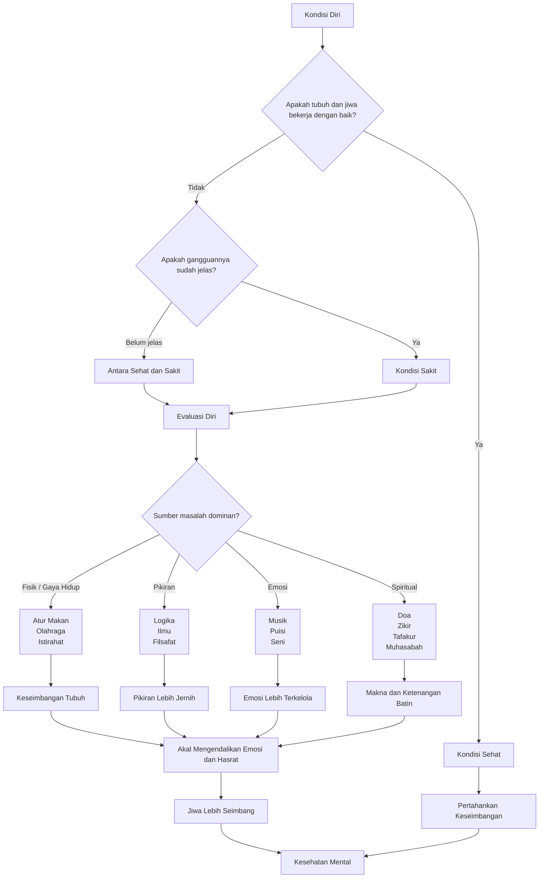
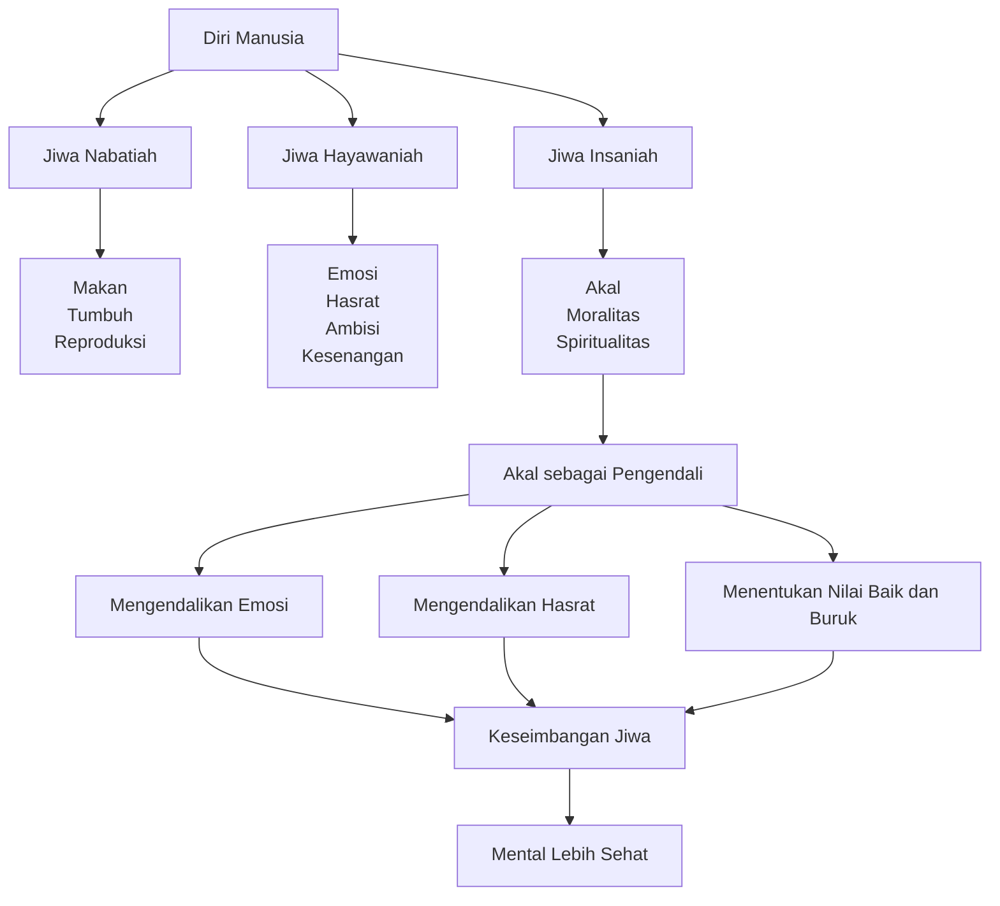
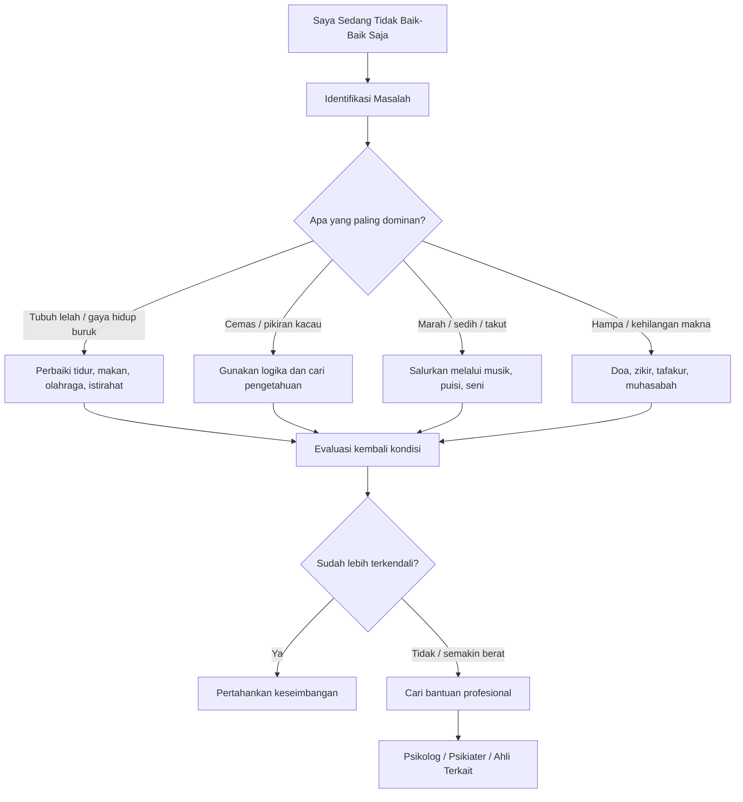

# Kesehatan Mental Menurut Ibnu Sina
## Ringkasan Materi Fahruddin Faiz

> Ringkasan ini disusun berdasarkan file **“Kesehatan Mental Ibnu Sina by Fahrudin Faiz”**.

---

## 1. Gambaran Umum

Dalam materi ini, kesehatan mental menurut Ibnu Sina tidak hanya berarti tidak stres, tidak sedih, atau tidak mengalami gangguan jiwa.

Kesehatan mental dipahami sebagai **keseimbangan antara tubuh, emosi, pikiran/akal, dan spiritualitas**.

Seseorang disebut sehat apabila unsur-unsur tersebut bekerja secara selaras dan tidak ada satu bagian yang terlalu dominan.

---

## 2. Tiga Kondisi Manusia

Ibnu Sina membagi kondisi manusia menjadi tiga:

### 1. Sehat

Tubuh dan jiwa bekerja sesuai keadaan alaminya dan menjalankan fungsi secara normal.

### 2. Sakit

Terdapat gangguan yang sudah terlihat atau dirasakan dan menghambat fungsi normal seseorang.

### 3. Kondisi antara sehat dan sakit

Seseorang belum dapat dikatakan sakit, tetapi juga tidak merasa benar-benar sehat.

Contohnya:

- mudah lelah walaupun sudah istirahat;
- stres tanpa sebab yang jelas;
- cemas terus-menerus;
- pikiran terasa tidak tenang;
- merasa ada sesuatu yang tidak beres dalam diri.

Kondisi ini perlu diperhatikan sebelum berkembang menjadi masalah yang lebih berat.

---

## 3. Ciri Mental yang Sehat

Dalam materi, terdapat empat ciri utama kesehatan mental.

### 3.1 Emosi Stabil

Stabil bukan berarti tidak pernah marah, sedih, takut, kecewa, atau stres.

Yang penting adalah seseorang **masih mampu mengendalikan emosinya**.

Emosi menjadi masalah ketika:

- terlalu berlebihan;
- berlangsung terus-menerus;
- sulit dikendalikan;
- reaksi jauh lebih besar daripada masalah yang sebenarnya.

---

### 3.2 Pikiran Jernih

Akal harus tetap dapat digunakan untuk:

- berpikir rasional;
- memahami keadaan;
- membedakan baik dan buruk;
- mempertimbangkan akibat tindakan;
- mengambil keputusan.

Pikiran yang jernih berfungsi sebagai pengendali emosi dan keinginan.

---

### 3.3 Jasmani dan Rohani Selaras

Menurut pembahasan Ibnu Sina, jiwa dan tubuh saling memengaruhi.

Contohnya:

- stres dapat membuat tubuh terasa tidak nyaman;
- kecemasan dapat memengaruhi kondisi fisik;
- kelelahan fisik dapat membuat pikiran sulit fokus;
- kurang tidur dapat memengaruhi emosi.

Karena itu, kesehatan mental tidak dapat sepenuhnya dipisahkan dari kesehatan tubuh.

---

### 3.4 Spiritualitas dan Moralitas Hidup

Manusia tidak hanya membutuhkan kesehatan fisik dan pikiran, tetapi juga:

- tujuan hidup;
- makna hidup;
- kesadaran moral;
- hubungan dengan Tuhan.

Ketika unsur ini hilang, seseorang dapat merasa:

- kosong;
- hampa;
- kehilangan arah;
- tidak memahami tujuan hidupnya.

---

# 4. Tiga Daya Jiwa

Ibnu Sina menjelaskan bahwa dalam diri manusia terdapat tiga daya utama.

## 4.1 Jiwa Nabatiah / Vegetatif

Berhubungan dengan kebutuhan dasar kehidupan.

Contoh:

- makan;
- tumbuh;
- mempertahankan kehidupan;
- reproduksi.

---

## 4.2 Jiwa Hayawaniah / Sensitif

Berhubungan dengan:

- emosi;
- keinginan;
- hasrat;
- ambisi;
- kesenangan;
- persepsi inderawi.

Bagian ini penting, tetapi tidak boleh menguasai seluruh kehidupan manusia.

---

## 4.3 Jiwa Insaniah / Rasional

Berhubungan dengan:

- berpikir;
- memahami;
- menilai;
- moralitas;
- spiritualitas.

Menurut materi, bagian inilah yang seharusnya menjadi **pengendali utama**.

---

## 5. Peran Akal

Akal memiliki tiga fungsi utama.

### Mengendalikan emosi

Misalnya ketika sedang marah, seseorang perlu menilai:

> Apakah masalah ini memang sebesar reaksiku?

### Mengendalikan hasrat

Tidak semua keinginan harus langsung diikuti.

Akal mempertimbangkan:

- manfaat;
- risiko;
- akibat jangka panjang.

### Memahami nilai

Akal membantu menentukan:

- baik atau buruk;
- benar atau salah;
- layak atau tidak layak.

---

# 6. Hubungan Jiwa dan Tubuh

Ibnu Sina memandang tubuh dan jiwa sebagai dua bagian yang saling berhubungan.

Jiwa menggunakan tubuh untuk menjalankan berbagai fungsi, sedangkan kondisi tubuh juga dapat memengaruhi jiwa.

Secara sederhana:

```text
Pikiran / Jiwa
      ↓
Mempengaruhi tubuh

Tubuh
      ↓
Mempengaruhi pikiran / jiwa
```

Karena itu:

- tubuh yang kelelahan dapat membuat emosi lebih sulit dikendalikan;
- pikiran yang penuh kecemasan dapat membuat tubuh ikut terasa tidak sehat.

---

# 7. Pentingnya Pikiran

Dalam materi dijelaskan bahwa pikiran mempunyai pengaruh besar terhadap kondisi manusia.

Pikiran yang terus-menerus negatif dapat:

- memperbesar rasa takut;
- membuat seseorang semakin cemas;
- membuat masalah kecil terasa sangat besar.

Karena itu, seseorang perlu membedakan antara:

**bahaya yang nyata**

dan

**bahaya yang hanya dibayangkan oleh pikiran.**

---

# 8. Konsep Mizaj dan Empat Temperamen

Materi juga membahas teori klasik tentang **mizaj**, yaitu keseimbangan empat unsur/cairan tubuh yang diasosiasikan dengan temperamen seseorang.

> Catatan: bagian ini merupakan teori medis historis yang dibahas dalam materi Ibnu Sina, bukan sistem diagnosis psikologi modern.

---

## 8.1 Melankolis

Karakter positif:

- analitis;
- teliti;
- terorganisir;
- serius;
- penuh perencanaan.

Jika berlebihan:

- terlalu sensitif;
- pesimis;
- mudah overthinking;
- terlalu lama mengambil keputusan.

---

## 8.2 Sanguinis

Karakter positif:

- ceria;
- komunikatif;
- optimis;
- spontan.

Jika berlebihan:

- impulsif;
- kurang konsisten;
- sulit menjaga komitmen.

---

## 8.3 Koleris

Karakter positif:

- tegas;
- fokus;
- pekerja keras;
- mampu memimpin;
- cepat mengambil keputusan.

Jika berlebihan:

- ingin mendominasi;
- arogan;
- kurang empati;
- agresif.

---

## 8.4 Flegmatis

Karakter positif:

- tenang;
- fleksibel;
- adaptif;
- pendengar yang baik;
- mudah menjaga keharmonisan.

Jika berlebihan:

- terlalu santai;
- kurang ambisi;
- pasif;
- lamban bertindak.

---

# 9. Jenis Masalah dan Pendekatan Terapinya

Materi membagi masalah manusia berdasarkan sumbernya.

| Masalah | Pendekatan yang Dibahas |
|---|---|
| Fisik dan gaya hidup | pola makan, olahraga, istirahat |
| Pikiran / mental | logika, ilmu, filsafat |
| Emosi | musik, puisi, seni |
| Spiritual | doa, zikir, tafakur, muhasabah |

---

# 10. Terapi Mental: Logika, Ilmu, dan Filsafat

## 10.1 Logika

Logika membantu manusia berpikir lebih jernih.

Contoh ketika cemas:

> “Apakah hal yang saya takutkan benar-benar sudah terjadi?”

Sering kali kecemasan muncul karena seseorang memperlakukan kemungkinan sebagai kepastian.

---

## 10.2 Ilmu

Pengetahuan membantu manusia memahami sesuatu yang sebelumnya tidak diketahui.

Ketidaktahuan dapat memunculkan:

- takut;
- panik;
- bingung;
- kecemasan.

Ketika memperoleh pengetahuan yang cukup, keadaan menjadi lebih mudah dipahami dan dikendalikan.

---

## 10.3 Filsafat

Filsafat membantu manusia memahami:

- tujuan hidup;
- nilai hidup;
- cita-cita;
- makna keberadaan.

Seseorang yang memiliki tujuan besar tidak mudah hancur hanya karena mengalami kegagalan kecil.

---

# 11. Terapi Emosional: Musik, Puisi, dan Seni

Ketika seseorang terlalu sedih, marah, takut, atau lelah secara emosional, pikiran rasional terkadang sulit langsung bekerja.

Dalam keadaan tersebut, seni dapat menjadi media untuk mengekspresikan emosi.

Contohnya:

- mendengarkan atau memainkan musik;
- bernyanyi;
- menulis puisi;
- membuat karya seni.

Tujuannya adalah **katarsis**, yaitu mengeluarkan atau menyalurkan emosi yang tertahan.

---

# 12. Terapi Spiritual

Masalah spiritual muncul ketika seseorang mengalami kehilangan makna hidup.

Gejalanya dapat berupa:

- merasa kosong;
- merasa hidup tidak berarti;
- kehilangan arah;
- merasa jauh dari Tuhan;
- mempertanyakan tujuan keberadaannya.

Pendekatan yang dibahas meliputi:

### Doa

Membantu menyadari bahwa manusia memiliki keterbatasan dan membutuhkan Tuhan.

### Zikir

Menjaga pikiran dan hati tetap mengingat Tuhan.

### Tafakur, Muhasabah, dan Meditasi

Membantu seseorang berhenti sejenak, menenangkan pikiran, dan melihat kembali arah kehidupannya.

---

# 13. Membantu Orang Lain

Salah satu bagian menarik dalam materi adalah gagasan bahwa **berkontribusi kepada orang lain dapat membantu mengurangi beban batin**.

Ketika seseorang membantu orang lain, dapat muncul kesadaran:

> “Ternyata hidup saya masih berguna.”

Hal tersebut dapat menguatkan:

- rasa bermakna;
- harga diri;
- rasa syukur;
- hubungan sosial.

---

# 14. Menjaga Tubuh

Kesehatan mental juga berkaitan dengan gaya hidup.

Hal-hal yang ditekankan antara lain:

- menjaga pola makan;
- tidak makan berlebihan;
- olahraga;
- cukup tidur;
- cukup istirahat;
- mengelola stres.

Tubuh yang tidak terawat dapat membuat pikiran dan emosi lebih sulit dikendalikan.

---

# 15. Kapan Perlu Mencari Bantuan Profesional?

Materi juga menekankan bahwa ketika masalah mental sudah berat, seseorang tidak perlu malu mencari bantuan.

Sebagaimana sakit fisik ditangani dokter, masalah kesehatan mental juga dapat dibantu oleh:

- psikolog;
- psikiater;
- tenaga profesional terkait.

Mencari bantuan bukanlah aib.

---

# 16. Inti Konsep Kesehatan Mental Ibnu Sina

Secara sederhana:

> **Kesehatan mental adalah keseimbangan.**

Bukan menghilangkan seluruh emosi, keinginan, atau kesedihan.

Yang dibutuhkan adalah kemampuan untuk menjaga agar:

- tubuh tetap sehat;
- emosi tetap terkendali;
- akal tetap jernih;
- keinginan tidak berlebihan;
- hidup memiliki tujuan;
- spiritualitas tetap hidup.

---

# 17. Flowchart Utama



---

# 18. Flowchart Tiga Daya Jiwa



---

# 19. Flowchart Praktis Ketika Menghadapi Masalah



---

# 20. Ringkasan Super Singkat

Urutan praktis dari keseluruhan materi dapat diringkas menjadi:

```text
Jaga tubuh
    ↓
Jernihkan pikiran
    ↓
Kendalikan emosi
    ↓
Kendalikan keinginan
    ↓
Pahami diri
    ↓
Cari ilmu
    ↓
Temukan tujuan dan makna
    ↓
Hidupkan spiritualitas
    ↓
Beri manfaat kepada orang lain
    ↓
Jaga keseimbangan hidup
```

---

## Kesimpulan

Pesan utama materi ini adalah bahwa manusia yang sehat bukan manusia yang tidak pernah mengalami masalah.

Manusia yang sehat adalah manusia yang mampu **menjaga keseimbangan**.

Sedih, marah, takut, stres, keinginan, dan ambisi merupakan bagian dari kehidupan manusia.

Namun semuanya perlu diarahkan oleh **akal yang jernih**, ditopang oleh **tubuh yang sehat**, dan dilengkapi dengan **tujuan serta spiritualitas**.

Dengan demikian, kesehatan mental dapat dipahami sebagai:

> **keselarasan antara tubuh, emosi, akal, perilaku, dan kehidupan spiritual.**
