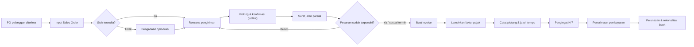
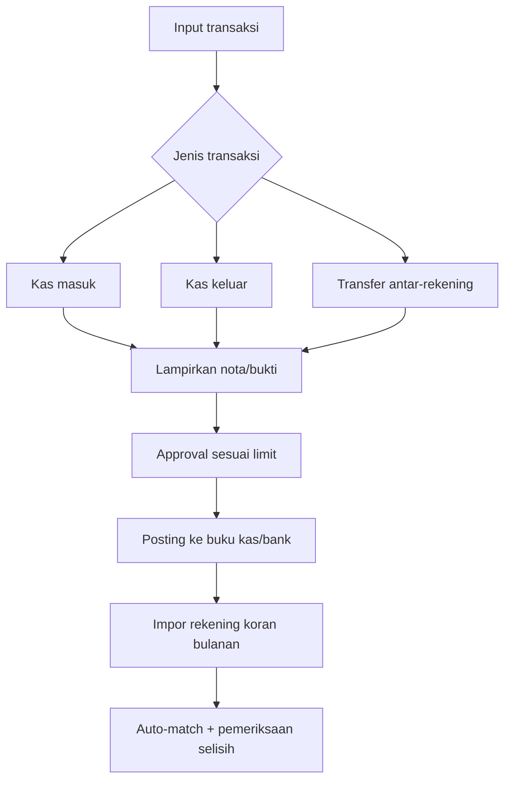
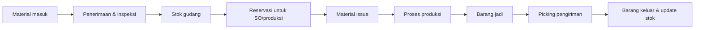
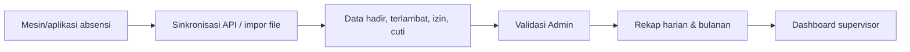
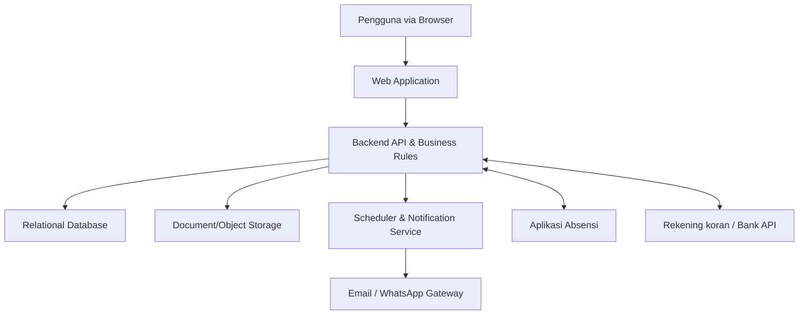

# Rancangan Sistem Admin Operasional & Finance

**Dokumen awal untuk diskusi kebutuhan, desain solusi, dan timeline implementasi**  
Versi: 1.0 — 8 Agustus 2026

---

## 1. Ringkasan Eksekutif

Berdasarkan dua dokumen kebutuhan, sistem yang dibutuhkan adalah aplikasi back-office terintegrasi untuk mendukung aktivitas berikut:

1. **Admin Operasional**: pengelolaan material/stok, gudang, rencana produksi, pesanan pelanggan, pengiriman parsial, dan pemantauan absensi.
2. **Admin Finance**: dashboard keuangan, kas dan bank, penjualan dan piutang, pembelian dan hutang, rekonsiliasi bank, pengingat jatuh tempo, serta laporan.

Rekomendasi implementasi adalah membangun **web application mandiri dan modular** dengan database terpusat. Pada tahap ini tidak ada integrasi dengan SAP. Istilah MM, WM, PP, dan SD pada dokumen kebutuhan digunakan sebagai referensi kelompok fungsi bisnis, bukan sebagai modul yang terhubung ke SAP.

### Sasaran utama

- Satu sumber data untuk operasional dan keuangan.
- Mengurangi input ulang dan penggunaan spreadsheet terpisah.
- Mendukung satu Sales Order/PO pelanggan dengan beberapa pengiriman parsial.
- Menghasilkan invoice dan pencatatan piutang dari transaksi penjualan.
- Memantau hutang/piutang sebelum jatuh tempo.
- Menyediakan jejak audit dan persetujuan transaksi.
- Menyajikan laporan harian, mingguan, dan bulanan.

---

## 2. Ruang Lingkup Sistem

### 2.1 Modul inti

| Modul | Fungsi utama | Prioritas |
|---|---|---:|
| Master Data | Pelanggan, supplier, barang, gudang, rekening bank, pajak, pengguna | Wajib |
| Sales & Distribution | Sales Order, pengiriman parsial, surat jalan, invoice, faktur pajak | Wajib |
| Finance AR | Piutang, penerimaan pembayaran, aging, pengingat jatuh tempo | Wajib |
| Procurement & AP | Purchase Order, invoice supplier, hutang, jadwal pembayaran | Wajib |
| Kas & Bank | Kas masuk, kas keluar, transfer, bukti transaksi, saldo | Wajib |
| Inventory/Warehouse | Barang masuk/keluar, stok per gudang, mutasi, kartu stok | Wajib |
| Dashboard & Laporan | KPI keuangan, penjualan, stok, jatuh tempo | Wajib |
| Approval & Audit Trail | Persetujuan, histori perubahan, pembatalan terkendali | Wajib |
| Rekonsiliasi Bank | Impor rekening koran dan pencocokan transaksi | Fase 2 |
| Production Planning | Jadwal dan kontrol proses produksi | Fase 2 |
| Absensi | Sinkronisasi kehadiran dan izin karyawan | Fase 2/Integrasi |

### 2.2 Peran pengguna

| Peran | Akses utama |
|---|---|
| Admin Operasional | Sales Order, stok, gudang, produksi, surat jalan |
| Admin Finance | Kas-bank, invoice, piutang, hutang, rekonsiliasi, laporan |
| Sales | Input dan melihat status Sales Order |
| Warehouse | Picking, barang keluar/masuk, konfirmasi pengiriman |
| Purchasing | Purchase Order dan penerimaan invoice supplier |
| Supervisor/Manager | Approval, dashboard, laporan, monitoring |
| System Admin | Pengguna, hak akses, konfigurasi, master data |
| Auditor/Viewer | Akses baca laporan dan audit trail |

Hak akses sebaiknya menggunakan **Role-Based Access Control (RBAC)** dan pembatasan aksi seperti create, view, edit, approve, post, cancel, dan export.

---

## 3. Alur Bisnis Utama

### 3.1 Order-to-Cash: pesanan sampai penerimaan pembayaran



**Aturan penting:**

- Satu Sales Order dapat memiliki banyak surat jalan.
- Kuantitas pengiriman tidak boleh melebihi sisa kuantitas pesanan.
- Invoice dapat dibuat per pengiriman atau gabungan beberapa pengiriman, sesuai kebijakan perusahaan.
- Sistem menghitung status otomatis: Draft, Approved, Partial Delivery, Fully Delivered, Partially Paid, Paid, atau Overdue.
- Pengingat piutang muncul di dashboard mulai H-7 dan dapat dikirim melalui email/WhatsApp bila layanan tersebut disediakan.

### 3.2 Procure-to-Pay: pembelian sampai pembayaran supplier

```mermaid
flowchart LR
    A["Permintaan pembelian"] --> B["Purchase Order"]
    B --> C["Approval PO"]
    C --> D["Barang/jasa diterima"]
    D --> E["Invoice supplier diterima"]
    E --> F["Verifikasi PO, penerimaan, invoice"]
    F --> G["Catat hutang & jatuh tempo"]
    G --> H["Jadwal pembayaran"]
    H --> I["Approval pembayaran"]
    I --> J["Transfer/kas keluar"]
    J --> K["Upload bukti pembayaran"]
    K --> L["Pelunasan & rekonsiliasi"]
```



### 3.3 Kas dan bank



Rekonsiliasi “otomatis” direkomendasikan berupa pencocokan berdasarkan tanggal, nominal, rekening, dan referensi transaksi. Item yang tidak cocok masuk ke daftar pengecualian untuk diperiksa Admin Finance.

### 3.4 Stok, gudang, dan produksi



Untuk MVP, production planning dapat dibatasi pada jadwal produksi, target, realisasi, status, dan pemakaian material. Fitur MRP, capacity planning, costing produksi detail, atau shop-floor control menjadi pengembangan lanjutan.

### 3.5 Absensi



---

## 4. Desain Produk yang Direkomendasikan

### 4.1 Navigasi utama

```text
Dashboard
├── Ringkasan Keuangan
├── Operasional & Pengiriman
└── Notifikasi / Tugas Persetujuan

Transaksi
├── Penjualan
│   ├── Sales Order
│   ├── Surat Jalan
│   ├── Invoice & Faktur Pajak
│   └── Piutang
├── Pembelian
│   ├── Purchase Order
│   ├── Penerimaan Barang
│   ├── Invoice Supplier
│   └── Hutang
├── Kas & Bank
│   ├── Kas Masuk/Keluar
│   ├── Transfer Bank
│   └── Rekonsiliasi
├── Inventory & Warehouse
└── Production Planning

Laporan
├── Penjualan
├── Piutang & Aging
├── Pembelian & Hutang
├── Kas & Bank
├── Stok & Mutasi
└── Audit Trail

Master Data | Approval | Absensi | Pengaturan
```

### 4.2 Dashboard Finance

Komponen yang disarankan:

- Kartu saldo kas dan setiap rekening bank.
- Total pemasukan dan pengeluaran bulan berjalan.
- Grafik pemasukan vs pengeluaran per bulan.
- Piutang jatuh tempo 7 hari ke depan dan piutang overdue.
- Hutang jatuh tempo 7 hari ke depan dan hutang overdue.
- Aging piutang/hutang: belum jatuh tempo, 1–30, 31–60, 61–90, dan >90 hari.
- Daftar transaksi yang menunggu approval.
- Rekonsiliasi terakhir dan jumlah transaksi yang belum cocok.

### 4.3 Layar Sales Order dan pengiriman parsial

- Header: pelanggan, nomor/tanggal PO, alamat kirim, termin pembayaran, pajak.
- Detail barang: SKU, deskripsi, kuantitas, satuan, harga, diskon, pajak.
- Ringkasan: nilai sebelum pajak, PPN, total, sisa yang belum dikirim.
- Tab pengiriman: daftar surat jalan dan kuantitas masing-masing.
- Tab invoice: invoice terkait, jatuh tempo, nilai terbayar, sisa piutang.
- Timeline aktivitas: pembuat, approver, perubahan, dan dokumen yang diunggah.

### 4.4 Standar UX

- Desktop-first dan responsif untuk tablet; mobile digunakan untuk approval dan monitoring sederhana.
- Pencarian, filter, sort, pagination, dan export Excel/PDF pada semua daftar utama.
- Nomor dokumen otomatis tetapi dapat mengikuti format perusahaan.
- Status diberi label warna yang konsisten.
- Form menyimpan draft dan memvalidasi data sebelum posting.
- Transaksi yang sudah diposting tidak dihapus; koreksi melalui cancel/reversal dengan alasan.

---

## 5. Arsitektur Teknis Tingkat Tinggi



### Rekomendasi nonfungsional

- Web application dengan API terpisah agar integrasi lebih mudah.
- Database relasional, backup harian, dan restore test berkala.
- Enkripsi saat transit (HTTPS) dan enkripsi kredensial/secret.
- Audit trail untuk login, input, perubahan, approval, posting, dan export.
- Hak akses berbasis peran serta optional maker-checker.
- Penyimpanan lampiran terkontrol, dengan tipe dan ukuran file dibatasi.
- Monitoring error dan aktivitas integrasi.
- Lingkungan terpisah: development, staging/UAT, dan production.

---

## 6. Pembagian Fase Implementasi

### Fase 1 — MVP Finance & Commercial Operations

Mencakup:

- Login, pengguna, role, master data, audit trail dasar.
- Dashboard finance dasar.
- Sales Order, pengiriman parsial, surat jalan.
- Invoice, faktur pajak sebagai lampiran, piutang, pengingat H-7.
- Purchase Order, invoice supplier, hutang, jadwal pembayaran.
- Kas masuk/keluar, transfer bank, dan upload bukti.
- Stok dasar dan pergerakan barang.
- Laporan penjualan daily/weekly/monthly serta laporan hutang/piutang.
- Approval dasar dan export PDF/Excel.

### Fase 2 — Automation & Operational Control

- Rekonsiliasi bank semi-otomatis/otomatis.
- Production planning dasar.
- Dashboard operasional dan laporan stok lanjutan.
- Sinkronisasi absensi.
- Notifikasi eksternal.
- Penyempurnaan approval matrix dan audit.

### Fase 3 — Optimization

- Bank API jika bank mendukung dan akses disetujui.
- Automasi jurnal/accounting bila chart of accounts dan aturan akuntansi masuk scope.
- Analitik lanjutan, mobile workflow, atau fitur multi-company/multi-currency.

---

## 7. Timeline Pengerjaan

Estimasi dasar untuk **Fase 1/MVP adalah 16 minggu**, menggunakan satu tim produk kecil dan keputusan/feedback dari pihak perusahaan maksimal 1–2 hari kerja.

| Minggu | Aktivitas | Output |
|---:|---|---|
| 1–2 | Discovery, pemetaan proses, validasi scope | BRD ringkas, process map, backlog, acceptance criteria |
| 3 | Information architecture dan UI/UX | Wireframe dan prototype alur utama |
| 4 | Desain teknis, database, setup environment | Arsitektur, schema awal, CI/CD, staging |
| 5–6 | Foundation & master data | Login, role, master, audit, konfigurasi |
| 7–9 | Penjualan, pengiriman, invoice, piutang | Alur Order-to-Cash end-to-end |
| 10–11 | Pembelian, invoice supplier, hutang | Alur Procure-to-Pay end-to-end |
| 12 | Kas-bank dan lampiran transaksi | Transaksi kas, bank, transfer, posting |
| 13 | Inventory dasar, dashboard, laporan | Stok, KPI, laporan, export |
| 14 | Integrasi antar-modul dan system testing | Release candidate untuk UAT |
| 15 | UAT, training key user, perbaikan | UAT sign-off dan panduan pengguna |
| 16 | Migrasi awal, go-live, hypercare | Production release dan dukungan go-live |

### Timeline tambahan

| Pekerjaan tambahan | Estimasi durasi |
|---|---:|
| Fase 2: rekonsiliasi, produksi dasar, absensi | 6–10 minggu |
| Bank API | 4–8 minggu setelah akses sandbox tersedia |

Timeline dapat bertambah bila dibutuhkan migrasi data historis besar, aturan approval kompleks, akuntansi buku besar penuh, multi-company, perubahan proses saat development, atau akses API eksternal terlambat.

---

## 8. Asumsi Perencanaan

Estimasi di atas menggunakan asumsi berikut:

- Aplikasi digunakan oleh satu perusahaan/legal entity, satu mata uang utama, dan maksimal sekitar 50 pengguna awal.
- Aplikasi berupa web responsif, bukan mobile app native.
- Bahasa antarmuka utama adalah Bahasa Indonesia.
- Finance pada Fase 1 berfokus pada sub-ledger transaksi, kas-bank, AR, dan AP; **general ledger, chart of accounts, jurnal otomatis lengkap, neraca, laba-rugi, dan tutup buku belum dianggap termasuk** kecuali dikonfirmasi.
- Faktur pajak dicatat/diunggah sebagai data dan lampiran; integrasi langsung dengan sistem pajak belum termasuk.
- Rekonsiliasi bank awal memakai file CSV/XLSX atau format rekening koran yang disepakati.
- Migrasi mencakup master data dan saldo/transaksi pembuka menggunakan template, bukan cleansing seluruh histori bertahun-tahun.
- Perusahaan menyediakan subject-matter expert, data contoh, SOP, format dokumen, dan keputusan UAT tepat waktu.
- Biaya dan lisensi layanan bank, WhatsApp, email, atau produk pihak ketiga belum dibahas dalam dokumen ini.

---

## 9. Risiko dan Mitigasi

| Risiko | Dampak | Mitigasi |
|---|---|---|
| Definisi finance belum mencakup GL | Perbedaan ekspektasi laporan | Putuskan sub-ledger vs full accounting saat discovery |
| Format rekening koran berbeda | Auto-match tidak akurat | Uji file dari seluruh bank sebelum development |
| Banyak variasi proses pengiriman | Rework Sales Order/surat jalan | Workshop dengan contoh transaksi nyata dan edge case |
| Master data tidak bersih | Duplikasi dan laporan salah | Template, validasi, deduplikasi, dan data owner |
| Approval lambat saat UAT | Go-live mundur | Tetapkan key user dan jadwal UAT sejak kickoff |
| Pengguna tetap memakai spreadsheet | Data sistem tidak lengkap | Training, SOP, champion user, dan monitoring adopsi |

---

## 10. Kriteria Selesai untuk MVP

MVP dianggap siap go-live jika:

- Pengguna dapat menyelesaikan alur Sales Order → pengiriman parsial → invoice → pelunasan.
- Pengguna dapat menyelesaikan alur PO → penerimaan → invoice supplier → pembayaran.
- Saldo dan mutasi kas-bank dapat ditelusuri ke bukti transaksi.
- Stok berubah berdasarkan penerimaan dan pengeluaran yang diposting.
- Hutang/piutang dan jatuh tempo tampil akurat di dashboard.
- Laporan penjualan dapat difilter harian, mingguan, dan bulanan.
- Role, approval dasar, audit trail, backup, dan restore telah diuji.
- UAT ditandatangani oleh perwakilan Operasional dan Finance.
- Panduan pengguna dan training key user telah diselesaikan.

---

## 11. Pertanyaan untuk Finalisasi Scope

1. Apakah dibutuhkan accounting penuh (jurnal, COA, buku besar, neraca, laba-rugi), atau hanya administrasi AR/AP dan kas-bank?
2. Berapa jumlah perusahaan, cabang, gudang, rekening bank, pengguna, dan estimasi transaksi per bulan?
3. Apakah invoice dibuat per surat jalan, per termin, atau dapat menggabungkan beberapa pengiriman?
4. Apakah faktur pajak hanya diunggah atau perlu integrasi dengan sistem pajak?
5. Bank apa saja yang digunakan dan seperti apa format rekening korannya?
6. Aplikasi/mesin absensi apa yang digunakan dan apakah menyediakan API/export file?
7. Siapa saja approver dan berapa batas nominal untuk masing-masing approval?
8. Berapa tahun data historis yang harus dimigrasikan?

Jawaban atas pertanyaan tersebut diperlukan untuk memfinalkan scope of work dan jadwal implementasi.

---

## 12. Rekomendasi Langkah Berikutnya

1. Lakukan workshop discovery 2–3 sesi bersama Operasional, Finance, Warehouse, Sales, Purchasing, dan IT.
2. Bawa contoh dokumen nyata: PO pelanggan, Sales Order, surat jalan, invoice, faktur pajak, PO supplier, invoice supplier, rekening koran, dan laporan saat ini.
3. Kunci scope MVP dan backlog fase lanjutan.
4. Buat prototype clickable untuk alur pengiriman parsial, invoice, dan dashboard finance.
5. Finalisasi proposal teknis dan milestone implementasi setelah discovery.
