# Product Requirement Document (PRD) & Database Schema
## Cloud-Based Accounting Software (SaaS)

---

## 1. Document Overview

* **Product Name:** AccuCloud / Smart Ledger Engine
* **Target Audience:** UMKM, Perusahaan Menengah (SMEs), Konsultan Pajak & Akuntan
* **Platform:** Web Application (Responsive) & API Gateway
* **Document Version:** v1.4.0
* **Author:** Lead Product Manager & System Architect
* **Last Updated:** 02-08-2026

### Changelog

| Version | Tanggal | Perubahan |
|---|---|---|
| v1.0.0 | - | Versi awal PRD & schema |
| v1.1.0 | 01-08-2026 | Tambah tabel pajak (tax_rates, invoice_taxes), payments & payment_allocations, bank_accounts/bank_statements/reconciliation_entries, sales_orders & purchase_orders, exchange_rates, audit_logs, fiscal_periods; tambah kolom multi-currency, tax_invoice_number (e-Faktur), source_type, cash_flow_category, normal_balance, updated_at/deleted_at; tambah Row Level Security & aturan validasi double-entry; tambah FR pajak, multi-currency, import, dashboard, audit trail |
| v1.2.0 | 02-08-2026 | Tambah Section 6 Business Process Flowcharts (Mermaid): overview sistem, order-to-cash, procure-to-pay, validasi double-entry, rekonsiliasi bank, period closing, alur pajak e-Faktur/e-Bupot |
| v1.2.1 | 02-08-2026 | Hapus tabel `roles` custom & kolom `role` di `users` — RBAC dihandle **spatie/laravel-permission** (tabel roles, permissions, model_has_roles, model_has_permissions, role_has_permissions) |
| v1.3.0 | 02-08-2026 | **Fase 2 + Konversi MySQL:** tambah modul aset tetap & penyusutan (fixed_assets, depreciation_entries), jurnal berulang (recurring_journals), inventory & COGS (items, stock_movements), payroll & PPh 21 (employees, payroll_runs, payroll_items); **database PostgreSQL → MySQL 8** (CHAR(36) UUID, ENUM inline, JSON, DATETIME, DECIMAL; RLS diganti isolasi multi-tenant app-layer) |
| v1.3.1 | 02-08-2026 | Tambah Section 12 Auto-Posting Rules Matrix (mapping terpusat trigger transaksi → jurnal DR/CR) + flowchart posting engine; tambah FR-GL-006 |
| v1.4.0 | 02-08-2026 | **Fase 3:** tambah credit note & retur (credit_notes, credit_note_items), export laporan PDF/Excel (FR-REP-006/007), notifikasi & reminder jatuh tempo (notifications, reminder_settings, FR-NTF-001..004); flowchart retur & reminder; matrix CN-01/CN-02 |

---

## 2. Executive Summary & Vision

Produk ini dirancang sebagai platform akuntansi berbasis cloud (*SaaS*) yang intuitif, aman, dan mematuhi standar akuntansi Indonesia (PSAK). Fokus utama platform ini adalah otomatisasi pembukuan, pencatatan transaksi multi-mata uang, rekonsiliasi bank otomatis, serta integrasi pelaporan pajak (e-Faktur & e-Bupot). Target kompetitif: **Jurnal.id / Accurate Online** — menyasar segmen SME & konsultan pajak yang butuh pembukuan proper + kepatuhan pajak, bukan sekadar pencatatan transaksi.

---

## 3. Product Goals & Target Metrics

1. **Efisiensi Waktu:** Mengurangi waktu proses pembukuan bulanan hingga 60% melalui otomatisasi pencatatan dan rekonsiliasi.
2. **Kepatuhan Pajak:** Memfasilitasi ekspor data transaksi ke format standar PPN & PPh (e-Faktur & e-Bupot) secara presisi.
3. **Kemudahan Kolaborasi:** Memungkinkan pemilik bisnis, staf keuangan, dan konsultan pajak bekerja dalam satu platform dengan hak akses berbasis peran (RBAC).
4. **Onboarding Cepat:** Import data Excel (COA, kontak, saldo awal, transaksi) dengan tingkat keberhasilan mapping ≥ 95% untuk mempercepat migrasi dari Excel/software lama.
5. **Akurasi Data:** 100% jurnal yang diposting harus balance (debit = kredit); nol transaksi nyangkut di period closing.
6. **Cakupan Fase 2 (v1.3):** Aset tetap & penyusutan, jurnal berulang, inventory & COGS, serta payroll & PPh 21 — siap menangani UMKM jasa maupun dagang/retail.

---

## 4. Key Features & Functional Requirements

### 4.1. General Ledger & Chart of Accounts (CoA)
* **FR-GL-001:** Pengelolaan Bagan Akun (Chart of Accounts) standar sesuai PSAK dengan struktur hirarkis (Header vs Account).
* **FR-GL-002:** Pencatatan Jurnal Umum (*General Journal*) secara manual dan otomatis dari modul pembantu (Penjualan, Pembelian, Kas/Bank).
* **FR-GL-003:** Penguncian Buku Kas/Periode (*Period Closing*) untuk mencegah perubahan data pada periode yang telah ditutup.
* **FR-GL-004:** Setiap akun memiliki *normal balance* (DEBIT/CREDIT) dan klasifikasi arus kas (Operating/Investing/Financing) untuk mendukung validasi jurnal & laporan arus kas.
* **FR-GL-005:** Koreksi data finansial pasca-posting hanya melalui *reversal entry* (jurnal pembalik) — tidak ada UPDATE langsung pada jurnal yang sudah diposting.
* **FR-GL-006:** Posting jurnal otomatis mengikuti **Auto-Posting Rules Matrix** (Section 12) — mapping trigger transaksi → jurnal (DR/CR) terpusat, satu sumber kebenaran untuk engine, mudah diaudit & dikembangkan.

### 4.2. Sales & Accounts Receivable (Piutang Usaha)
* **FR-AR-001:** Pembuatan Penawaran (*Quotation*), Pesanan Penjualan (*Sales Order*), dan Faktur Penjualan (*Sales Invoice*).
* **FR-AR-002:** Tracking status pembayaran faktur (Draft, Unpaid, Partially Paid, Paid, Overdue, Cancelled).
* **FR-AR-003:** Penerimaan Pembayaran (*Customer Receipt*) dengan alokasi piutang multi-faktur.
* **FR-AR-004:** Faktur menyimpan nomor seri e-Faktur (tax invoice number) untuk keperluan pelaporan PPN.
* **FR-AR-005:** Pembuatan *Credit Note* (retur penjualan) yang mengurangi piutang & pendapatan, dengan alokasi ke faktur asal — BARU v1.4.

### 4.3. Purchasing & Accounts Payable (Hutang Usaha)
* **FR-AP-001:** Pembuatan Pesanan Pembelian (*Purchase Order*) dan Tagihan Pemasok (*Vendor Bill*).
* **FR-AP-002:** Pelunasan Hutang (*Vendor Payment*) dan pencatatan potongan/diskon pembelian.
* **FR-AP-003:** Pencatatan PPN Masukan (Input VAT) dari tagihan pemasok untuk dikreditkan pada SPT PPN.
* **FR-AP-004:** Pembuatan *Debit Note* (retur pembelian) yang mengurangi hutang & beban, dengan alokasi ke vendor bill asal — BARU v1.4.

### 4.4. Cash & Bank Management
* **FR-CB-001:** Pengelolaan akun Kas, Bank, dan e-Wallet (GoPay, OVO, dll).
* **FR-CB-002:** Import rekening koran (Format CSV/Excel/MT940) dan pencocokan otomatis (*Bank Reconciliation*).
* **FR-CB-003:** Pencatatan Transfer Antar Bank dan Biaya Admin.
* **FR-CB-004:** Setiap rekening bank memiliki saldo awal dan mata uang sendiri.

### 4.5. Financial Reporting
* **FR-REP-001:** Laporan Laba Rugi (*Profit and Loss / Income Statement*).
* **FR-REP-002:** Laporan Neraca (*Balance Sheet*).
* **FR-REP-003:** Laporan Arus Kas (*Cash Flow Statement* - Direct & Indirect) — klasifikasi berdasarkan kategori arus kas per akun.
* **FR-REP-004:** Laporan Buku Besar (*General Ledger Detail*) dan Neraca Saldo (*Trial Balance*).
* **FR-REP-005:** Laporan Piutang Usia (*Aging Report*) dan Hutang Usia.
* **FR-REP-006:** Ekspor semua laporan (Laba Rugi, Neraca, Arus Kas, Buku Besar, Neraca Saldo, Aging) ke **PDF & Excel (XLSX)** dengan format konsisten — BARU v1.4.
* **FR-REP-007:** Ekspor dokumen transaksi (Invoice, Credit Note, Statement) ke **PDF** dengan template branding perusahaan — siap kirim ke customer/vendor — BARU v1.4.

### 4.6. Tax Compliance (PPN & PPh) — **BARU di v1.1**
* **FR-TAX-001:** Manajemen tarif pajak (PPN 11%, PPh 21/23/4(2)) per organisasi dengan masa berlaku.
* **FR-TAX-002:** Perhitungan pajak otomatis per faktur dengan breakdown DPP, PPN, dan PPh (tabel `invoice_taxes`).
* **FR-TAX-003:** PPN Masukan vs PPN Keluaran untuk persiapan SPT PPN (e-Faktur).
* **FR-TAX-004:** Ekspor data pajak ke format e-Faktur & e-Bupot (CSV/XML sesuai ketentuan DJP).

### 4.7. Multi-Currency — **BARU di v1.1**
* **FR-MC-001:** Transaksi (jurnal, invoice, pembayaran) dapat memakai mata uang selain IDR dengan kurs harian.
* **FR-MC-002:** Manajemen kurs (tabel `exchange_rates`) per pasangan mata uang per tanggal; laporan tetap dalam mata uang dasar organisasi.

### 4.8. Import & Data Migration — **BARU di v1.1**
* **FR-IMP-001:** Import data dari Excel/CSV: Chart of Accounts, kontak, saldo awal, dan transaksi.
* **FR-IMP-002:** Validasi & mapping kolom sebelum commit; laporan hasil import (sukses/gagal + alasan) untuk memastikan migrasi aman.

### 4.9. Dashboard — **BARU di v1.1**
* **FR-DSH-001:** Dashboard ringkas: saldo kas/bank, laba bulan berjalan, piutang & hutang jatuh tempo, grafik tren pendapatan.

### 4.10. Access Control & Audit — **BARU di v1.1**
* **FR-ACC-001:** Role default (admin, accountant, viewer, consultant) + role kustom dengan permission per modul — diimplementasikan via **spatie/laravel-permission** (bukan tabel custom).
* **FR-AUD-001:** Audit trail lengkap: siapa, kapan, aksi apa (create/update/delete/void/close), nilai sebelum & sesudah, IP address.

### 4.11. Fixed Assets & Depreciation — **BARU di v1.3 (Fase 2)**
* **FR-FA-001:** Pencatatan aset tetap (pembelian, nilai perolehan, masa manfaat, metode penyusutan).
* **FR-FA-002:** Perhitungan & posting penyusutan otomatis per periode (straight-line / double-declining) — jurnal: Beban Penyusutan (D) / Akumulasi Penyusutan (K).
* **FR-FA-003:** Pelaporan nilai buku aset (cost − akumulasi) & jadwal penyusutan per aset.
* **FR-FA-004:** Penjualan/penghapusan aset (disposal) dengan perhitungan gain/loss otomatis.

### 4.12. Recurring Transactions (Jurnal Berulang) — **BARU di v1.3 (Fase 2)**
* **FR-REC-001:** Template jurnal berulang (sewa, iuran, depresiasi, cicilan) dengan frekuensi harian/mingguan/bulanan/tahunan.
* **FR-REC-002:** Generate draft jurnal otomatis pada `next_run_date`; user tinggal review & posting (tetap tunduk validasi balance & period closing).

### 4.13. Inventory & COGS (Persediaan & HPP) — **BARU di v1.3 (Fase 2)**
* **FR-INV-001:** Master produk/jasa (tabel `items`) dengan akun pendapatan & beban default per item.
* **FR-INV-002:** Pencatatan mutasi stok (saldo awal, pembelian, penjualan, penyesuaian) — setiap mutasi tercatat di `stock_movements`.
* **FR-INV-003:** Perhitungan HPP/COGS (moving average / FIFO) saat penjualan — jurnal: HPP (D) / Persediaan (K).
* **FR-INV-004:** Laporan stok & nilai persediaan; stok tidak boleh negatif.

### 4.14. Payroll & PPh 21 — **BARU di v1.3 (Fase 2)**
* **FR-PAY-001:** Master karyawan (gaji pokok, tunjangan, NPWP, rekening).
* **FR-PAY-002:** Run payroll per periode: hitung gross, potongan, PPh 21, dan netto.
* **FR-PAY-003:** Posting jurnal gaji otomatis — Beban Gaji (D) / Hutang Gaji & Hutang PPh 21 (K).
* **FR-PAY-004:** Laporan slip gaji & rekap PPh 21 (form 1721-A1) untuk pelaporan.

### 4.15. Notifications & Reminders — **BARU di v1.4 (Fase 3)**
* **FR-NTF-001:** Reminder otomatis invoice jatuh tempo (H-3, H-1, H-0) & overdue — via email + notifikasi in-app (Laravel Notifications).
* **FR-NTF-002:** Notifikasi event penting: pembayaran diterima, invoice dibatalkan, jurnal direject, periode akan ditutup.
* **FR-NTF-003:** Pengaturan reminder per organisasi (hari sebelum jatuh tempo, channel, enable/disable) — tabel `reminder_settings`.
* **FR-NTF-004:** Pusat notifikasi in-app + riwayat pengiriman (tabel `notifications`).

---

## 5. Non-Functional Requirements (NFR)

* **Security:** Enkripsi data *at-rest* (AES-256) & *in-transit* (TLS 1.3), Multi-Factor Authentication (MFA), audit logging komprehensif (tabel `audit_logs`), rate limiting pada API.
* **Scalability:** Arsitektur multi-tenant dengan isolasi data antar entitas/organisasi — **isolasi di app-layer** (setiap query wajib difilter `organization_id` via Laravel Global Scope) karena MySQL tidak memiliki RLS seperti PostgreSQL. Opsional: database terpisah per tenant untuk enterprise.
* **Availability:** SLA Uptime minimum 99.9%.
* **Data Integrity:** Soft delete (`deleted_at`) untuk semua data finansial — tidak ada hard delete; jurnal wajib balance sebelum diposting; period closing menolak perubahan.
* **Backup & DR:** Backup otomatis harian + point-in-time recovery; retensi minimum 30 hari.

---

## 6. Business Process Flowcharts (Mermaid)

Diagram alur berikut merepresentasikan proses bisnis inti (sesuai functional requirements pada Section 4). Semua diagram memakai sintaks **Mermaid** — otomatis render di GitHub, GitLab, VS Code, Obsidian, dan Typora.

### 6.1. Alur Sistem (Overview)

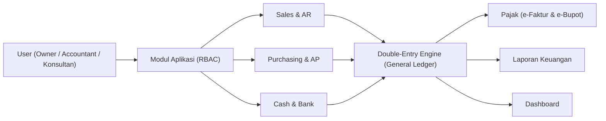

### 6.2. Alur Penjualan — Order to Cash

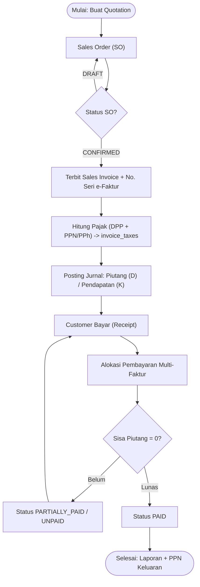

### 6.3. Alur Pembelian — Procure to Pay

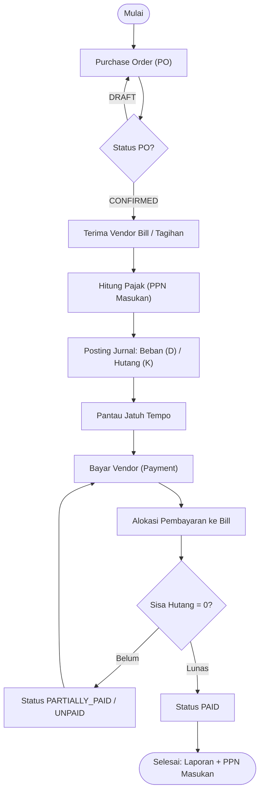

### 6.4. Alur Jurnal & Validasi Double-Entry

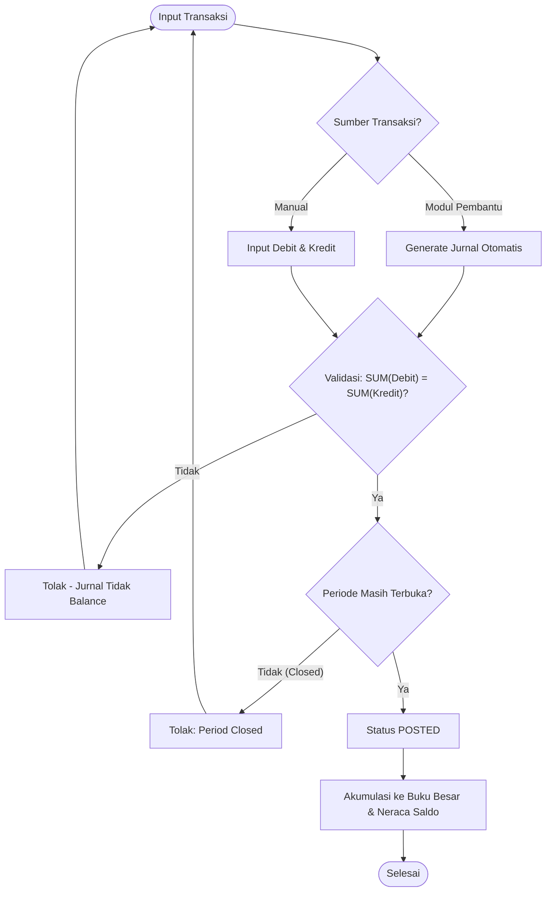

### 6.5. Alur Rekonsiliasi Bank

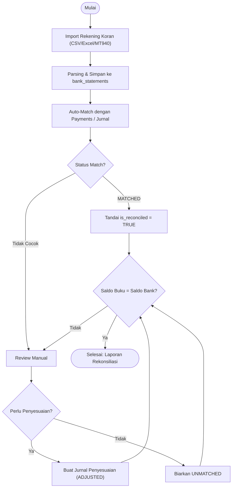

### 6.6. Alur Period Closing

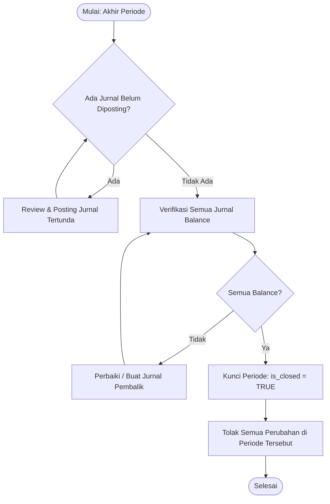

### 6.7. Alur Pajak (e-Faktur & e-Bupot)

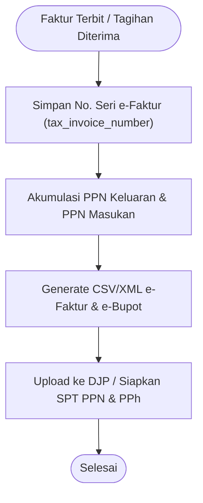


### 6.8. Alur Aset Tetap & Penyusutan — **BARU v1.3 (Fase 2)**

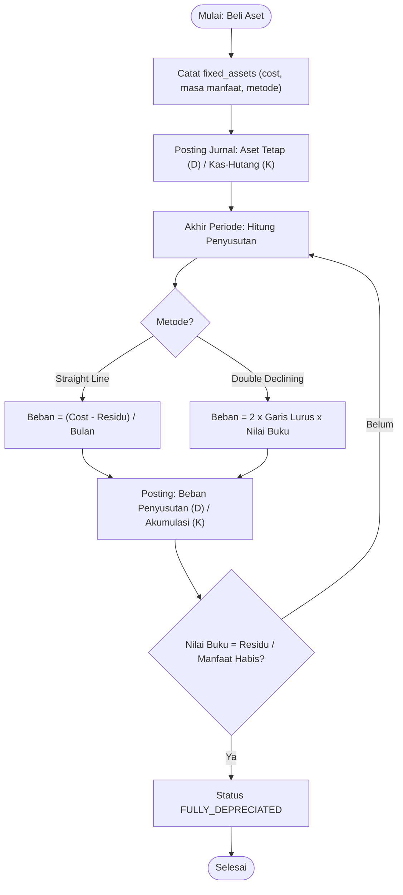

### 6.9. Alur Jurnal Berulang (Recurring) — **BARU v1.3 (Fase 2)**

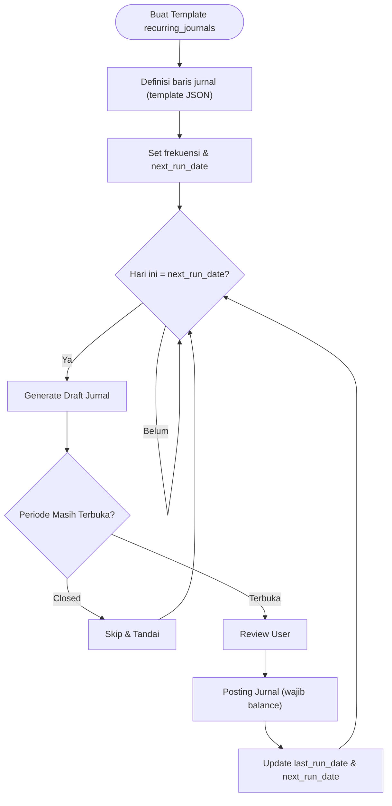

### 6.10. Alur Inventory & COGS — **BARU v1.3 (Fase 2)**

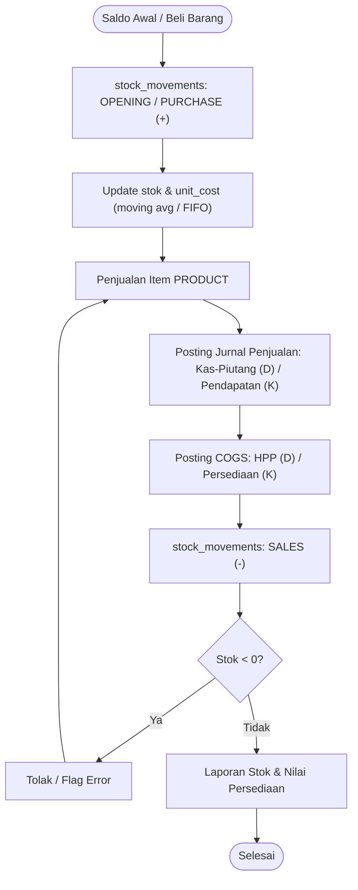

### 6.11. Alur Payroll & PPh 21 — **BARU v1.3 (Fase 2)**

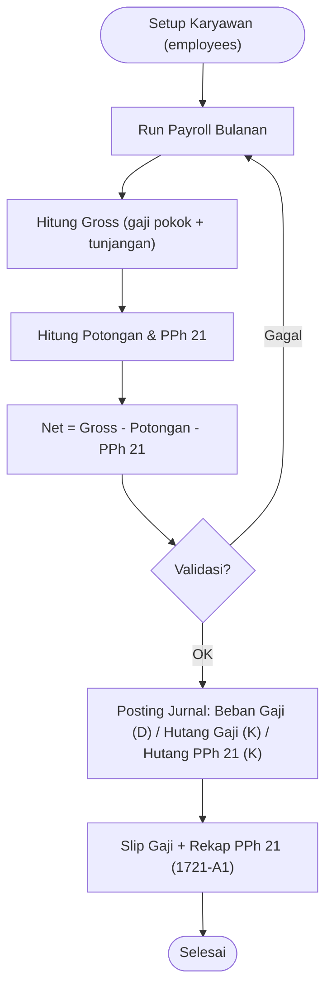

### 6.12. Alur Retur / Credit Note — **BARU v1.4 (Fase 3)**

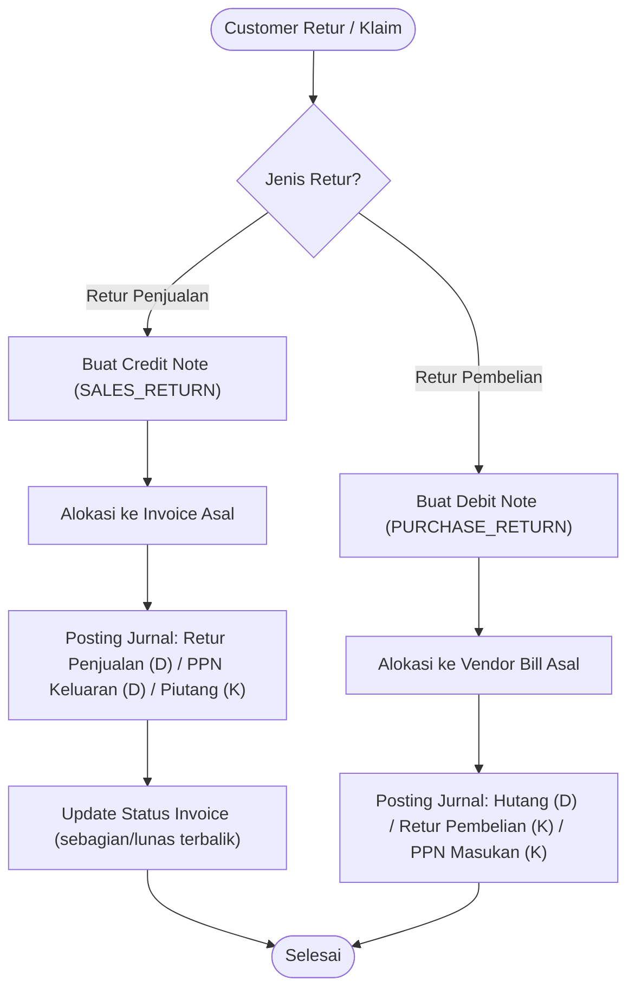

### 6.13. Alur Reminder Jatuh Tempo — **BARU v1.4 (Fase 3)**

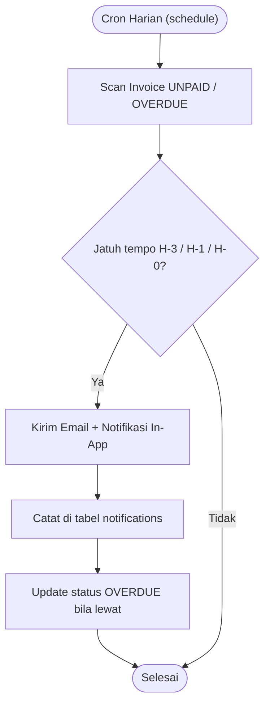

---

## 7. Database Schema Design (Entity Relationship Layout)

Database dirancang menggunakan **MySQL 8 (InnoDB, utf8mb4)** dengan pola multi-tenant (shared schema + `organization_id` di semua tabel). Isolasi tenant dilakukan di **app-layer** (Laravel Global Scope) — MySQL tidak memiliki Row Level Security seperti PostgreSQL (lihat Section 10).

```
                        +---------------------+
                        |    organizations    |
                        +----------+----------+
                                   |
         +----------------+--------+--------+----------------+
         |                |                 |                |
+--------v-------+ +-------v-------+ +------v-------+ +-----v-------+
|     users      | |   accounts    | |  contacts    | | bank_accounts|
+--------+-------+ +-------+-------+ +-------+-------+ +-----+-------+
         |                 |                 |               |
         |         +-------+--------+        |               |
         |         | fiscal_periods |        |               |
         |         +-------+--------+        |               |
         |                 |                 |               |
+--------v-----------------v-----------------v---------------v-------+
|                  journal_entries (currency_code, exchange_rate,    |
|                          reversed_entry_id, fiscal_period_id)      |
+--------+-----------------------------------------+----------------+
         |                                         |
+--------v---------+                       +--------v---------+
|  journal_items   |                       |  audit_logs      |
| (debit, credit,  |                       +------------------+
|  account_id)     |
+------------------+
```

```
contacts (customer/vendor)
   |
   +--> invoices (invoice_type, source_type, tax_invoice_number, currency_code)
   |        +--> invoice_items
   |        +--> invoice_taxes (tax_rate_id, tax_base/DPP, tax_amount)
   |
   +--> payments (payment_type: RECEIPT/PAYMENT, payment_method)
            +--> payment_allocations (payment_id, invoice_id, amount)
```

```
contacts --> sales_orders --> invoices   (alur penjualan: Quotation/SO -> Invoice)
contacts --> purchase_orders --> invoices (alur pembelian: PO -> Vendor Bill)
bank_accounts --> bank_statements --> reconciliation_entries (payment_id / journal_entry_id)
organizations --> tax_rates --> invoice_taxes
organizations --> exchange_rates (base_currency, quote_currency, rate, rate_date)
```

```
Fase 2 (v1.3):
organizations --> fixed_assets --> depreciation_entries --> journal_entries
organizations --> recurring_journals (template JSON) --> journal_entries
organizations --> items <--> stock_movements (COGS -> journal_entries)
organizations --> employees --> payroll_runs --> payroll_items (PPh 21)
```

```
Fase 3 (v1.4):
contacts --> credit_notes (SALES_RETURN / PURCHASE_RETURN) --> credit_note_items
organizations --> reminder_settings & notifications (reminder jatuh tempo)
```

---

## 8. Database Tables Definition & DDL Spec

### 8.1. Organization & User Management (Multi-Tenancy)

#### Table: `organizations`
| Column Name | Data Type | Constraints | Description |
|---|---|---|---|
| `id` | CHAR(36) | PRIMARY KEY | ID Unik Organisasi |
| `name` | VARCHAR(255) | NOT NULL | Nama Perusahaan/Entitas |
| `tax_number` | VARCHAR(50) | NULLABLE | NPWP Perusahaan |
| `currency_code` | VARCHAR(3) | DEFAULT 'IDR' | Mata Uang Utama |
| `fiscal_year_start` | DATE | NULLABLE | Awal tahun buku |
| `created_at` | DATETIME | DEFAULT CURRENT_TIMESTAMP | Waktu Dibuat |
| `updated_at` | DATETIME | DEFAULT CURRENT_TIMESTAMP | Waktu Diubah |

#### Table: `users`
| Column Name | Data Type | Constraints | Description |
|---|---|---|---|
| `id` | CHAR(36) | PRIMARY KEY | ID Unik Pengguna |
| `organization_id` | CHAR(36) | FOREIGN KEY -> organizations(id) | Tenant/Organisasi |
| `full_name` | VARCHAR(150) | NOT NULL | Nama Lengkap |
| `email` | VARCHAR(150) | NOT NULL | Email Pengguna — UNIQUE per tenant (`organization_id, email`) |
| `password_hash` | VARCHAR(255) | NOT NULL | Hash Password |
| `is_active` | BOOLEAN | DEFAULT TRUE | Status Keaktifan |
| `mfa_enabled` | BOOLEAN | DEFAULT FALSE | Status MFA |
| `last_login_at` | DATETIME | NULLABLE | Login Terakhir |
| `created_at` | DATETIME | DEFAULT CURRENT_TIMESTAMP | Waktu Dibuat |
| `updated_at` | DATETIME | DEFAULT CURRENT_TIMESTAMP | Waktu Diubah |

> **Catatan RBAC:** Role & permission TIDAK disimpan di tabel custom — dikelola **spatie/laravel-permission** (tabel `roles`, `permissions`, `model_has_roles`, `model_has_permissions`, `role_has_permissions`) via `$user->assignRole()`, `$user->givePermissionTo()`, dll.

---

### 8.2. Chart of Accounts (CoA) & General Ledger

#### Table: `accounts`
| Column Name | Data Type | Constraints | Description |
|---|---|---|---|
| `id` | CHAR(36) | PRIMARY KEY | ID Akun |
| `organization_id` | CHAR(36) | FOREIGN KEY -> organizations(id) | Organization Owner |
| `code` | VARCHAR(50) | NOT NULL | Kode Akun (e.g. 1110-01) |
| `name` | VARCHAR(150) | NOT NULL | Nama Akun (e.g. Kas Utama) |
| `account_type` | VARCHAR(50) | NOT NULL | Asset, Liability, Equity, Revenue, Expense |
| `parent_id` | CHAR(36) | FOREIGN KEY -> accounts(id) | Akun Induk (Sub-Account) |
| `is_header` | BOOLEAN | DEFAULT FALSE | Apakah Akun Header (Non-Posting) |
| `normal_balance` | VARCHAR(6) | DEFAULT 'DEBIT' | DEBIT/CREDIT — validasi jurnal |
| `cash_flow_category` | VARCHAR(20) | DEFAULT 'NONE' | OPERATING/INVESTING/FINANCING/NONE — utk laporan arus kas |
| `is_active` | BOOLEAN | DEFAULT TRUE | Status Akun |
| `created_at` | DATETIME | DEFAULT CURRENT_TIMESTAMP | Waktu Dibuat |
| `updated_at` | DATETIME | DEFAULT CURRENT_TIMESTAMP | Waktu Diubah |
| `deleted_at` | DATETIME | NULLABLE | Soft delete |

#### Table: `fiscal_periods` — BARU v1.1 (Period Closing)
| Column Name | Data Type | Constraints | Description |
|---|---|---|---|
| `id` | CHAR(36) | PRIMARY KEY | ID Periode |
| `organization_id` | CHAR(36) | FOREIGN KEY -> organizations(id) | Tenant Owner |
| `name` | VARCHAR(100) | NOT NULL | Nama Periode (e.g. "Januari 2026") |
| `start_date` | DATE | NOT NULL | Tanggal Mulai |
| `end_date` | DATE | NOT NULL | Tanggal Selesai |
| `is_closed` | BOOLEAN | DEFAULT FALSE | Status Closed |
| `closed_at` | DATETIME | NULLABLE | Waktu Ditutup |
| `closed_by` | CHAR(36) | FOREIGN KEY -> users(id) | User Penutup |

#### Table: `journal_entries`
| Column Name | Data Type | Constraints | Description |
|---|---|---|---|
| `id` | CHAR(36) | PRIMARY KEY | ID Transaksi Jurnal |
| `organization_id` | CHAR(36) | FOREIGN KEY -> organizations(id) | Tenant Owner |
| `fiscal_period_id` | CHAR(36) | FOREIGN KEY -> fiscal_periods(id) | Periode — validasi period closing |
| `entry_number` | VARCHAR(100) | NOT NULL, UNIQUE | Nomor Bukti Jurnal |
| `entry_date` | DATE | NOT NULL | Tanggal Transaksi |
| `description` | TEXT | NULLABLE | Keterangan Jurnal |
| `status` | VARCHAR(30) | DEFAULT 'POSTED' | DRAFT, POSTED, VOID |
| `currency_code` | VARCHAR(3) | DEFAULT 'IDR' | Mata uang jurnal |
| `exchange_rate` | DECIMAL(18,6) | DEFAULT 1.0 | Kurs saat transaksi |
| `reversed_entry_id` | CHAR(36) | FOREIGN KEY -> journal_entries(id) | Jurnal pembalik (koreksi) |
| `created_by` | CHAR(36) | FOREIGN KEY -> users(id) | User Pembuat |
| `created_at` | DATETIME | DEFAULT CURRENT_TIMESTAMP | Waktu Dibuat |
| `updated_at` | DATETIME | DEFAULT CURRENT_TIMESTAMP | Waktu Diubah |
| `deleted_at` | DATETIME | NULLABLE | Soft delete |

#### Table: `journal_items`
| Column Name | Data Type | Constraints | Description |
|---|---|---|---|
| `id` | CHAR(36) | PRIMARY KEY | ID Detail Baris |
| `journal_entry_id` | CHAR(36) | FOREIGN KEY -> journal_entries(id) | Reference Jurnal |
| `account_id` | CHAR(36) | FOREIGN KEY -> accounts(id) | Akun yang Di-debit/Kredit |
| `debit` | DECIMAL(18,2) | DEFAULT 0.00 | Nilai Debit (>= 0) |
| `credit` | DECIMAL(18,2) | DEFAULT 0.00 | Nilai Kredit (>= 0) |
| `memo` | VARCHAR(255) | NULLABLE | Catatan Khusus Baris |

---

### 8.3. Contacts & Transactions (AR & AP)

#### Table: `contacts`
| Column Name | Data Type | Constraints | Description |
|---|---|---|---|
| `id` | CHAR(36) | PRIMARY KEY | ID Kontak |
| `organization_id` | CHAR(36) | FOREIGN KEY -> organizations(id) | Tenant Owner |
| `name` | VARCHAR(200) | NOT NULL | Nama Pelanggan/Pemasok |
| `type` | VARCHAR(50) | NOT NULL | CUSTOMER, VENDOR, BOTH |
| `email` | VARCHAR(100) | NULLABLE | Kontak Email |
| `phone` | VARCHAR(50) | NULLABLE | Nomor Telepon |
| `tax_id` | VARCHAR(50) | NULLABLE | NPWP Kontak |
| `address` | TEXT | NULLABLE | Alamat |
| `bank_name` | VARCHAR(100) | NULLABLE | Bank utk transfer |
| `bank_account_number` | VARCHAR(50) | NULLABLE | No. Rekening utk transfer |
| `is_active` | BOOLEAN | DEFAULT TRUE | Status Kontak |
| `created_at` | DATETIME | DEFAULT CURRENT_TIMESTAMP | Waktu Dibuat |
| `updated_at` | DATETIME | DEFAULT CURRENT_TIMESTAMP | Waktu Diubah |
| `deleted_at` | DATETIME | NULLABLE | Soft delete |

#### Table: `sales_orders` — BARU v1.1 (FR-AR-001)
| Column Name | Data Type | Constraints | Description |
|---|---|---|---|
| `id` | CHAR(36) | PRIMARY KEY | ID Sales Order |
| `organization_id` | CHAR(36) | FOREIGN KEY -> organizations(id) | Tenant Owner |
| `contact_id` | CHAR(36) | FOREIGN KEY -> contacts(id) | Customer |
| `so_number` | VARCHAR(100) | NOT NULL | Nomor SO |
| `order_date` | DATE | NOT NULL | Tanggal Order |
| `status` | VARCHAR(30) | DEFAULT 'DRAFT' | DRAFT, CONFIRMED, INVOICED, CANCELLED |
| `subtotal` | DECIMAL(18,2) | DEFAULT 0.00 | Total Sebelum Pajak |
| `tax_amount` | DECIMAL(18,2) | DEFAULT 0.00 | Total Pajak |
| `total_amount` | DECIMAL(18,2) | DEFAULT 0.00 | Total Akhir |
| `created_by` | CHAR(36) | FOREIGN KEY -> users(id) | User Pembuat |
| `created_at` | DATETIME | DEFAULT CURRENT_TIMESTAMP | Waktu Dibuat |
| `updated_at` | DATETIME | DEFAULT CURRENT_TIMESTAMP | Waktu Diubah |

#### Table: `sales_order_items` — BARU v1.1
| Column Name | Data Type | Constraints | Description |
|---|---|---|---|
| `id` | CHAR(36) | PRIMARY KEY | ID Item SO |
| `sales_order_id` | CHAR(36) | FOREIGN KEY -> sales_orders(id) | Reference SO |
| `account_id` | CHAR(36) | FOREIGN KEY -> accounts(id) | Akun Pendapatan |
| `item_id` | CHAR(36) | NULLABLE, FOREIGN KEY -> items(id) | Produk terkait (BARU v1.3) |
| `description` | TEXT | NOT NULL | Deskripsi |
| `quantity` | DECIMAL(12,4) | DEFAULT 1 | Jumlah |
| `unit_price` | DECIMAL(18,2) | NOT NULL | Harga Satuan |
| `amount` | DECIMAL(18,2) | NOT NULL | Total Baris |

#### Table: `purchase_orders` — BARU v1.1 (FR-AP-001)
| Column Name | Data Type | Constraints | Description |
|---|---|---|---|
| `id` | CHAR(36) | PRIMARY KEY | ID Purchase Order |
| `organization_id` | CHAR(36) | FOREIGN KEY -> organizations(id) | Tenant Owner |
| `contact_id` | CHAR(36) | FOREIGN KEY -> contacts(id) | Vendor |
| `po_number` | VARCHAR(100) | NOT NULL | Nomor PO |
| `order_date` | DATE | NOT NULL | Tanggal Order |
| `status` | VARCHAR(30) | DEFAULT 'DRAFT' | DRAFT, CONFIRMED, BILLED, CANCELLED |
| `subtotal` | DECIMAL(18,2) | DEFAULT 0.00 | Total Sebelum Pajak |
| `tax_amount` | DECIMAL(18,2) | DEFAULT 0.00 | Total Pajak |
| `total_amount` | DECIMAL(18,2) | DEFAULT 0.00 | Total Akhir |
| `created_by` | CHAR(36) | FOREIGN KEY -> users(id) | User Pembuat |
| `created_at` | DATETIME | DEFAULT CURRENT_TIMESTAMP | Waktu Dibuat |
| `updated_at` | DATETIME | DEFAULT CURRENT_TIMESTAMP | Waktu Diubah |

#### Table: `purchase_order_items` — BARU v1.1
| Column Name | Data Type | Constraints | Description |
|---|---|---|---|
| `id` | CHAR(36) | PRIMARY KEY | ID Item PO |
| `purchase_order_id` | CHAR(36) | FOREIGN KEY -> purchase_orders(id) | Reference PO |
| `account_id` | CHAR(36) | FOREIGN KEY -> accounts(id) | Akun Beban/Aset |
| `item_id` | CHAR(36) | NULLABLE, FOREIGN KEY -> items(id) | Produk terkait (BARU v1.3) |
| `description` | TEXT | NOT NULL | Deskripsi |
| `quantity` | DECIMAL(12,4) | DEFAULT 1 | Jumlah |
| `unit_price` | DECIMAL(18,2) | NOT NULL | Harga Satuan |
| `amount` | DECIMAL(18,2) | NOT NULL | Total Baris |

#### Table: `invoices`
| Column Name | Data Type | Constraints | Description |
|---|---|---|---|
| `id` | CHAR(36) | PRIMARY KEY | ID Faktur |
| `organization_id` | CHAR(36) | FOREIGN KEY -> organizations(id) | Tenant Owner |
| `contact_id` | CHAR(36) | FOREIGN KEY -> contacts(id) | Customer/Vendor |
| `invoice_type` | VARCHAR(30) | NOT NULL | SALES (Penjualan) / PURCHASE (Pembelian) |
| `invoice_number` | VARCHAR(100) | NOT NULL | Nomor Invoice |
| `source_type` | VARCHAR(30) | DEFAULT 'INVOICE' | QUOTATION/SALES_ORDER/PURCHASE_ORDER/INVOICE/MANUAL |
| `source_id` | CHAR(36) | NULLABLE | Ref SO/PO asal |
| `issue_date` | DATE | NOT NULL | Tanggal Terbit |
| `due_date` | DATE | NOT NULL | Tanggal Jatuh Tempo |
| `subtotal` | DECIMAL(18,2) | NOT NULL | Total Sebelum Pajak |
| `tax_amount` | DECIMAL(18,2) | DEFAULT 0.00 | Total Pajak (PPN/PPh) |
| `total_amount` | DECIMAL(18,2) | NOT NULL | Total Akhir |
| `currency_code` | VARCHAR(3) | DEFAULT 'IDR' | Mata uang faktur |
| `exchange_rate` | DECIMAL(18,6) | DEFAULT 1.0 | Kurs saat faktur |
| `tax_invoice_number` | VARCHAR(100) | NULLABLE | Nomor seri e-Faktur |
| `status` | VARCHAR(30) | DEFAULT 'UNPAID' | DRAFT, UNPAID, PARTIALLY_PAID, PAID, OVERDUE, CANCELLED |
| `created_at` | DATETIME | DEFAULT CURRENT_TIMESTAMP | Waktu Dibuat |
| `updated_at` | DATETIME | DEFAULT CURRENT_TIMESTAMP | Waktu Diubah |
| `deleted_at` | DATETIME | NULLABLE | Soft delete |

#### Table: `invoice_items`
| Column Name | Data Type | Constraints | Description |
|---|---|---|---|
| `id` | CHAR(36) | PRIMARY KEY | ID Item Faktur |
| `invoice_id` | CHAR(36) | FOREIGN KEY -> invoices(id) | Reference Invoice |
| `account_id` | CHAR(36) | FOREIGN KEY -> accounts(id) | Akun Pendapatan/Beban |
| `item_id` | CHAR(36) | NULLABLE, FOREIGN KEY -> items(id) | Produk terkait (BARU v1.3) |
| `description` | TEXT | NOT NULL | Deskripsi Barang/Jasa |
| `quantity` | DECIMAL(12,4) | DEFAULT 1 | Jumlah |
| `unit_price` | DECIMAL(18,2) | NOT NULL | Harga Satuan |
| `amount` | DECIMAL(18,2) | NOT NULL | Total Baris (Qty * Price) |

#### Table: `tax_rates` — BARU v1.1 (FR-TAX-001)
| Column Name | Data Type | Constraints | Description |
|---|---|---|---|
| `id` | CHAR(36) | PRIMARY KEY | ID Tarif Pajak |
| `organization_id` | CHAR(36) | FOREIGN KEY -> organizations(id) | Tenant Owner |
| `code` | VARCHAR(20) | NOT NULL | PPN, PPH21, PPH23, PPH42 |
| `name` | VARCHAR(100) | NOT NULL | Nama Pajak |
| `rate` | DECIMAL(5,2) | NOT NULL | Tarif, e.g. 11.00 (PPN), 2.00 (PPh23) |
| `tax_type` | VARCHAR(10) | NOT NULL | OUTPUT (PPN keluaran) / INPUT (PPN masukan) / WITHHOLDING |
| `is_active` | BOOLEAN | DEFAULT TRUE | Status Aktif |
| `effective_date` | DATE | DEFAULT CURRENT_DATE | Tanggal Efektif |

#### Table: `invoice_taxes` — BARU v1.1 (FR-TAX-002)
| Column Name | Data Type | Constraints | Description |
|---|---|---|---|
| `id` | CHAR(36) | PRIMARY KEY | ID Pajak Faktur |
| `invoice_id` | CHAR(36) | FOREIGN KEY -> invoices(id) | Reference Invoice |
| `tax_rate_id` | CHAR(36) | FOREIGN KEY -> tax_rates(id) | Jenis Pajak |
| `tax_base` | DECIMAL(18,2) | NOT NULL | DPP |
| `tax_amount` | DECIMAL(18,2) | NOT NULL | Nilai Pajak |

#### Table: `payments` — BARU v1.1 (FR-AR-003 / FR-AP-002)
| Column Name | Data Type | Constraints | Description |
|---|---|---|---|
| `id` | CHAR(36) | PRIMARY KEY | ID Pembayaran |
| `organization_id` | CHAR(36) | FOREIGN KEY -> organizations(id) | Tenant Owner |
| `contact_id` | CHAR(36) | FOREIGN KEY -> contacts(id) | Customer/Vendor |
| `payment_type` | VARCHAR(20) | NOT NULL | RECEIPT (terima) / PAYMENT (bayar) |
| `payment_date` | DATE | NOT NULL | Tanggal Bayar |
| `amount` | DECIMAL(18,2) | NOT NULL, CHECK (amount > 0) | Nilai Pembayaran |
| `payment_method` | VARCHAR(20) | DEFAULT 'CASH' | CASH, BANK, EWALLET |
| `bank_account_id` | CHAR(36) | FOREIGN KEY -> bank_accounts(id) | Rekening asal/tujuan |
| `reference_number` | VARCHAR(100) | NULLABLE | No. bukti transfer |
| `memo` | TEXT | NULLABLE | Keterangan |
| `created_by` | CHAR(36) | FOREIGN KEY -> users(id) | User Pembuat |
| `created_at` | DATETIME | DEFAULT CURRENT_TIMESTAMP | Waktu Dibuat |
| `updated_at` | DATETIME | DEFAULT CURRENT_TIMESTAMP | Waktu Diubah |

#### Table: `payment_allocations` — BARU v1.1 (alokasi multi-faktur)
| Column Name | Data Type | Constraints | Description |
|---|---|---|---|
| `id` | CHAR(36) | PRIMARY KEY | ID Alokasi |
| `payment_id` | CHAR(36) | FOREIGN KEY -> payments(id) | Reference Payment |
| `invoice_id` | CHAR(36) | FOREIGN KEY -> invoices(id) | Invoice yang Dilunasi |
| `amount` | DECIMAL(18,2) | NOT NULL, CHECK (amount > 0) | Nilai Alokasi |

---

### 8.4. Cash & Bank (FR-CB-001/002/003)

#### Table: `bank_accounts` — BARU v1.1
| Column Name | Data Type | Constraints | Description |
|---|---|---|---|
| `id` | CHAR(36) | PRIMARY KEY | ID Rekening |
| `organization_id` | CHAR(36) | FOREIGN KEY -> organizations(id) | Tenant Owner |
| `name` | VARCHAR(150) | NOT NULL | Nama (e.g. "BCA 1234567", "GoPay") |
| `bank_name` | VARCHAR(100) | NULLABLE | Nama Bank |
| `account_number` | VARCHAR(50) | NULLABLE | No. Rekening |
| `account_holder` | VARCHAR(150) | NULLABLE | Pemilik Rekening |
| `currency_code` | VARCHAR(3) | DEFAULT 'IDR' | Mata Uang |
| `opening_balance` | DECIMAL(18,2) | DEFAULT 0.00 | Saldo Awal |
| `is_active` | BOOLEAN | DEFAULT TRUE | Status Aktif |

#### Table: `bank_statements` — BARU v1.1
| Column Name | Data Type | Constraints | Description |
|---|---|---|---|
| `id` | CHAR(36) | PRIMARY KEY | ID Baris Mutasi |
| `organization_id` | CHAR(36) | FOREIGN KEY -> organizations(id) | Tenant Owner |
| `bank_account_id` | CHAR(36) | FOREIGN KEY -> bank_accounts(id) | Rekening |
| `statement_date` | DATE | NOT NULL | Tanggal Mutasi |
| `reference` | VARCHAR(100) | NULLABLE | Referensi Bank |
| `description` | VARCHAR(255) | NULLABLE | Deskripsi |
| `debit` | DECIMAL(18,2) | DEFAULT 0.00 | Masuk |
| `credit` | DECIMAL(18,2) | DEFAULT 0.00 | Keluar |
| `balance` | DECIMAL(18,2) | NULLABLE | Saldo Bank (cross-check) |
| `is_reconciled` | BOOLEAN | DEFAULT FALSE | Status Cocok |

#### Table: `reconciliation_entries` — BARU v1.1
| Column Name | Data Type | Constraints | Description |
|---|---|---|---|
| `id` | CHAR(36) | PRIMARY KEY | ID Rekonsiliasi |
| `organization_id` | CHAR(36) | FOREIGN KEY -> organizations(id) | Tenant Owner |
| `bank_statement_id` | CHAR(36) | FOREIGN KEY -> bank_statements(id) | Baris Mutasi |
| `payment_id` | CHAR(36) | FOREIGN KEY -> payments(id) | Cocok dgn Pembayaran |
| `journal_entry_id` | CHAR(36) | FOREIGN KEY -> journal_entries(id) | Atau jurnal langsung |
| `status` | VARCHAR(20) | DEFAULT 'MATCHED' | MATCHED, UNMATCHED, ADJUSTED |

---

### 8.5. Multi-Currency & Audit

#### Table: `exchange_rates` — BARU v1.1 (FR-MC-002)
| Column Name | Data Type | Constraints | Description |
|---|---|---|---|
| `id` | CHAR(36) | PRIMARY KEY | ID Kurs |
| `organization_id` | CHAR(36) | FOREIGN KEY -> organizations(id) | Tenant Owner |
| `base_currency` | VARCHAR(3) | NOT NULL | e.g. IDR |
| `quote_currency` | VARCHAR(3) | NOT NULL | e.g. USD |
| `rate` | DECIMAL(18,6) | NOT NULL | Nilai Kurs |
| `rate_date` | DATE | NOT NULL | Tanggal Kurs |

#### Table: `audit_logs` — BARU v1.1 (FR-AUD-001)
| Column Name | Data Type | Constraints | Description |
|---|---|---|---|
| `id` | CHAR(36) | PRIMARY KEY | ID Log |
| `organization_id` | CHAR(36) | FOREIGN KEY -> organizations(id) | Tenant Owner |
| `user_id` | CHAR(36) | FOREIGN KEY -> users(id) | User Pelaku |
| `action` | VARCHAR(50) | NOT NULL | CREATE, UPDATE, DELETE, VOID, CLOSE, APPROVE |
| `entity_type` | VARCHAR(50) | NOT NULL | invoice, journal_entry, payment, dll |
| `entity_id` | CHAR(36) | NOT NULL | ID Entitas |
| `old_value` | JSON | NULLABLE | Nilai Sebelum |
| `new_value` | JSON | NULLABLE | Nilai Sesudah |
| `ip_address` | VARCHAR(45) | NULLABLE | IP User |
| `created_at` | DATETIME | DEFAULT CURRENT_TIMESTAMP | Waktu Aksi |


### 8.6. Fixed Assets & Depreciation — **BARU v1.3 (Fase 2)**

#### Table: `fixed_assets`
| Column Name | Data Type | Constraints | Description |
|---|---|---|---|
| `id` | CHAR(36) | PRIMARY KEY | UUID (app-generated) |
| `organization_id` | CHAR(36) | FOREIGN KEY -> organizations(id) | Tenant Owner |
| `asset_code` | VARCHAR(50) | NOT NULL | Kode Aset (e.g. AST-001) |
| `name` | VARCHAR(150) | NOT NULL | Nama Aset |
| `account_id` | CHAR(36) | FOREIGN KEY -> accounts(id) | Akun Aset Tetap |
| `depreciation_account_id` | CHAR(36) | FOREIGN KEY -> accounts(id) | Akun Akumulasi Penyusutan |
| `expense_account_id` | CHAR(36) | FOREIGN KEY -> accounts(id) | Akun Beban Penyusutan |
| `purchase_date` | DATE | NOT NULL | Tanggal Perolehan |
| `purchase_cost` | DECIMAL(18,2) | NOT NULL | Nilai Perolehan |
| `useful_life_months` | INT | NOT NULL | Masa Manfaat (bulan) |
| `salvage_value` | DECIMAL(18,2) | DEFAULT 0.00 | Nilai Residu |
| `depreciation_method` | VARCHAR(20) | DEFAULT 'STRAIGHT_LINE' | STRAIGHT_LINE / DOUBLE_DECLINING |
| `accumulated_depreciation` | DECIMAL(18,2) | DEFAULT 0.00 | Akumulasi Penyusutan |
| `book_value` | DECIMAL(18,2) | DEFAULT 0.00 | Nilai Buku (cost − akumulasi) |
| `status` | VARCHAR(20) | DEFAULT 'ACTIVE' | ACTIVE / FULLY_DEPRECIATED / DISPOSED |
| `disposed_at` | DATETIME | NULLABLE | Tanggal Disposal |
| `created_at` / `updated_at` | DATETIME | DEFAULT CURRENT_TIMESTAMP | Timestamps |
| `deleted_at` | DATETIME | NULLABLE | Soft delete |

#### Table: `depreciation_entries`
| Column Name | Data Type | Constraints | Description |
|---|---|---|---|
| `id` | CHAR(36) | PRIMARY KEY | UUID |
| `organization_id` | CHAR(36) | FOREIGN KEY -> organizations(id) | Tenant Owner |
| `fixed_asset_id` | CHAR(36) | FOREIGN KEY -> fixed_assets(id) | Aset |
| `journal_entry_id` | CHAR(36) | FOREIGN KEY -> journal_entries(id) | Jurnal penyusutan hasil posting |
| `period` | VARCHAR(7) | NOT NULL | Periode YYYY-MM |
| `amount` | DECIMAL(18,2) | NOT NULL | Nilai Penyusutan |
| `status` | VARCHAR(20) | DEFAULT 'DRAFT' | DRAFT / POSTED |
| `created_at` | DATETIME | DEFAULT CURRENT_TIMESTAMP | Waktu Dibuat |

---

### 8.7. Recurring Transactions — **BARU v1.3 (Fase 2)**

#### Table: `recurring_journals`
| Column Name | Data Type | Constraints | Description |
|---|---|---|---|
| `id` | CHAR(36) | PRIMARY KEY | UUID |
| `organization_id` | CHAR(36) | FOREIGN KEY -> organizations(id) | Tenant Owner |
| `name` | VARCHAR(150) | NOT NULL | Nama Template (e.g. "Sewa Kantor Bulanan") |
| `description` | TEXT | NULLABLE | Keterangan |
| `frequency` | VARCHAR(20) | NOT NULL | DAILY / WEEKLY / MONTHLY / YEARLY |
| `start_date` | DATE | NOT NULL | Mulai Berlaku |
| `end_date` | DATE | NULLABLE | Berakhir (NULL = tanpa batas) |
| `next_run_date` | DATE | NOT NULL | Jadwal Generate Berikutnya |
| `last_run_date` | DATE | NULLABLE | Terakhir Generate |
| `is_active` | BOOLEAN | DEFAULT TRUE | Status Aktif |
| `template` | JSON | NOT NULL | Baris jurnal: [{"account_id","debit","credit","memo"}] |
| `created_by` | CHAR(36) | FOREIGN KEY -> users(id) | User Pembuat |
| `created_at` / `updated_at` | DATETIME | DEFAULT CURRENT_TIMESTAMP | Timestamps |
| `deleted_at` | DATETIME | NULLABLE | Soft delete |

---

### 8.8. Inventory & COGS — **BARU v1.3 (Fase 2)**

#### Table: `items`
| Column Name | Data Type | Constraints | Description |
|---|---|---|---|
| `id` | CHAR(36) | PRIMARY KEY | UUID |
| `organization_id` | CHAR(36) | FOREIGN KEY -> organizations(id) | Tenant Owner |
| `code` | VARCHAR(50) | NOT NULL | SKU |
| `name` | VARCHAR(150) | NOT NULL | Nama Produk/Jasa |
| `type` | VARCHAR(20) | DEFAULT 'PRODUCT' | PRODUCT / SERVICE |
| `unit` | VARCHAR(20) | DEFAULT 'PCS' | Satuan (pcs, kg, liter) |
| `default_price` | DECIMAL(18,2) | DEFAULT 0.00 | Harga Jual Default |
| `income_account_id` | CHAR(36) | FOREIGN KEY -> accounts(id) | Akun Pendapatan Default |
| `expense_account_id` | CHAR(36) | FOREIGN KEY -> accounts(id) | Akun Beban/HPP Default |
| `stock_qty` | DECIMAL(12,4) | DEFAULT 0.00 | Stok Berjalan |
| `is_active` | BOOLEAN | DEFAULT TRUE | Status Aktif |
| `created_at` / `updated_at` | DATETIME | DEFAULT CURRENT_TIMESTAMP | Timestamps |
| `deleted_at` | DATETIME | NULLABLE | Soft delete |

#### Table: `stock_movements`
| Column Name | Data Type | Constraints | Description |
|---|---|---|---|
| `id` | CHAR(36) | PRIMARY KEY | UUID |
| `organization_id` | CHAR(36) | FOREIGN KEY -> organizations(id) | Tenant Owner |
| `item_id` | CHAR(36) | FOREIGN KEY -> items(id) | Produk |
| `movement_date` | DATE | NOT NULL | Tanggal Mutasi |
| `movement_type` | VARCHAR(20) | NOT NULL | OPENING / PURCHASE / SALES / ADJUSTMENT |
| `quantity` | DECIMAL(12,4) | NOT NULL | Positif = masuk, negatif = keluar |
| `unit_cost` | DECIMAL(18,2) | NOT NULL | Harga pokok (basis COGS) |
| `reference_type` | VARCHAR(50) | NULLABLE | invoice / purchase_order / dll |
| `reference_id` | CHAR(36) | NULLABLE | Ref dokumen |
| `memo` | VARCHAR(255) | NULLABLE | Catatan |
| `created_by` | CHAR(36) | FOREIGN KEY -> users(id) | User Pencatat |
| `created_at` | DATETIME | DEFAULT CURRENT_TIMESTAMP | Waktu Dibuat |

---

### 8.9. Payroll & PPh 21 — **BARU v1.3 (Fase 2)**

#### Table: `employees`
| Column Name | Data Type | Constraints | Description |
|---|---|---|---|
| `id` | CHAR(36) | PRIMARY KEY | UUID |
| `organization_id` | CHAR(36) | FOREIGN KEY -> organizations(id) | Tenant Owner |
| `employee_number` | VARCHAR(50) | NOT NULL | NIK Karyawan |
| `full_name` | VARCHAR(150) | NOT NULL | Nama Lengkap |
| `tax_id` | VARCHAR(50) | NULLABLE | NPWP |
| `position` | VARCHAR(100) | NULLABLE | Jabatan |
| `join_date` | DATE | NULLABLE | Tanggal Masuk |
| `basic_salary` | DECIMAL(18,2) | DEFAULT 0.00 | Gaji Pokok |
| `bank_name` | VARCHAR(100) | NULLABLE | Bank Transfer |
| `bank_account_number` | VARCHAR(50) | NULLABLE | No. Rekening |
| `is_active` | BOOLEAN | DEFAULT TRUE | Status Aktif |
| `created_at` / `updated_at` | DATETIME | DEFAULT CURRENT_TIMESTAMP | Timestamps |
| `deleted_at` | DATETIME | NULLABLE | Soft delete |

#### Table: `payroll_runs`
| Column Name | Data Type | Constraints | Description |
|---|---|---|---|
| `id` | CHAR(36) | PRIMARY KEY | UUID |
| `organization_id` | CHAR(36) | FOREIGN KEY -> organizations(id) | Tenant Owner |
| `period` | VARCHAR(7) | NOT NULL | Periode YYYY-MM |
| `run_date` | DATE | NOT NULL | Tanggal Proses |
| `total_gross` | DECIMAL(18,2) | DEFAULT 0.00 | Total Bruto |
| `total_tax` | DECIMAL(18,2) | DEFAULT 0.00 | Total PPh 21 |
| `total_net` | DECIMAL(18,2) | DEFAULT 0.00 | Total Netto |
| `journal_entry_id` | CHAR(36) | FOREIGN KEY -> journal_entries(id) | Jurnal Gaji |
| `status` | VARCHAR(20) | DEFAULT 'DRAFT' | DRAFT / POSTED |
| `created_by` | CHAR(36) | FOREIGN KEY -> users(id) | User Proses |
| `created_at` / `updated_at` | DATETIME | DEFAULT CURRENT_TIMESTAMP | Timestamps |

#### Table: `payroll_items`
| Column Name | Data Type | Constraints | Description |
|---|---|---|---|
| `id` | CHAR(36) | PRIMARY KEY | UUID |
| `payroll_run_id` | CHAR(36) | FOREIGN KEY -> payroll_runs(id) | Run Payroll |
| `employee_id` | CHAR(36) | FOREIGN KEY -> employees(id) | Karyawan |
| `basic_salary` | DECIMAL(18,2) | DEFAULT 0.00 | Gaji Pokok |
| `allowances` | JSON | NULLABLE | Tunjangan: {"transport": 500000} |
| `deductions` | JSON | NULLABLE | Potongan: {"absence": 100000} |
| `tax_amount` | DECIMAL(18,2) | DEFAULT 0.00 | PPh 21 |
| `net_salary` | DECIMAL(18,2) | NOT NULL | Gaji Bersih |
| `memo` | TEXT | NULLABLE | Catatan |

---

### 8.10. Credit Note & Retur — **BARU v1.4 (Fase 3)**

#### Table: `credit_notes`
| Column Name | Data Type | Constraints | Description |
|---|---|---|---|
| `id` | CHAR(36) | PRIMARY KEY | UUID |
| `organization_id` | CHAR(36) | FOREIGN KEY -> organizations(id) | Tenant Owner |
| `contact_id` | CHAR(36) | FOREIGN KEY -> contacts(id) | Customer/Vendor |
| `invoice_id` | CHAR(36) | FOREIGN KEY -> invoices(id) | Invoice Asal (retur) |
| `credit_note_number` | VARCHAR(100) | NOT NULL | Nomor Credit Note |
| `note_type` | VARCHAR(20) | NOT NULL | SALES_RETURN / PURCHASE_RETURN |
| `issue_date` | DATE | NOT NULL | Tanggal Terbit |
| `subtotal` | DECIMAL(18,2) | DEFAULT 0.00 | Subtotal |
| `tax_amount` | DECIMAL(18,2) | DEFAULT 0.00 | Pajak |
| `total_amount` | DECIMAL(18,2) | NOT NULL | Total Akhir |
| `status` | VARCHAR(20) | DEFAULT 'DRAFT' | DRAFT / POSTED / APPLIED / VOID |
| `journal_entry_id` | CHAR(36) | FOREIGN KEY -> journal_entries(id) | Jurnal retur hasil posting |
| `memo` | TEXT | NULLABLE | Keterangan |
| `created_by` | CHAR(36) | FOREIGN KEY -> users(id) | User Pembuat |
| `created_at` / `updated_at` | DATETIME | DEFAULT CURRENT_TIMESTAMP | Timestamps |
| `deleted_at` | DATETIME | NULLABLE | Soft delete |

#### Table: `credit_note_items`
| Column Name | Data Type | Constraints | Description |
|---|---|---|---|
| `id` | CHAR(36) | PRIMARY KEY | UUID |
| `credit_note_id` | CHAR(36) | FOREIGN KEY -> credit_notes(id) | Credit Note |
| `account_id` | CHAR(36) | FOREIGN KEY -> accounts(id) | Akun Retur |
| `item_id` | CHAR(36) | FOREIGN KEY -> items(id) | Produk (opsional) |
| `description` | TEXT | NOT NULL | Deskripsi |
| `quantity` | DECIMAL(12,4) | DEFAULT 1 | Qty Retur |
| `unit_price` | DECIMAL(18,2) | NOT NULL | Harga Satuan |
| `amount` | DECIMAL(18,2) | NOT NULL | Total Baris |

---

### 8.11. Notifications & Reminders — **BARU v1.4 (Fase 3)**

#### Table: `reminder_settings`
| Column Name | Data Type | Constraints | Description |
|---|---|---|---|
| `id` | CHAR(36) | PRIMARY KEY | UUID |
| `organization_id` | CHAR(36) | FOREIGN KEY -> organizations(id) | Tenant Owner |
| `due_days_before` | INT | DEFAULT 3 | Reminder H-3 sebelum jatuh tempo |
| `overdue_days_after` | INT | DEFAULT 1 | Reminder H+1 setelah overdue |
| `email_enabled` | BOOLEAN | DEFAULT TRUE | Kirim via Email |
| `in_app_enabled` | BOOLEAN | DEFAULT TRUE | Notifikasi In-App |
| `created_at` / `updated_at` | DATETIME | DEFAULT CURRENT_TIMESTAMP | Timestamps |

#### Table: `notifications`
| Column Name | Data Type | Constraints | Description |
|---|---|---|---|
| `id` | CHAR(36) | PRIMARY KEY | UUID |
| `organization_id` | CHAR(36) | FOREIGN KEY -> organizations(id) | Tenant Owner |
| `user_id` | CHAR(36) | FOREIGN KEY -> users(id) | Penerima (NULL = broadcast) |
| `type` | VARCHAR(30) | NOT NULL | INVOICE_DUE / INVOICE_OVERDUE / PAYMENT_RECEIVED / SYSTEM |
| `channel` | VARCHAR(20) | DEFAULT 'IN_APP' | EMAIL / IN_APP / BOTH |
| `title` | VARCHAR(150) | NOT NULL | Judul |
| `body` | TEXT | NULLABLE | Isi Pesan |
| `entity_type` | VARCHAR(50) | NULLABLE | invoice / journal_entry / dll |
| `entity_id` | CHAR(36) | NULLABLE | Ref entitas |
| `is_read` | BOOLEAN | DEFAULT FALSE | Status Dibaca |
| `sent_at` | DATETIME | NULLABLE | Waktu Kirim |
| `created_at` | DATETIME | DEFAULT CURRENT_TIMESTAMP | Waktu Dibuat |

---

## 9. SQL DDL Implementation Code

```sql
-- ============================================================================
-- DDL v1.3 — AccuCloud / Smart Ledger Engine (MySQL 8, InnoDB, utf8mb4)
-- Basis: PRD v1.3 — Fase 2 + konversi PostgreSQL -> MySQL
--
-- KONVENSI MySQL:
--  * id: CHAR(36) — UUID di-generate di app layer (Laravel), bukan DB default.
--  * TIMESTAMPTZ -> DATETIME | JSONB -> JSON | NUMERIC -> DECIMAL | INET -> VARCHAR(45)
--  * ENUM inline di kolom (bukan CREATE TYPE).
--  * RLS PostgreSQL TIDAK ADA di MySQL -> isolasi multi-tenant di APP-LAYER
--    (Laravel Global Scope) — lihat PRD Section 10.
-- ============================================================================

-- ============================================================
-- 1. ORGANIZATION & USER (multi-tenancy)
-- ============================================================
CREATE TABLE organizations (
    id               CHAR(36) PRIMARY KEY,
    name             VARCHAR(255) NOT NULL,
    tax_number       VARCHAR(50),
    currency_code    VARCHAR(3) DEFAULT 'IDR',
    fiscal_year_start DATE,
    created_at       DATETIME DEFAULT CURRENT_TIMESTAMP,
    updated_at       DATETIME DEFAULT CURRENT_TIMESTAMP ON UPDATE CURRENT_TIMESTAMP
) ENGINE=InnoDB DEFAULT CHARSET=utf8mb4 COLLATE=utf8mb4_unicode_ci;

CREATE TABLE users (
    id               CHAR(36) PRIMARY KEY,
    organization_id  CHAR(36) NOT NULL,
    full_name        VARCHAR(150) NOT NULL,
    email            VARCHAR(150) NOT NULL,
    password_hash    VARCHAR(255) NOT NULL,
    is_active        BOOLEAN DEFAULT TRUE,
    mfa_enabled      BOOLEAN DEFAULT FALSE,
    last_login_at    DATETIME,
    created_at       DATETIME DEFAULT CURRENT_TIMESTAMP,
    updated_at       DATETIME DEFAULT CURRENT_TIMESTAMP ON UPDATE CURRENT_TIMESTAMP,
    deleted_at       DATETIME,
    UNIQUE KEY uq_users_org_email (organization_id, email),
    CONSTRAINT fk_users_org FOREIGN KEY (organization_id) REFERENCES organizations(id) ON DELETE CASCADE
) ENGINE=InnoDB DEFAULT CHARSET=utf8mb4 COLLATE=utf8mb4_unicode_ci;

-- RBAC: spatie/laravel-permission (roles, permissions, model_has_roles,
-- model_has_permissions, role_has_permissions) — bukan tabel custom.

-- ============================================================
-- 2. CHART OF ACCOUNTS & GENERAL LEDGER
-- ============================================================
CREATE TABLE accounts (
    id                  CHAR(36) PRIMARY KEY,
    organization_id     CHAR(36) NOT NULL,
    code                VARCHAR(50) NOT NULL,
    name                VARCHAR(150) NOT NULL,
    account_type        ENUM('ASSET','LIABILITY','EQUITY','REVENUE','EXPENSE') NOT NULL,
    parent_id           CHAR(36),
    is_header           BOOLEAN DEFAULT FALSE,
    normal_balance      VARCHAR(6) DEFAULT 'DEBIT',
    cash_flow_category  ENUM('OPERATING','INVESTING','FINANCING','NONE') DEFAULT 'NONE',
    is_active           BOOLEAN DEFAULT TRUE,
    created_at          DATETIME DEFAULT CURRENT_TIMESTAMP,
    updated_at          DATETIME DEFAULT CURRENT_TIMESTAMP ON UPDATE CURRENT_TIMESTAMP,
    deleted_at          DATETIME,
    UNIQUE KEY uq_org_account_code (organization_id, code),
    CONSTRAINT fk_accounts_org FOREIGN KEY (organization_id) REFERENCES organizations(id) ON DELETE CASCADE,
    CONSTRAINT fk_accounts_parent FOREIGN KEY (parent_id) REFERENCES accounts(id) ON DELETE SET NULL
) ENGINE=InnoDB DEFAULT CHARSET=utf8mb4 COLLATE=utf8mb4_unicode_ci;

-- Periode fiskal + penguncian (FR-GL-003)
CREATE TABLE fiscal_periods (
    id              CHAR(36) PRIMARY KEY,
    organization_id CHAR(36) NOT NULL,
    name            VARCHAR(100) NOT NULL,
    start_date      DATE NOT NULL,
    end_date        DATE NOT NULL,
    is_closed       BOOLEAN DEFAULT FALSE,
    closed_at       DATETIME,
    closed_by       CHAR(36),
    UNIQUE KEY uq_org_period_start (organization_id, start_date),
    CONSTRAINT fk_fp_org FOREIGN KEY (organization_id) REFERENCES organizations(id) ON DELETE CASCADE,
    CONSTRAINT fk_fp_closed_by FOREIGN KEY (closed_by) REFERENCES users(id)
) ENGINE=InnoDB DEFAULT CHARSET=utf8mb4 COLLATE=utf8mb4_unicode_ci;

CREATE TABLE journal_entries (
    id               CHAR(36) PRIMARY KEY,
    organization_id  CHAR(36) NOT NULL,
    fiscal_period_id CHAR(36),
    entry_number     VARCHAR(100) NOT NULL,
    entry_date       DATE NOT NULL,
    description      TEXT,
    status           VARCHAR(30) DEFAULT 'POSTED',
    currency_code    VARCHAR(3) DEFAULT 'IDR',
    exchange_rate    DECIMAL(18,6) DEFAULT 1.0,
    reversed_entry_id CHAR(36),
    created_by       CHAR(36),
    created_at       DATETIME DEFAULT CURRENT_TIMESTAMP,
    updated_at       DATETIME DEFAULT CURRENT_TIMESTAMP ON UPDATE CURRENT_TIMESTAMP,
    deleted_at       DATETIME,
    UNIQUE KEY uq_org_entry_number (organization_id, entry_number),
    KEY idx_journal_org_date (organization_id, entry_date),
    CONSTRAINT fk_je_org FOREIGN KEY (organization_id) REFERENCES organizations(id) ON DELETE CASCADE,
    CONSTRAINT fk_je_period FOREIGN KEY (fiscal_period_id) REFERENCES fiscal_periods(id),
    CONSTRAINT fk_je_reversed FOREIGN KEY (reversed_entry_id) REFERENCES journal_entries(id),
    CONSTRAINT fk_je_user FOREIGN KEY (created_by) REFERENCES users(id)
) ENGINE=InnoDB DEFAULT CHARSET=utf8mb4 COLLATE=utf8mb4_unicode_ci;

CREATE TABLE journal_items (
    id               CHAR(36) PRIMARY KEY,
    journal_entry_id CHAR(36) NOT NULL,
    account_id       CHAR(36) NOT NULL,
    debit            DECIMAL(18,2) NOT NULL DEFAULT 0.00,
    credit           DECIMAL(18,2) NOT NULL DEFAULT 0.00,
    memo             VARCHAR(255),
    KEY idx_journal_items_entry (journal_entry_id),
    CONSTRAINT fk_ji_entry FOREIGN KEY (journal_entry_id) REFERENCES journal_entries(id) ON DELETE CASCADE,
    CONSTRAINT fk_ji_account FOREIGN KEY (account_id) REFERENCES accounts(id),
    CONSTRAINT chk_no_negative CHECK (debit >= 0 AND credit >= 0)
) ENGINE=InnoDB DEFAULT CHARSET=utf8mb4 COLLATE=utf8mb4_unicode_ci;

-- ============================================================
-- 3. CONTACTS & MASTER DATA (customer/vendor/produk)
-- ============================================================
CREATE TABLE contacts (
    id                  CHAR(36) PRIMARY KEY,
    organization_id     CHAR(36) NOT NULL,
    name                VARCHAR(200) NOT NULL,
    type                VARCHAR(50) NOT NULL,
    email               VARCHAR(100),
    phone               VARCHAR(50),
    tax_id              VARCHAR(50),
    address             TEXT,
    bank_name           VARCHAR(100),
    bank_account_number VARCHAR(50),
    is_active           BOOLEAN DEFAULT TRUE,
    created_at          DATETIME DEFAULT CURRENT_TIMESTAMP,
    updated_at          DATETIME DEFAULT CURRENT_TIMESTAMP ON UPDATE CURRENT_TIMESTAMP,
    deleted_at          DATETIME,
    CONSTRAINT fk_contacts_org FOREIGN KEY (organization_id) REFERENCES organizations(id) ON DELETE CASCADE
) ENGINE=InnoDB DEFAULT CHARSET=utf8mb4 COLLATE=utf8mb4_unicode_ci;

-- Master produk/jasa (Fase 2 — FR-INV-001)
CREATE TABLE items (
    id               CHAR(36) PRIMARY KEY,
    organization_id  CHAR(36) NOT NULL,
    code             VARCHAR(50) NOT NULL,
    name             VARCHAR(150) NOT NULL,
    type             ENUM('PRODUCT','SERVICE') DEFAULT 'PRODUCT',
    unit             VARCHAR(20) DEFAULT 'PCS',
    default_price    DECIMAL(18,2) DEFAULT 0.00,
    income_account_id   CHAR(36),
    expense_account_id  CHAR(36),
    stock_qty        DECIMAL(12,4) DEFAULT 0.00,
    is_active        BOOLEAN DEFAULT TRUE,
    created_at       DATETIME DEFAULT CURRENT_TIMESTAMP,
    updated_at       DATETIME DEFAULT CURRENT_TIMESTAMP ON UPDATE CURRENT_TIMESTAMP,
    deleted_at       DATETIME,
    UNIQUE KEY uq_org_item_code (organization_id, code),
    CONSTRAINT fk_items_org FOREIGN KEY (organization_id) REFERENCES organizations(id) ON DELETE CASCADE,
    CONSTRAINT fk_items_income FOREIGN KEY (income_account_id) REFERENCES accounts(id),
    CONSTRAINT fk_items_expense FOREIGN KEY (expense_account_id) REFERENCES accounts(id)
) ENGINE=InnoDB DEFAULT CHARSET=utf8mb4 COLLATE=utf8mb4_unicode_ci;

-- Mutasi stok (Fase 2 — FR-INV-002/003)
CREATE TABLE stock_movements (
    id               CHAR(36) PRIMARY KEY,
    organization_id  CHAR(36) NOT NULL,
    item_id          CHAR(36) NOT NULL,
    movement_date    DATE NOT NULL,
    movement_type    ENUM('OPENING','PURCHASE','SALES','ADJUSTMENT') NOT NULL,
    quantity         DECIMAL(12,4) NOT NULL,
    unit_cost        DECIMAL(18,2) NOT NULL DEFAULT 0.00,
    reference_type   VARCHAR(50),
    reference_id     CHAR(36),
    memo             VARCHAR(255),
    created_by       CHAR(36),
    created_at       DATETIME DEFAULT CURRENT_TIMESTAMP,
    KEY idx_stock_item_date (item_id, movement_date),
    CONSTRAINT fk_sm_org FOREIGN KEY (organization_id) REFERENCES organizations(id) ON DELETE CASCADE,
    CONSTRAINT fk_sm_item FOREIGN KEY (item_id) REFERENCES items(id),
    CONSTRAINT fk_sm_user FOREIGN KEY (created_by) REFERENCES users(id)
) ENGINE=InnoDB DEFAULT CHARSET=utf8mb4 COLLATE=utf8mb4_unicode_ci;

-- ============================================================
-- 4. PENJUALAN (Quotation -> Sales Order -> Invoice)
-- ============================================================
CREATE TABLE sales_orders (
    id              CHAR(36) PRIMARY KEY,
    organization_id CHAR(36) NOT NULL,
    contact_id      CHAR(36) NOT NULL,
    so_number       VARCHAR(100) NOT NULL,
    order_date      DATE NOT NULL,
    status          VARCHAR(30) DEFAULT 'DRAFT',
    subtotal        DECIMAL(18,2) NOT NULL DEFAULT 0.00,
    tax_amount      DECIMAL(18,2) NOT NULL DEFAULT 0.00,
    total_amount    DECIMAL(18,2) NOT NULL DEFAULT 0.00,
    created_by      CHAR(36),
    created_at      DATETIME DEFAULT CURRENT_TIMESTAMP,
    updated_at      DATETIME DEFAULT CURRENT_TIMESTAMP ON UPDATE CURRENT_TIMESTAMP,
    UNIQUE KEY uq_org_so_number (organization_id, so_number),
    CONSTRAINT fk_so_org FOREIGN KEY (organization_id) REFERENCES organizations(id) ON DELETE CASCADE,
    CONSTRAINT fk_so_contact FOREIGN KEY (contact_id) REFERENCES contacts(id),
    CONSTRAINT fk_so_user FOREIGN KEY (created_by) REFERENCES users(id)
) ENGINE=InnoDB DEFAULT CHARSET=utf8mb4 COLLATE=utf8mb4_unicode_ci;

CREATE TABLE sales_order_items (
    id              CHAR(36) PRIMARY KEY,
    sales_order_id  CHAR(36) NOT NULL,
    account_id      CHAR(36) NOT NULL,
    item_id         CHAR(36),
    description     TEXT NOT NULL,
    quantity        DECIMAL(12,4) NOT NULL DEFAULT 1,
    unit_price      DECIMAL(18,2) NOT NULL DEFAULT 0.00,
    amount          DECIMAL(18,2) NOT NULL DEFAULT 0.00,
    KEY idx_soi_order (sales_order_id),
    CONSTRAINT fk_soi_order FOREIGN KEY (sales_order_id) REFERENCES sales_orders(id) ON DELETE CASCADE,
    CONSTRAINT fk_soi_account FOREIGN KEY (account_id) REFERENCES accounts(id),
    CONSTRAINT fk_soi_item FOREIGN KEY (item_id) REFERENCES items(id)
) ENGINE=InnoDB DEFAULT CHARSET=utf8mb4 COLLATE=utf8mb4_unicode_ci;

CREATE TABLE invoices (
    id                  CHAR(36) PRIMARY KEY,
    organization_id     CHAR(36) NOT NULL,
    contact_id          CHAR(36) NOT NULL,
    invoice_type        ENUM('SALES','PURCHASE') NOT NULL,
    invoice_number      VARCHAR(100) NOT NULL,
    source_type         ENUM('QUOTATION','SALES_ORDER','PURCHASE_ORDER','INVOICE','MANUAL') DEFAULT 'INVOICE',
    source_id           CHAR(36),
    issue_date          DATE NOT NULL,
    due_date            DATE NOT NULL,
    subtotal            DECIMAL(18,2) NOT NULL DEFAULT 0.00,
    tax_amount          DECIMAL(18,2) NOT NULL DEFAULT 0.00,
    total_amount        DECIMAL(18,2) NOT NULL DEFAULT 0.00,
    currency_code       VARCHAR(3) DEFAULT 'IDR',
    exchange_rate       DECIMAL(18,6) DEFAULT 1.0,
    tax_invoice_number  VARCHAR(100),
    status              ENUM('DRAFT','UNPAID','PARTIALLY_PAID','PAID','OVERDUE','CANCELLED') DEFAULT 'UNPAID',
    created_at          DATETIME DEFAULT CURRENT_TIMESTAMP,
    updated_at          DATETIME DEFAULT CURRENT_TIMESTAMP ON UPDATE CURRENT_TIMESTAMP,
    deleted_at          DATETIME,
    UNIQUE KEY uq_org_invoice_number (organization_id, invoice_type, invoice_number),
    KEY idx_invoices_org_status (organization_id, status),
    KEY idx_invoices_org_due (organization_id, due_date),
    CONSTRAINT fk_inv_org FOREIGN KEY (organization_id) REFERENCES organizations(id) ON DELETE CASCADE,
    CONSTRAINT fk_inv_contact FOREIGN KEY (contact_id) REFERENCES contacts(id)
) ENGINE=InnoDB DEFAULT CHARSET=utf8mb4 COLLATE=utf8mb4_unicode_ci;

CREATE TABLE invoice_items (
    id              CHAR(36) PRIMARY KEY,
    invoice_id      CHAR(36) NOT NULL,
    account_id      CHAR(36) NOT NULL,
    item_id         CHAR(36),
    description     TEXT NOT NULL,
    quantity        DECIMAL(12,4) NOT NULL DEFAULT 1,
    unit_price      DECIMAL(18,2) NOT NULL DEFAULT 0.00,
    amount          DECIMAL(18,2) NOT NULL DEFAULT 0.00,
    KEY idx_invitems_invoice (invoice_id),
    CONSTRAINT fk_invitems_invoice FOREIGN KEY (invoice_id) REFERENCES invoices(id) ON DELETE CASCADE,
    CONSTRAINT fk_invitems_account FOREIGN KEY (account_id) REFERENCES accounts(id),
    CONSTRAINT fk_invitems_item FOREIGN KEY (item_id) REFERENCES items(id)
) ENGINE=InnoDB DEFAULT CHARSET=utf8mb4 COLLATE=utf8mb4_unicode_ci;

-- ============================================================
-- 5. PAJAK (PPN / PPh) — kepatuhan Indonesia
-- ============================================================
CREATE TABLE tax_rates (
    id              CHAR(36) PRIMARY KEY,
    organization_id CHAR(36) NOT NULL,
    code            VARCHAR(20) NOT NULL,
    name            VARCHAR(100) NOT NULL,
    rate            DECIMAL(5,2) NOT NULL,
    tax_type        ENUM('OUTPUT','INPUT','WITHHOLDING') NOT NULL,
    is_active       BOOLEAN DEFAULT TRUE,
    effective_date  DATE DEFAULT (CURRENT_DATE),
    UNIQUE KEY uq_org_tax_code (organization_id, code),
    CONSTRAINT fk_tax_org FOREIGN KEY (organization_id) REFERENCES organizations(id) ON DELETE CASCADE
) ENGINE=InnoDB DEFAULT CHARSET=utf8mb4 COLLATE=utf8mb4_unicode_ci;

CREATE TABLE invoice_taxes (
    id              CHAR(36) PRIMARY KEY,
    invoice_id      CHAR(36) NOT NULL,
    tax_rate_id     CHAR(36) NOT NULL,
    tax_base        DECIMAL(18,2) NOT NULL,
    tax_amount      DECIMAL(18,2) NOT NULL,
    UNIQUE KEY uq_inv_tax (invoice_id, tax_rate_id),
    CONSTRAINT fk_it_invoice FOREIGN KEY (invoice_id) REFERENCES invoices(id) ON DELETE CASCADE,
    CONSTRAINT fk_it_rate FOREIGN KEY (tax_rate_id) REFERENCES tax_rates(id)
) ENGINE=InnoDB DEFAULT CHARSET=utf8mb4 COLLATE=utf8mb4_unicode_ci;

-- ============================================================
-- 6. KAS & BANK (FR-CB-001/002/003)
-- ============================================================
CREATE TABLE bank_accounts (
    id              CHAR(36) PRIMARY KEY,
    organization_id CHAR(36) NOT NULL,
    name            VARCHAR(150) NOT NULL,
    bank_name       VARCHAR(100),
    account_number  VARCHAR(50),
    account_holder  VARCHAR(150),
    currency_code   VARCHAR(3) DEFAULT 'IDR',
    opening_balance DECIMAL(18,2) DEFAULT 0.00,
    is_active       BOOLEAN DEFAULT TRUE,
    created_at      DATETIME DEFAULT CURRENT_TIMESTAMP,
    CONSTRAINT fk_ba_org FOREIGN KEY (organization_id) REFERENCES organizations(id) ON DELETE CASCADE
) ENGINE=InnoDB DEFAULT CHARSET=utf8mb4 COLLATE=utf8mb4_unicode_ci;

CREATE TABLE bank_statements (
    id              CHAR(36) PRIMARY KEY,
    organization_id CHAR(36) NOT NULL,
    bank_account_id CHAR(36) NOT NULL,
    statement_date  DATE NOT NULL,
    reference       VARCHAR(100),
    description     VARCHAR(255),
    debit           DECIMAL(18,2) DEFAULT 0.00,
    credit          DECIMAL(18,2) DEFAULT 0.00,
    balance         DECIMAL(18,2),
    is_reconciled   BOOLEAN DEFAULT FALSE,
    UNIQUE KEY uq_bank_stmt (bank_account_id, statement_date, reference, description),
    KEY idx_bank_stmt_acct (bank_account_id, is_reconciled),
    CONSTRAINT fk_bs_org FOREIGN KEY (organization_id) REFERENCES organizations(id) ON DELETE CASCADE,
    CONSTRAINT fk_bs_acct FOREIGN KEY (bank_account_id) REFERENCES bank_accounts(id)
) ENGINE=InnoDB DEFAULT CHARSET=utf8mb4 COLLATE=utf8mb4_unicode_ci;

-- ============================================================
-- 7. PEMBAYARAN & ALOKASI PIUTANG/HUTANG (FR-AR-003, FR-AP-002)
-- ============================================================
CREATE TABLE payments (
    id              CHAR(36) PRIMARY KEY,
    organization_id CHAR(36) NOT NULL,
    contact_id      CHAR(36) NOT NULL,
    payment_type    ENUM('RECEIPT','PAYMENT') NOT NULL,
    payment_date    DATE NOT NULL,
    amount          DECIMAL(18,2) NOT NULL,
    payment_method  ENUM('CASH','BANK','EWALLET') DEFAULT 'CASH',
    bank_account_id CHAR(36),
    reference_number VARCHAR(100),
    memo            TEXT,
    created_by      CHAR(36),
    created_at      DATETIME DEFAULT CURRENT_TIMESTAMP,
    updated_at      DATETIME DEFAULT CURRENT_TIMESTAMP ON UPDATE CURRENT_TIMESTAMP,
    KEY idx_payments_org_date (organization_id, payment_date),
    CONSTRAINT fk_pay_org FOREIGN KEY (organization_id) REFERENCES organizations(id) ON DELETE CASCADE,
    CONSTRAINT fk_pay_contact FOREIGN KEY (contact_id) REFERENCES contacts(id),
    CONSTRAINT fk_pay_bank FOREIGN KEY (bank_account_id) REFERENCES bank_accounts(id),
    CONSTRAINT fk_pay_user FOREIGN KEY (created_by) REFERENCES users(id),
    CONSTRAINT chk_payment_amount CHECK (amount > 0)
) ENGINE=InnoDB DEFAULT CHARSET=utf8mb4 COLLATE=utf8mb4_unicode_ci;

CREATE TABLE payment_allocations (
    id              CHAR(36) PRIMARY KEY,
    payment_id      CHAR(36) NOT NULL,
    invoice_id      CHAR(36) NOT NULL,
    amount          DECIMAL(18,2) NOT NULL,
    UNIQUE KEY uq_pay_alloc (payment_id, invoice_id),
    KEY idx_payment_alloc_inv (invoice_id),
    CONSTRAINT fk_alloc_payment FOREIGN KEY (payment_id) REFERENCES payments(id) ON DELETE CASCADE,
    CONSTRAINT fk_alloc_invoice FOREIGN KEY (invoice_id) REFERENCES invoices(id),
    CONSTRAINT chk_alloc_amount CHECK (amount > 0)
) ENGINE=InnoDB DEFAULT CHARSET=utf8mb4 COLLATE=utf8mb4_unicode_ci;

-- Hasil pencocokan rekonsiliasi (FR-CB-002)
CREATE TABLE reconciliation_entries (
    id                  CHAR(36) PRIMARY KEY,
    organization_id     CHAR(36) NOT NULL,
    bank_statement_id   CHAR(36) NOT NULL,
    payment_id          CHAR(36),
    journal_entry_id    CHAR(36),
    status              VARCHAR(20) DEFAULT 'MATCHED',
    created_at          DATETIME DEFAULT CURRENT_TIMESTAMP,
    CONSTRAINT fk_re_org FOREIGN KEY (organization_id) REFERENCES organizations(id) ON DELETE CASCADE,
    CONSTRAINT fk_re_stmt FOREIGN KEY (bank_statement_id) REFERENCES bank_statements(id),
    CONSTRAINT fk_re_payment FOREIGN KEY (payment_id) REFERENCES payments(id),
    CONSTRAINT fk_re_journal FOREIGN KEY (journal_entry_id) REFERENCES journal_entries(id)
) ENGINE=InnoDB DEFAULT CHARSET=utf8mb4 COLLATE=utf8mb4_unicode_ci;

-- ============================================================
-- 8. PEMBELIAN (Purchase Order -> Vendor Bill)
-- ============================================================
CREATE TABLE purchase_orders (
    id              CHAR(36) PRIMARY KEY,
    organization_id CHAR(36) NOT NULL,
    contact_id      CHAR(36) NOT NULL,
    po_number       VARCHAR(100) NOT NULL,
    order_date      DATE NOT NULL,
    status          VARCHAR(30) DEFAULT 'DRAFT',
    subtotal        DECIMAL(18,2) NOT NULL DEFAULT 0.00,
    tax_amount      DECIMAL(18,2) NOT NULL DEFAULT 0.00,
    total_amount    DECIMAL(18,2) NOT NULL DEFAULT 0.00,
    created_by      CHAR(36),
    created_at      DATETIME DEFAULT CURRENT_TIMESTAMP,
    updated_at      DATETIME DEFAULT CURRENT_TIMESTAMP ON UPDATE CURRENT_TIMESTAMP,
    UNIQUE KEY uq_org_po_number (organization_id, po_number),
    CONSTRAINT fk_po_org FOREIGN KEY (organization_id) REFERENCES organizations(id) ON DELETE CASCADE,
    CONSTRAINT fk_po_contact FOREIGN KEY (contact_id) REFERENCES contacts(id),
    CONSTRAINT fk_po_user FOREIGN KEY (created_by) REFERENCES users(id)
) ENGINE=InnoDB DEFAULT CHARSET=utf8mb4 COLLATE=utf8mb4_unicode_ci;

CREATE TABLE purchase_order_items (
    id              CHAR(36) PRIMARY KEY,
    purchase_order_id CHAR(36) NOT NULL,
    account_id      CHAR(36) NOT NULL,
    item_id         CHAR(36),
    description     TEXT NOT NULL,
    quantity        DECIMAL(12,4) NOT NULL DEFAULT 1,
    unit_price      DECIMAL(18,2) NOT NULL DEFAULT 0.00,
    amount          DECIMAL(18,2) NOT NULL DEFAULT 0.00,
    KEY idx_poi_order (purchase_order_id),
    CONSTRAINT fk_poi_order FOREIGN KEY (purchase_order_id) REFERENCES purchase_orders(id) ON DELETE CASCADE,
    CONSTRAINT fk_poi_account FOREIGN KEY (account_id) REFERENCES accounts(id),
    CONSTRAINT fk_poi_item FOREIGN KEY (item_id) REFERENCES items(id)
) ENGINE=InnoDB DEFAULT CHARSET=utf8mb4 COLLATE=utf8mb4_unicode_ci;

-- ============================================================
-- 9. MULTI-CURRENCY & AUDIT
-- ============================================================
CREATE TABLE exchange_rates (
    id              CHAR(36) PRIMARY KEY,
    organization_id CHAR(36) NOT NULL,
    base_currency   VARCHAR(3) NOT NULL,
    quote_currency  VARCHAR(3) NOT NULL,
    rate            DECIMAL(18,6) NOT NULL,
    rate_date       DATE NOT NULL,
    UNIQUE KEY uq_org_rate (organization_id, base_currency, quote_currency, rate_date),
    CONSTRAINT fk_er_org FOREIGN KEY (organization_id) REFERENCES organizations(id) ON DELETE CASCADE
) ENGINE=InnoDB DEFAULT CHARSET=utf8mb4 COLLATE=utf8mb4_unicode_ci;

CREATE TABLE audit_logs (
    id              CHAR(36) PRIMARY KEY,
    organization_id CHAR(36) NOT NULL,
    user_id         CHAR(36),
    action          VARCHAR(50) NOT NULL,
    entity_type     VARCHAR(50) NOT NULL,
    entity_id       CHAR(36) NOT NULL,
    old_value       JSON,
    new_value       JSON,
    ip_address      VARCHAR(45),
    created_at      DATETIME DEFAULT CURRENT_TIMESTAMP,
    KEY idx_audit_org_entity (organization_id, entity_type, entity_id),
    CONSTRAINT fk_audit_org FOREIGN KEY (organization_id) REFERENCES organizations(id) ON DELETE CASCADE,
    CONSTRAINT fk_audit_user FOREIGN KEY (user_id) REFERENCES users(id)
) ENGINE=InnoDB DEFAULT CHARSET=utf8mb4 COLLATE=utf8mb4_unicode_ci;

-- ============================================================
-- 10. FASE 2 — ASET TETAP & PENYUSUTAN (FR-FA-001..004)
-- ============================================================
CREATE TABLE fixed_assets (
    id                      CHAR(36) PRIMARY KEY,
    organization_id         CHAR(36) NOT NULL,
    asset_code              VARCHAR(50) NOT NULL,
    name                    VARCHAR(150) NOT NULL,
    account_id              CHAR(36) NOT NULL,
    depreciation_account_id CHAR(36) NOT NULL,
    expense_account_id      CHAR(36) NOT NULL,
    purchase_date           DATE NOT NULL,
    purchase_cost           DECIMAL(18,2) NOT NULL,
    useful_life_months      INT NOT NULL,
    salvage_value           DECIMAL(18,2) DEFAULT 0.00,
    depreciation_method     ENUM('STRAIGHT_LINE','DOUBLE_DECLINING') DEFAULT 'STRAIGHT_LINE',
    accumulated_depreciation DECIMAL(18,2) DEFAULT 0.00,
    book_value              DECIMAL(18,2) DEFAULT 0.00,
    status                  ENUM('ACTIVE','FULLY_DEPRECIATED','DISPOSED') DEFAULT 'ACTIVE',
    disposed_at             DATETIME,
    created_at              DATETIME DEFAULT CURRENT_TIMESTAMP,
    updated_at              DATETIME DEFAULT CURRENT_TIMESTAMP ON UPDATE CURRENT_TIMESTAMP,
    deleted_at              DATETIME,
    UNIQUE KEY uq_org_asset_code (organization_id, asset_code),
    KEY idx_fixed_asset_org (organization_id, status),
    CONSTRAINT fk_fa_org FOREIGN KEY (organization_id) REFERENCES organizations(id) ON DELETE CASCADE,
    CONSTRAINT fk_fa_account FOREIGN KEY (account_id) REFERENCES accounts(id),
    CONSTRAINT fk_fa_depr FOREIGN KEY (depreciation_account_id) REFERENCES accounts(id),
    CONSTRAINT fk_fa_exp FOREIGN KEY (expense_account_id) REFERENCES accounts(id)
) ENGINE=InnoDB DEFAULT CHARSET=utf8mb4 COLLATE=utf8mb4_unicode_ci;

CREATE TABLE depreciation_entries (
    id               CHAR(36) PRIMARY KEY,
    organization_id  CHAR(36) NOT NULL,
    fixed_asset_id   CHAR(36) NOT NULL,
    journal_entry_id CHAR(36),
    period           VARCHAR(7) NOT NULL,
    amount           DECIMAL(18,2) NOT NULL,
    status           ENUM('DRAFT','POSTED') DEFAULT 'DRAFT',
    created_at       DATETIME DEFAULT CURRENT_TIMESTAMP,
    UNIQUE KEY uq_asset_period (fixed_asset_id, period),
    CONSTRAINT fk_de_org FOREIGN KEY (organization_id) REFERENCES organizations(id) ON DELETE CASCADE,
    CONSTRAINT fk_de_asset FOREIGN KEY (fixed_asset_id) REFERENCES fixed_assets(id) ON DELETE CASCADE,
    CONSTRAINT fk_de_journal FOREIGN KEY (journal_entry_id) REFERENCES journal_entries(id)
) ENGINE=InnoDB DEFAULT CHARSET=utf8mb4 COLLATE=utf8mb4_unicode_ci;

-- ============================================================
-- 11. FASE 2 — JURNAL BERULANG / RECURRING (FR-REC-001..002)
-- ============================================================
CREATE TABLE recurring_journals (
    id               CHAR(36) PRIMARY KEY,
    organization_id  CHAR(36) NOT NULL,
    name             VARCHAR(150) NOT NULL,
    description      TEXT,
    frequency        ENUM('DAILY','WEEKLY','MONTHLY','YEARLY') NOT NULL,
    start_date       DATE NOT NULL,
    end_date         DATE,
    next_run_date    DATE NOT NULL,
    last_run_date    DATE,
    is_active        BOOLEAN DEFAULT TRUE,
    template         JSON NOT NULL,
    created_by       CHAR(36),
    created_at       DATETIME DEFAULT CURRENT_TIMESTAMP,
    updated_at       DATETIME DEFAULT CURRENT_TIMESTAMP ON UPDATE CURRENT_TIMESTAMP,
    deleted_at       DATETIME,
    KEY idx_recurring_next (next_run_date, is_active),
    CONSTRAINT fk_rj_org FOREIGN KEY (organization_id) REFERENCES organizations(id) ON DELETE CASCADE,
    CONSTRAINT fk_rj_user FOREIGN KEY (created_by) REFERENCES users(id)
) ENGINE=InnoDB DEFAULT CHARSET=utf8mb4 COLLATE=utf8mb4_unicode_ci;

-- ============================================================
-- 12. FASE 2 — PAYROLL & PPh 21 (FR-PAY-001..004)
-- ============================================================
CREATE TABLE employees (
    id                  CHAR(36) PRIMARY KEY,
    organization_id     CHAR(36) NOT NULL,
    employee_number     VARCHAR(50) NOT NULL,
    full_name           VARCHAR(150) NOT NULL,
    tax_id              VARCHAR(50),
    position            VARCHAR(100),
    join_date           DATE,
    basic_salary        DECIMAL(18,2) DEFAULT 0.00,
    bank_name           VARCHAR(100),
    bank_account_number VARCHAR(50),
    is_active           BOOLEAN DEFAULT TRUE,
    created_at          DATETIME DEFAULT CURRENT_TIMESTAMP,
    updated_at          DATETIME DEFAULT CURRENT_TIMESTAMP ON UPDATE CURRENT_TIMESTAMP,
    deleted_at          DATETIME,
    UNIQUE KEY uq_org_employee_number (organization_id, employee_number),
    CONSTRAINT fk_emp_org FOREIGN KEY (organization_id) REFERENCES organizations(id) ON DELETE CASCADE
) ENGINE=InnoDB DEFAULT CHARSET=utf8mb4 COLLATE=utf8mb4_unicode_ci;

CREATE TABLE payroll_runs (
    id               CHAR(36) PRIMARY KEY,
    organization_id  CHAR(36) NOT NULL,
    period           VARCHAR(7) NOT NULL,
    run_date         DATE NOT NULL,
    total_gross      DECIMAL(18,2) DEFAULT 0.00,
    total_tax        DECIMAL(18,2) DEFAULT 0.00,
    total_net        DECIMAL(18,2) DEFAULT 0.00,
    journal_entry_id CHAR(36),
    status           ENUM('DRAFT','POSTED') DEFAULT 'DRAFT',
    created_by       CHAR(36),
    created_at       DATETIME DEFAULT CURRENT_TIMESTAMP,
    updated_at       DATETIME DEFAULT CURRENT_TIMESTAMP ON UPDATE CURRENT_TIMESTAMP,
    UNIQUE KEY uq_org_period (organization_id, period),
    CONSTRAINT fk_pr_org FOREIGN KEY (organization_id) REFERENCES organizations(id) ON DELETE CASCADE,
    CONSTRAINT fk_pr_journal FOREIGN KEY (journal_entry_id) REFERENCES journal_entries(id),
    CONSTRAINT fk_pr_user FOREIGN KEY (created_by) REFERENCES users(id)
) ENGINE=InnoDB DEFAULT CHARSET=utf8mb4 COLLATE=utf8mb4_unicode_ci;

CREATE TABLE payroll_items (
    id               CHAR(36) PRIMARY KEY,
    payroll_run_id   CHAR(36) NOT NULL,
    employee_id      CHAR(36) NOT NULL,
    basic_salary     DECIMAL(18,2) DEFAULT 0.00,
    allowances       JSON,
    deductions       JSON,
    tax_amount       DECIMAL(18,2) DEFAULT 0.00,
    net_salary       DECIMAL(18,2) NOT NULL,
    memo             TEXT,
    KEY idx_pi_run (payroll_run_id),
    CONSTRAINT fk_pi_run FOREIGN KEY (payroll_run_id) REFERENCES payroll_runs(id) ON DELETE CASCADE,
    CONSTRAINT fk_pi_employee FOREIGN KEY (employee_id) REFERENCES employees(id)
) ENGINE=InnoDB DEFAULT CHARSET=utf8mb4 COLLATE=utf8mb4_unicode_ci;

-- ============================================================
-- 13. FASE 3 — CREDIT NOTE & RETUR (FR-AR-005 / FR-AP-004)
-- ============================================================
CREATE TABLE credit_notes (
    id                  CHAR(36) PRIMARY KEY,
    organization_id     CHAR(36) NOT NULL,
    contact_id          CHAR(36) NOT NULL,
    invoice_id          CHAR(36),                     -- invoice asal (retur)
    credit_note_number  VARCHAR(100) NOT NULL,
    note_type           ENUM('SALES_RETURN','PURCHASE_RETURN') NOT NULL,
    issue_date          DATE NOT NULL,
    subtotal            DECIMAL(18,2) NOT NULL DEFAULT 0.00,
    tax_amount          DECIMAL(18,2) NOT NULL DEFAULT 0.00,
    total_amount        DECIMAL(18,2) NOT NULL DEFAULT 0.00,
    status              ENUM('DRAFT','POSTED','APPLIED','VOID') DEFAULT 'DRAFT',
    journal_entry_id    CHAR(36),
    memo                TEXT,
    created_by          CHAR(36),
    created_at          DATETIME DEFAULT CURRENT_TIMESTAMP,
    updated_at          DATETIME DEFAULT CURRENT_TIMESTAMP ON UPDATE CURRENT_TIMESTAMP,
    deleted_at          DATETIME,
    UNIQUE KEY uq_org_cn_number (organization_id, credit_note_number),
    CONSTRAINT fk_cn_org FOREIGN KEY (organization_id) REFERENCES organizations(id) ON DELETE CASCADE,
    CONSTRAINT fk_cn_contact FOREIGN KEY (contact_id) REFERENCES contacts(id),
    CONSTRAINT fk_cn_invoice FOREIGN KEY (invoice_id) REFERENCES invoices(id),
    CONSTRAINT fk_cn_journal FOREIGN KEY (journal_entry_id) REFERENCES journal_entries(id),
    CONSTRAINT fk_cn_user FOREIGN KEY (created_by) REFERENCES users(id)
) ENGINE=InnoDB DEFAULT CHARSET=utf8mb4 COLLATE=utf8mb4_unicode_ci;

CREATE TABLE credit_note_items (
    id              CHAR(36) PRIMARY KEY,
    credit_note_id  CHAR(36) NOT NULL,
    account_id      CHAR(36) NOT NULL,
    item_id         CHAR(36),
    description     TEXT NOT NULL,
    quantity        DECIMAL(12,4) NOT NULL DEFAULT 1,
    unit_price      DECIMAL(18,2) NOT NULL DEFAULT 0.00,
    amount          DECIMAL(18,2) NOT NULL DEFAULT 0.00,
    KEY idx_cn_items (credit_note_id),
    CONSTRAINT fk_cni_note FOREIGN KEY (credit_note_id) REFERENCES credit_notes(id) ON DELETE CASCADE,
    CONSTRAINT fk_cni_account FOREIGN KEY (account_id) REFERENCES accounts(id),
    CONSTRAINT fk_cni_item FOREIGN KEY (item_id) REFERENCES items(id)
) ENGINE=InnoDB DEFAULT CHARSET=utf8mb4 COLLATE=utf8mb4_unicode_ci;

-- ============================================================
-- 14. NOTIFIKASI & REMINDER (FR-NTF-001..004)
-- ============================================================
CREATE TABLE reminder_settings (
    id                  CHAR(36) PRIMARY KEY,
    organization_id     CHAR(36) NOT NULL,
    due_days_before     INT DEFAULT 3,                -- reminder H-3 sebelum jatuh tempo
    overdue_days_after  INT DEFAULT 1,                -- reminder H+1 setelah overdue
    email_enabled       BOOLEAN DEFAULT TRUE,
    in_app_enabled      BOOLEAN DEFAULT TRUE,
    created_at          DATETIME DEFAULT CURRENT_TIMESTAMP,
    updated_at          DATETIME DEFAULT CURRENT_TIMESTAMP ON UPDATE CURRENT_TIMESTAMP,
    UNIQUE KEY uq_org_reminder (organization_id),
    CONSTRAINT fk_rs_org FOREIGN KEY (organization_id) REFERENCES organizations(id) ON DELETE CASCADE
) ENGINE=InnoDB DEFAULT CHARSET=utf8mb4 COLLATE=utf8mb4_unicode_ci;

CREATE TABLE notifications (
    id                  CHAR(36) PRIMARY KEY,
    organization_id     CHAR(36) NOT NULL,
    user_id             CHAR(36),                     -- NULL = broadcast
    type                ENUM('INVOICE_DUE','INVOICE_OVERDUE','PAYMENT_RECEIVED','SYSTEM') NOT NULL,
    channel             ENUM('EMAIL','IN_APP','BOTH') DEFAULT 'IN_APP',
    title               VARCHAR(150) NOT NULL,
    body                TEXT,
    entity_type         VARCHAR(50),
    entity_id           CHAR(36),
    is_read             BOOLEAN DEFAULT FALSE,
    sent_at             DATETIME,
    created_at          DATETIME DEFAULT CURRENT_TIMESTAMP,
    KEY idx_notif_org_read (organization_id, is_read),
    CONSTRAINT fk_ntf_org FOREIGN KEY (organization_id) REFERENCES organizations(id) ON DELETE CASCADE,
    CONSTRAINT fk_ntf_user FOREIGN KEY (user_id) REFERENCES users(id)
) ENGINE=InnoDB DEFAULT CHARSET=utf8mb4 COLLATE=utf8mb4_unicode_ci;

-- ============================================================
-- 15. VALIDASI APP-LAYER (double-entry engine — lihat PRD Section 11)
-- ============================================================
-- a. Jurnal: SUM(debit) == SUM(credit) sebelum status POSTED
-- b. Jurnal ke periode CLOSED -> tolak (kecuali reversal khusus)
-- c. Alokasi pembayaran <= amount payment & sisa piutang/hutang invoice
-- d. invoices.total_amount == subtotal + SUM(invoice_taxes.tax_amount)
-- e. Soft delete (deleted_at) bukan hard delete utk data finansial
-- f. Koreksi pasca-posting wajib lewat jurnal pembalik (reversed_entry_id)
-- g. Penyusutan: accumulated_depreciation <= purchase_cost - salvage_value
-- h. Recurring: jurnal hasil generate wajib balance; periode closed -> skip
-- i. Persediaan: stok >= 0; penjualan PRODUCT wajib posting COGS
-- j. Payroll: net = gross - potongan - PPh 21; jurnal wajib balance

```

---

## 10. Multi-Tenant Isolation (App-Layer) — BARU v1.3 (MySQL)

MySQL (Community/Standard) TIDAK memiliki Row Level Security seperti PostgreSQL. Isolasi antar tenant WAJIB diimplementasikan di **app-layer** dengan aturan:

1. **Semua tabel tenant wajib punya `organization_id`** (CHAR(36), FK -> organizations) + index gabungan.
2. **Wajib filter `WHERE organization_id = ?` di SEMUA query** — dibungkus **Laravel Global Scope** (trait `BelongsToTenant`) supaya tidak mungkin terlewat.
3. **Unique constraint multi-tenant:** semua UNIQUE KEY harus include `organization_id` (contoh: `uq_org_account_code`, `uq_users_org_email`). Email user unik **per tenant**, bukan global.
4. **Opsional (enterprise):** isolasi fisik via database terpisah per tenant; untuk MVP cukup shared schema + app-layer scope.
5. **Audit:** `audit_logs` mencatat `organization_id` + user + IP untuk traceability & forensik.

```php
// app/Models/Scopes/TenantScope.php — Laravel Global Scope
class TenantScope implements Scope
{
    public function apply(Builder $builder, Model $model)
    {
        $builder->where($model->getTable().'.organization_id', tenant_id());
    }
}

// Di setiap model tenant:
// protected static function booted(): void
// {
//     static::addGlobalScope(new TenantScope);
// }
```

---

## 11. Data Integrity Rules (Double-Entry Engine) — BARU v1.1

Aturan validasi WAJIB diimplementasikan di app-layer sebelum transaksi di-commit:

1. **Jurnal wajib balance:** `SUM(debit) == SUM(credit)` sebelum status berubah menjadi POSTED. Jangan pernah commit jurnal yang tidak balance.
2. **Period closing:** Jurnal tidak boleh masuk ke periode yang sudah `is_closed = TRUE` (kecuali reversal khusus dengan approval).
3. **Alokasi pembayaran:** `SUM(payment_allocations) <= payments.amount` dan `SUM(alokasi per invoice) <= invoices.total_amount` (sisa piutang/hutang).
4. **Total faktur:** `invoices.total_amount == invoices.subtotal + SUM(invoice_taxes.tax_amount)`.
5. **Soft delete:** Data finansial tidak pernah di-hard delete; gunakan `deleted_at`.
6. **Koreksi pasca-posting:** Perubahan data finansial yang sudah diposting WAJIB melalui jurnal pembalik (`reversed_entry_id`), bukan UPDATE langsung.
7. **Penyusutan:** `accumulated_depreciation` tidak boleh melebihi `purchase_cost − salvage_value`; jurnal penyusutan wajib balance & tunduk period closing.
8. **Recurring:** jurnal hasil generate otomatis wajib balance; jika `next_run_date` jatuh di periode closed → skip & tandai.
9. **Persediaan:** stok tidak boleh negatif; setiap penjualan item PRODUCT wajib posting COGS (HPP D / Persediaan K); metode COGS konsisten (moving average / FIFO).
10. **Payroll:** `net = gross − potongan − PPh 21`; jurnal gaji wajib balance; PPh 21 disetor sesuai jatuh tempo (e-Bupot 21).
11. **Credit note:** `SUM(credit_note alokasi) ≤ invoices.total_amount` (sisa piutang/hutang); status invoice asal diperbarui sesuai nilai retur; stok retur masuk kembali bila item PRODUCT.

> Mapping lengkap trigger → jurnal (DR/CR) ada di **Section 12 Auto-Posting Rules Matrix**.

---

## 12. Auto-Posting Rules Matrix (Posting Engine)

Mesin posting jurnal otomatis (FR-GL-002 / FR-GL-006) memakai **aturan mapping terpusat** di bawah ini — satu sumber kebenaran yang dipakai tim backend untuk implementasi engine. Alur engine:

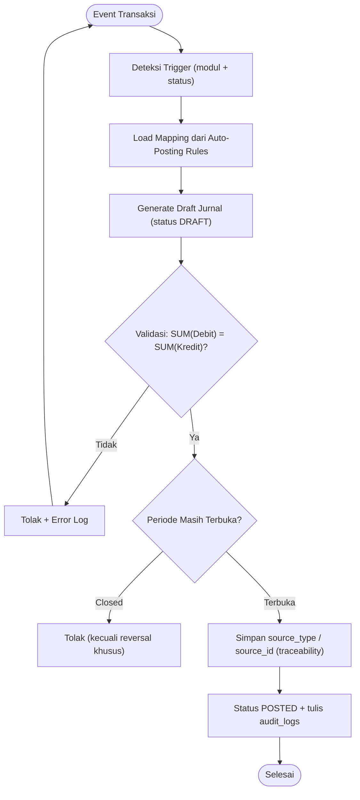

### 12.1. Matriks Mapping Transaksi → Jurnal

| Kode | Trigger / Sumber | Debit (Akun) | Kredit (Akun) | Kondisi & Catatan |
|---|---|---|---|---|
| AR-01 | `invoices` SALES → status POSTED | Piutang Usaha (1xxx) | Pendapatan (4xxx), PPN Keluaran (2xxx) | Dr = subtotal + PPN; wajib balance; nomor e-Faktur diisi sebelum POSTED (FR-AR-004) |
| AR-02 | `invoices` SALES tunai (payment_method CASH/BANK/EWALLET) | Kas / Bank (1xxx) | Pendapatan (4xxx), PPN Keluaran (2xxx) | Tanpa piutang; receipt langsung ter-posting bersamaan |
| AR-03 | `payments` RECEIPT + `payment_allocations` | Kas / Bank (1xxx) | Piutang Usaha (1xxx) | Alokasi multi-faktur; selisih kurs → Gain/Loss Kurs (FR-MC) |
| AP-01 | `invoices` PURCHASE → status POSTED | Beban (5xxx) / Persediaan (1xxx), PPN Masukan (1xxx) | Hutang Usaha (2xxx) | PPN masukan boleh dikreditkan (FR-AP-003); total = subtotal + PPN |
| AP-02 | `payments` PAYMENT + `payment_allocations` | Hutang Usaha (2xxx) | Kas / Bank (1xxx), Hutang PPh 23 (2xxx) | PPh 23 dipotong saat bayar (persiapan e-Bupot) |
| CB-01 | Transfer antar `bank_accounts` | Bank Tujuan (1xxx) | Bank Asal (1xxx) | Biaya admin: Dr Biaya Admin (6xxx) / Cr Bank Asal |
| CB-02 | `reconciliation_entries` → status ADJUSTED | Kas / Bank (1xxx) selisih | Pendapatan Bunga (4xxx) / Beban Bank (6xxx) | Sesuai mapping selisih; bisa jurnal manual bila perlu |
| FA-01 | Proses akhir periode (`depreciation_entries`) | Beban Penyusutan (6xxx) | Akumulasi Penyusutan (1xxx) | Straight-line / double-declining; nilai buku = cost − akumulasi (FR-FA-002) |
| FA-02 | `fixed_assets` → status DISPOSED | Kas (harga jual), Akumulasi Penyusutan (1xxx) | Aset Tetap (1xxx) cost, Gain Disposal (4xxx) / Loss Disposal (6xxx) | Gain/loss dihitung otomatis (FR-FA-004) |
| RC-01 | `recurring_journals` next_run_date + approve user | Sesuai template JSON | Sesuai template JSON | Wajib balance; periode closed → skip & tandai (FR-REC-002) |
| IN-01 | Sales invoice item tipe PRODUCT | HPP / COGS (5xxx) | Persediaan (1xxx) | Moving average / FIFO konsisten; stok tidak boleh negatif (FR-INV-003) |
| IN-02 | `stock_movements` ADJUSTMENT | Persediaan (1xxx) naik / Beban (6xxx) turun | Beban (6xxx) / Persediaan (1xxx) | Arah sesuai selisih fisik (FR-INV-002) |
| PY-01 | `payroll_runs` → status POSTED | Beban Gaji (6xxx) | Hutang Gaji (2xxx) netto, Hutang PPh 21 (2xxx) | net = gross − potongan − PPh 21 (FR-PAY-003) |
| MC-01 | Pembayaran dengan kurs ≠ kurs invoice | Kas (kurs spot), Piutang (kurs invoice) | Gain Kurs (4xxx) / Loss Kurs (6xxx) | Selisih kurs dihitung otomatis saat alokasi (FR-MC-001) |
| GL-01 | Koreksi pasca-posting (`reversed_entry_id`) | Kebalikan jurnal asli (Dr ↔ Cr) | Kebalikan jurnal asli | Wajib via jurnal pembalik, bukan UPDATE (FR-GL-005) |
| CN-01 | `credit_notes` SALES_RETURN → POSTED | Retur Penjualan (5xxx), PPN Keluaran (2xxx) | Piutang Usaha (1xxx) | Alokasi ke invoice asal; total ≤ sisa piutang (FR-AR-005) |
| CN-02 | `credit_notes` PURCHASE_RETURN → POSTED | Hutang Usaha (2xxx) | Retur Pembelian (5xxx), PPN Masukan (1xxx) | Alokasi ke vendor bill asal; total ≤ sisa hutang (FR-AP-004) |

### 12.2. Aturan Implementasi Engine

1. **Satu sumber kebenaran:** engine membaca mapping dari matriks ini — perubahan aturan cukup di satu tempat, tidak menyebar di kode.
2. **Wajib tunduk Section 11:** setiap jurnal hasil generate harus balance, tunduk period closing, dan soft-delete friendly.
3. **Traceability:** setiap jurnal otomatis menyimpan referensi sumber (`source_type` / `source_id` / `reference_type` / `reference_id`) + ditulis ke `audit_logs`.
4. **Approval opsional:** role tertentu bisa diwajibkan approve draft jurnal sebelum POSTED via permission Spatie (contoh: `journal.approve`).
5. **Multi-currency:** seluruh nilai DR/CR memakai mata uang & kurs transaksi sumber (FR-MC).

---

## 13. Conclusion & Next Steps

PRD dan Schema Database v1.3 ini menjadi landasan teknis untuk fase pengembangan produk setara **Jurnal.id / Accurate Online**, dibangun di atas **Laravel + MySQL 8**. Tahap berikutnya meliputi:

1. Perancangan UI/UX (Wireframing & Prototyping).
2. Setup Laravel 12 + MySQL 8 (InnoDB, utf8mb4) + API (Sanctum) & service layer.
3. Implementasi Double-Entry Engine Validation + Tenant Global Scope (`organization_id` di semua query).
4. Implementasi seed data (COA standar PSAK, tax_rates default PPN 11% / PPh 21/23/4(2)).
5. Import engine (Excel/CSV) dengan validasi & mapping — pintu masuk utama migrasi user.
6. Modul pajak (e-Faktur & e-Bupot export) sebagai diferensiator kompetitif.
7. Fase 2: aset tetap & penyusutan, jurnal berulang, inventory & COGS, payroll & PPh 21 (skema sudah siap di v1.3).
8. Fase 3: credit note & retur, export laporan PDF/Excel, notifikasi & reminder jatuh tempo (skema sudah siap di v1.4).
