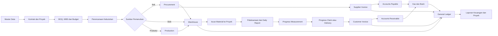
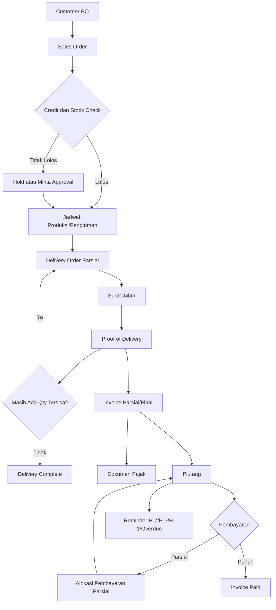
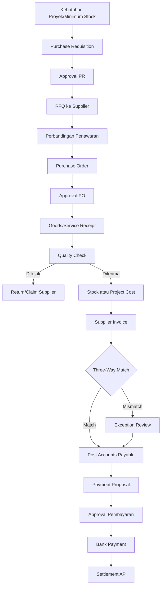
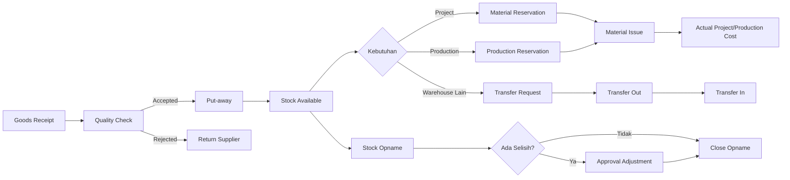
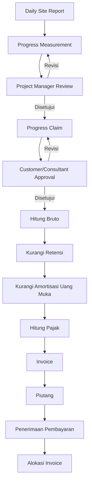
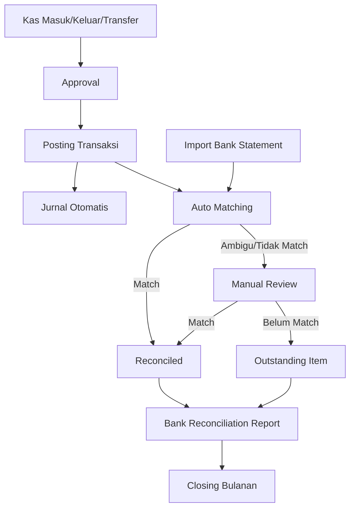
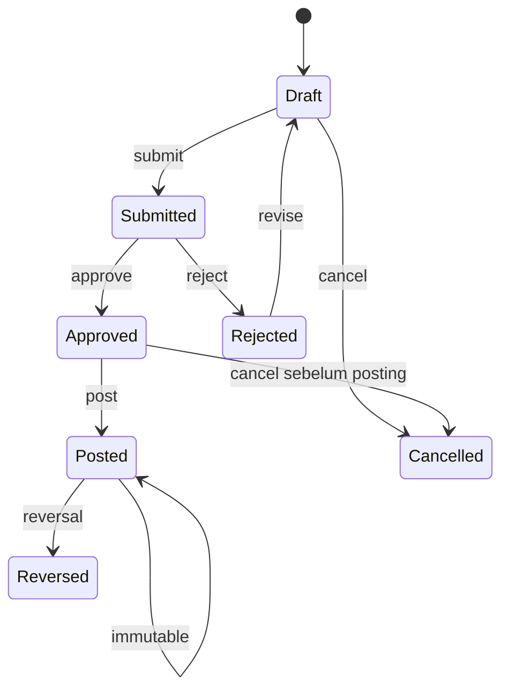

# Blueprint Sistem ERP Konstruksi

> Dokumen kebutuhan fitur, alur proses, flowchart, dan rancangan database berdasarkan kebutuhan Admin Finance dan Admin Operasional pada gambar sumber.

## 1. Tujuan Sistem

Membangun sistem terintegrasi untuk mengelola:

- Proyek dan kontrak konstruksi.
- Material, stok, gudang, dan perpindahan barang.
- Pengadaan dan utang supplier.
- Pesanan pelanggan, pengiriman parsial, invoice, dan piutang.
- Perencanaan pekerjaan/produksi.
- Kas, bank, rekonsiliasi, dan general ledger.
- Kehadiran dan izin karyawan.
- Approval, audit trail, dokumen, dan laporan manajemen.

## 2. Asumsi dan Batasan Awal

1. Sistem digunakan oleh satu grup usaha, tetapi mendukung banyak perusahaan, cabang, proyek, dan gudang.
2. Model bisnis utama adalah proyek konstruksi. Modul produksi/fabrikasi dapat diaktifkan bila perusahaan memproduksi komponen sendiri.
3. Satu Sales Order atau PO pelanggan dapat dikirim beberapa kali melalui Delivery Order/Surat Jalan parsial.
4. Setiap transaksi finansial yang di-posting harus menghasilkan jurnal dengan total debit sama dengan kredit.
5. Tarif dan kode pajak bersifat configurable; jangan hard-code tarif pajak ke source code.
6. Dokumen sensitif disimpan di private storage, bukan di folder publik.
7. Dokumen yang sudah posted tidak boleh dihapus atau diedit langsung; koreksi memakai reversal atau dokumen koreksi.
8. Pengakuan pendapatan konstruksi perlu dipilih saat discovery: berdasarkan invoice, progress billing, atau kebijakan akuntansi lain yang disetujui perusahaan.

## 3. Aktor dan Hak Akses

| Aktor | Tanggung jawab utama |
|---|---|
| Direksi/Owner | Dashboard eksekutif, persetujuan transaksi bernilai besar, performa proyek |
| Project Manager | WBS, jadwal, budget proyek, kebutuhan material, progres, variation order |
| Site Supervisor | Laporan harian, pemakaian material, progres lapangan, penerimaan di lokasi |
| Admin Operasional | Master operasional, sales order, jadwal pengiriman, data harian |
| Purchasing | Purchase request, RFQ, perbandingan vendor, purchase order |
| Warehouse | Penerimaan, penyimpanan, transfer, issue material, stock opname |
| Production Planner | BOM, production order, jadwal dan realisasi produksi/fabrikasi |
| Finance/Accounting | Invoice, AR/AP, kas-bank, jurnal, rekonsiliasi, closing |
| Tax Officer | Kode pajak, dokumen pajak, rekonsiliasi dan pelaporan pajak |
| HR/Admin Absensi | Data karyawan, shift, kehadiran, izin/cuti |
| Auditor | Akses read-only ke transaksi, dokumen, jurnal, dan audit trail |
| System Administrator | User, role, permission, konfigurasi, workflow approval |

## 4. Modul dan Fitur

### 4.1 Identity, Access, dan Governance

- Login, reset password, MFA opsional.
- Role-Based Access Control sampai level aksi dan proyek.
- Pemisahan tugas: pembuat, pemeriksa, penyetuju, dan pembayar.
- Approval matrix berdasarkan jenis dokumen, proyek, nominal, dan cabang.
- Status standar: `draft`, `submitted`, `approved`, `posted`, `rejected`, `reversed`, `cancelled`.
- Audit trail sebelum/sesudah perubahan.
- Nomor dokumen otomatis per perusahaan/cabang/periode.
- Locking periode akuntansi.
- Idempotency untuk mencegah posting atau jurnal ganda.

### 4.2 Master Data

- Perusahaan dan cabang.
- Proyek dan lokasi proyek.
- Customer, supplier, subcontractor.
- Karyawan dan project member.
- Item material, jasa, alat, dan finished goods.
- Satuan dan konversi satuan.
- Gudang, lokasi/bin, dan gudang proyek.
- Chart of Accounts.
- Kode pajak dan mapping akun.
- Payment terms.
- Cost center, WBS, dan cost code.

### 4.3 Project dan Construction Control

- Project profile dan kontrak pelanggan.
- Bill of Quantity/BOQ.
- Work Breakdown Structure/WBS.
- RAB/budget awal dan revisi budget.
- Cost code untuk material, tenaga kerja, alat, subcontractor, dan overhead.
- Baseline schedule dan milestone.
- Daily site report.
- Progress fisik dan progress finansial.
- Progress claim/termyn.
- Uang muka dan amortisasi uang muka.
- Retensi pelanggan dan supplier.
- Variation Order/pekerjaan tambah-kurang.
- Komitmen biaya dari PO dan subcontract order.
- Actual cost dari pemakaian material, supplier invoice, payroll allocation, dan jurnal.
- Budget vs committed vs actual vs forecast.
- Project profitability dan Estimate at Completion.

### 4.4 Material Management

- Item master dan kategori material.
- Purchase requisition dari proyek/gudang.
- Material requirement plan.
- Minimum stock dan reorder alert.
- Barang masuk, keluar, retur, dan adjustment.
- Reservasi material untuk proyek.
- Material issue ke proyek atau production order.
- Traceability transaksi material.
- Metode valuation configurable: moving average atau FIFO.

### 4.5 Warehouse Management

- Multi-gudang dan gudang proyek.
- Lokasi/bin dalam gudang.
- Goods Receipt.
- Quality check dan status accepted/rejected/quarantine.
- Put-away.
- Picking dan packing.
- Transfer antar-gudang.
- Surat jalan dan proof of delivery.
- Stock opname dan approval selisih.
- Batch/serial number bila dibutuhkan.
- Kartu stok dan aging inventory.

### 4.6 Production/Fabrication Planning

- Bill of Materials/BOM.
- Routing/tahapan proses.
- Production plan dan production order.
- Jadwal tenaga kerja dan mesin.
- Material issue ke produksi.
- Work in Process.
- Output produksi dan produk reject.
- Pemakaian aktual vs standar.
- Biaya produksi per order.

> Modul ini opsional bila perusahaan tidak melakukan fabrikasi atau produksi internal.

### 4.7 Sales dan Distribution

- Quotation dan revisi quotation.
- Customer Purchase Order.
- Sales Order sebagai dokumen awal internal.
- Alokasi stok atau rencana produksi.
- Jadwal pengiriman.
- Delivery Order/Surat Jalan parsial.
- Proof of Delivery.
- Monitoring `ordered`, `delivered`, `invoiced`, dan `remaining` quantity.
- Invoice dari pengiriman atau progress claim.
- Tanggal jatuh tempo berdasarkan payment term.
- Credit note dan retur penjualan.
- Dokumen pajak yang direferensikan ke invoice.
- Laporan penjualan harian, mingguan, bulanan, per customer, dan per proyek.

### 4.8 Purchase dan Accounts Payable

- Purchase Requisition.
- Request for Quotation.
- Perbandingan quotation supplier.
- Purchase Order dan approval.
- Penerimaan barang atau jasa.
- Supplier Invoice.
- Three-way matching: PO vs penerimaan vs invoice.
- Debit note dan retur pembelian.
- Tracking utang dan jatuh tempo.
- Payment proposal dan jadwal pembayaran.
- Pembayaran penuh atau parsial.
- Dokumen pajak masukan dan bukti potong.

### 4.9 Sales Invoice dan Accounts Receivable

- Invoice berdasarkan Delivery Order atau progress claim yang disetujui.
- Invoice parsial.
- Payment term dan tanggal jatuh tempo.
- Reminder H-7, H-3, H-1, dan overdue; interval configurable.
- Penerimaan pembayaran penuh atau parsial.
- Allocation pembayaran ke satu atau beberapa invoice.
- Customer advance/deposit.
- Aging piutang.
- Credit limit dan hold Sales Order opsional.
- Rekonsiliasi piutang ke General Ledger.

### 4.10 Kas dan Bank

- Kas masuk.
- Kas keluar.
- Transfer antar-rekening.
- Petty cash dan pertanggungjawaban.
- Upload bukti transfer/nota melalui private storage.
- Bank statement import melalui CSV/API.
- Auto-matching berdasarkan tanggal, nominal, referensi, dan rekening lawan.
- Manual matching untuk transaksi yang ambigu.
- Rekonsiliasi bulanan.
- Unreconciled transaction report.
- Cash position dan cash-flow forecast.

### 4.11 General Ledger dan Accounting

- Chart of Accounts berjenjang.
- Jurnal otomatis dari transaksi sumber.
- Jurnal manual dengan approval.
- Buku besar dan neraca saldo.
- Laba rugi, neraca, dan arus kas.
- Cost center dan project accounting.
- Accrual dan prepaid expense.
- Closing period.
- Reversal dan adjustment.
- Trial balance per perusahaan, cabang, proyek, dan cost center.
- Subledger AR/AP/Inventory harus dapat direkonsiliasi ke General Ledger.

### 4.12 Pajak

- Tax code configurable.
- Dokumen pajak terkait invoice penjualan dan pembelian.
- PPN keluaran dan masukan.
- Withholding tax sesuai jenis transaksi.
- Bukti potong.
- Rekonsiliasi pajak dengan invoice dan GL.
- Export data untuk sistem pajak yang digunakan perusahaan.
- Audit trail perubahan data pajak.

### 4.13 Absensi

- Data karyawan dan penempatan proyek.
- Shift dan kalender kerja.
- Check-in/check-out.
- Lokasi/geotag opsional.
- Izin, sakit, cuti, dan lembur.
- Approval atasan.
- Rekap harian dan bulanan.
- Allocation jam kerja ke proyek/cost code.
- Integrasi payroll pada fase lanjutan.

### 4.14 Dashboard dan Laporan

#### Dashboard Finance

- Saldo kas dan bank.
- Pemasukan vs pengeluaran bulanan.
- Piutang dan utang jatuh tempo.
- Aging AR/AP.
- Unreconciled bank transactions.
- Cash-flow forecast.

#### Dashboard Operasional

- Progres proyek.
- Material yang menipis.
- PO belum diterima.
- Pengiriman hari ini.
- Produksi terlambat.
- Kehadiran tenaga kerja.

#### Dashboard Direksi

- Nilai kontrak dan backlog.
- Revenue dan gross margin per proyek.
- Budget vs committed vs actual.
- Cash position.
- Overdue receivable.
- Proyek terlambat dan cost overrun.

### 4.15 Notifikasi

- Approval menunggu tindakan.
- Stok minimum.
- PO atau pengiriman terlambat.
- Piutang H-7 sampai overdue.
- Utang mendekati jatuh tempo.
- Budget hampir atau sudah terlampaui.
- Dokumen pajak belum lengkap.
- Bank reconciliation belum selesai.
- Izin/cuti menunggu approval.

Notifikasi dapat melalui in-app, email, dan WhatsApp, dengan template dan penerima configurable.

## 5. Flowchart

### 5.1 Alur Utama Sistem



### 5.2 Order-to-Cash dan Pengiriman Parsial



### 5.3 Procure-to-Pay



### 5.4 Material dan Warehouse



### 5.5 Progress Billing Konstruksi



### 5.6 Kas, Bank, dan Rekonsiliasi



### 5.7 Approval dan Posting



## 6. Integrasi Akuntansi

| Event bisnis | Debit | Kredit |
|---|---|---|
| Customer invoice | Piutang usaha | Pendapatan dan pajak keluaran bila ada |
| Penerimaan customer | Kas/Bank | Piutang usaha |
| Supplier invoice material | Inventory/WIP/Beban dan pajak masukan bila ada | Utang usaha |
| Pembayaran supplier | Utang usaha | Kas/Bank |
| Issue material ke proyek | WIP/Biaya proyek | Persediaan |
| Hasil produksi masuk gudang | Persediaan barang jadi | WIP produksi |
| Kas keluar langsung | Beban/Aset/Uang muka | Kas/Bank |
| Transfer bank | Bank tujuan | Bank sumber |
| Retensi customer | Piutang retensi | Piutang usaha atau akun settlement sesuai desain |
| Reversal | Kebalikan jurnal asli | Kebalikan jurnal asli |

> Mapping akun ditentukan melalui konfigurasi per item category, tax code, project cost code, dan transaction type. Jurnal tidak boleh dibangun dengan akun hard-coded.

## 7. Struktur Database

### 7.1 Konvensi

- Primary key menggunakan `UUID`/`ULID`.
- Semua tabel transaksional memiliki `company_id`, `branch_id`, dan bila relevan `project_id`.
- Nilai uang: `DECIMAL(20,2)`.
- Kuantitas: `DECIMAL(20,6)`.
- Waktu disimpan dalam UTC dan ditampilkan sesuai timezone perusahaan.
- Semua header dokumen memiliki `document_no`, `status`, `document_date`, `created_by`, `approved_by`, `posted_at`, dan `row_version`.
- Gunakan foreign key dan unique constraint, bukan hanya validasi aplikasi.
- `posted` document immutable.
- Soft delete hanya untuk master data atau draft; transaksi posted tidak dihapus.

### 7.2 ERD Domain Utama

```mermaid
erDiagram
    COMPANIES ||--o{ BRANCHES : has
    COMPANIES ||--o{ PROJECTS : owns
    PROJECTS ||--o{ WBS_NODES : decomposes
    PROJECTS ||--o{ PROJECT_BUDGETS : budgets
    PROJECT_BUDGETS ||--o{ PROJECT_BUDGET_LINES : contains
    PARTIES ||--o{ CUSTOMER_CONTRACTS : customer
    PROJECTS ||--o{ CUSTOMER_CONTRACTS : governed_by
    CUSTOMER_CONTRACTS ||--o{ CONTRACT_BOQ_LINES : contains
    CUSTOMER_CONTRACTS ||--o{ PROGRESS_CLAIMS : billed_by
    PROGRESS_CLAIMS ||--o{ PROGRESS_CLAIM_LINES : contains

    PARTIES ||--o{ SALES_ORDERS : customer
    SALES_ORDERS ||--o{ SALES_ORDER_LINES : contains
    SALES_ORDERS ||--o{ DELIVERY_ORDERS : fulfilled_by
    DELIVERY_ORDERS ||--o{ DELIVERY_ORDER_LINES : contains
    DELIVERY_ORDERS ||--o{ CUSTOMER_INVOICES : billed_by
    CUSTOMER_INVOICES ||--o{ CUSTOMER_INVOICE_LINES : contains
    CUSTOMER_INVOICES ||--o{ RECEIPT_ALLOCATIONS : settled_by
    CUSTOMER_RECEIPTS ||--o{ RECEIPT_ALLOCATIONS : allocates

    PROJECTS ||--o{ PURCHASE_REQUISITIONS : requests
    PURCHASE_REQUISITIONS ||--o{ PURCHASE_REQUISITION_LINES : contains
    PARTIES ||--o{ PURCHASE_ORDERS : supplier
    PURCHASE_ORDERS ||--o{ PURCHASE_ORDER_LINES : contains
    PURCHASE_ORDERS ||--o{ GOODS_RECEIPTS : received_as
    GOODS_RECEIPTS ||--o{ GOODS_RECEIPT_LINES : contains
    PURCHASE_ORDERS ||--o{ SUPPLIER_INVOICES : billed_by
    SUPPLIER_INVOICES ||--o{ SUPPLIER_INVOICE_LINES : contains
    SUPPLIER_INVOICES ||--o{ PAYMENT_ALLOCATIONS : settled_by
    SUPPLIER_PAYMENTS ||--o{ PAYMENT_ALLOCATIONS : allocates

    ITEMS ||--o{ SALES_ORDER_LINES : ordered
    ITEMS ||--o{ PURCHASE_ORDER_LINES : purchased
    ITEMS ||--o{ INVENTORY_TRANSACTION_LINES : moved
    WAREHOUSES ||--o{ WAREHOUSE_LOCATIONS : contains
    INVENTORY_TRANSACTIONS ||--o{ INVENTORY_TRANSACTION_LINES : contains
    WAREHOUSES ||--o{ STOCK_BALANCES : stores
    ITEMS ||--o{ STOCK_BALANCES : balanced

    CHART_OF_ACCOUNTS ||--o{ JOURNAL_LINES : posted_to
    JOURNALS ||--o{ JOURNAL_LINES : contains
    PROJECTS ||--o{ JOURNAL_LINES : attributes
    BANK_ACCOUNTS ||--o{ BANK_STATEMENT_LINES : imports
    BANK_RECONCILIATIONS ||--o{ BANK_RECONCILIATION_LINES : matches

    EMPLOYEES ||--o{ ATTENDANCE_RECORDS : records
    EMPLOYEES ||--o{ LEAVE_REQUESTS : requests
    PROJECTS ||--o{ TIMESHEET_ENTRIES : consumes
    EMPLOYEES ||--o{ TIMESHEET_ENTRIES : submits
```



### 7.3 Identity dan Governance

| Tabel | Kolom utama |
|---|---|
| `users` | `id`, `employee_id`, `name`, `email`, `password_hash`, `status`, `mfa_enabled` |
| `roles` | `id`, `company_id`, `code`, `name` |
| `permissions` | `id`, `code`, `module`, `action` |
| `user_roles` | `user_id`, `role_id`, `project_id nullable` |
| `role_permissions` | `role_id`, `permission_id` |
| `approval_workflows` | `id`, `company_id`, `document_type`, `name`, `active` |
| `approval_steps` | `id`, `workflow_id`, `sequence`, `role_id`, `min_amount`, `max_amount` |
| `approval_requests` | `id`, `workflow_id`, `document_type`, `document_id`, `current_step`, `status` |
| `approval_actions` | `id`, `request_id`, `step_id`, `actor_id`, `action`, `notes`, `acted_at` |
| `audit_logs` | `id`, `company_id`, `actor_id`, `entity_type`, `entity_id`, `action`, `before_json`, `after_json`, `ip`, `created_at` |
| `attachments` | `id`, `entity_type`, `entity_id`, `storage_disk`, `storage_key`, `original_name`, `mime_type`, `size`, `checksum`, `uploaded_by` |
| `document_access_logs` | `id`, `attachment_id`, `user_id`, `action`, `ip`, `user_agent`, `created_at` |

### 7.4 Organisasi dan Master

| Tabel | Kolom utama |
|---|---|
| `companies` | `id`, `code`, `name`, `tax_id`, `base_currency`, `timezone` |
| `branches` | `id`, `company_id`, `code`, `name`, `address` |
| `parties` | `id`, `company_id`, `type`, `code`, `name`, `tax_id`, `credit_limit`, `payment_term_id` |
| `party_contacts` | `id`, `party_id`, `name`, `phone`, `email`, `role` |
| `projects` | `id`, `company_id`, `branch_id`, `code`, `name`, `customer_id`, `start_date`, `end_date`, `status`, `manager_id` |
| `project_members` | `project_id`, `employee_id`, `role`, `start_date`, `end_date` |
| `uoms` | `id`, `code`, `name`, `precision` |
| `uom_conversions` | `from_uom_id`, `to_uom_id`, `factor` |
| `items` | `id`, `company_id`, `sku`, `name`, `type`, `base_uom_id`, `valuation_method`, `inventory_account_id` |
| `payment_terms` | `id`, `code`, `days`, `description` |
| `tax_codes` | `id`, `company_id`, `code`, `type`, `rate`, `input_account_id`, `output_account_id`, `effective_from`, `effective_to` |

### 7.5 Project Construction

| Tabel | Kolom utama |
|---|---|
| `customer_contracts` | `id`, `project_id`, `customer_id`, `contract_no`, `contract_value`, `start_date`, `end_date`, `retention_rate`, `advance_amount`, `status` |
| `contract_boq_lines` | `id`, `contract_id`, `code`, `description`, `uom_id`, `qty`, `unit_price`, `amount` |
| `wbs_nodes` | `id`, `project_id`, `parent_id`, `code`, `name`, `level`, `status` |
| `cost_codes` | `id`, `company_id`, `code`, `name`, `category` |
| `project_budgets` | `id`, `project_id`, `version`, `status`, `total_amount`, `approved_at` |
| `project_budget_lines` | `id`, `budget_id`, `wbs_id`, `cost_code_id`, `item_id`, `qty`, `unit_cost`, `amount` |
| `variation_orders` | `id`, `project_id`, `contract_id`, `vo_no`, `description`, `value`, `time_impact_days`, `status` |
| `daily_site_reports` | `id`, `project_id`, `report_date`, `weather`, `summary`, `submitted_by`, `approved_by` |
| `daily_site_report_lines` | `id`, `report_id`, `wbs_id`, `activity`, `qty`, `uom_id`, `worker_count`, `notes` |
| `progress_claims` | `id`, `contract_id`, `claim_no`, `period_start`, `period_end`, `gross_amount`, `retention_amount`, `advance_deduction`, `tax_amount`, `net_amount`, `status` |
| `progress_claim_lines` | `id`, `claim_id`, `boq_line_id`, `previous_progress`, `current_progress`, `cumulative_progress`, `amount` |
| `retentions` | `id`, `source_type`, `source_id`, `party_id`, `amount`, `due_date`, `released_amount`, `status` |
| `subcontract_orders` | `id`, `project_id`, `supplier_id`, `document_no`, `scope`, `contract_value`, `retention_rate`, `status` |

### 7.6 Sales, Delivery, dan AR

| Tabel | Kolom utama |
|---|---|
| `sales_orders` | `id`, `company_id`, `branch_id`, `project_id`, `customer_id`, `document_no`, `customer_po_no`, `order_date`, `payment_term_id`, `currency`, `status`, `total_amount` |
| `sales_order_lines` | `id`, `sales_order_id`, `item_id`, `description`, `uom_id`, `qty_ordered`, `qty_delivered`, `qty_invoiced`, `unit_price`, `tax_code_id`, `amount` |
| `delivery_orders` | `id`, `sales_order_id`, `warehouse_id`, `document_no`, `delivery_date`, `vehicle_no`, `driver_name`, `status` |
| `delivery_order_lines` | `id`, `delivery_order_id`, `sales_order_line_id`, `item_id`, `qty`, `uom_id` |
| `proof_of_deliveries` | `id`, `delivery_order_id`, `received_by`, `received_at`, `signature_attachment_id`, `notes` |
| `customer_invoices` | `id`, `customer_id`, `project_id`, `delivery_order_id nullable`, `progress_claim_id nullable`, `document_no`, `invoice_date`, `due_date`, `subtotal`, `tax_amount`, `retention_amount`, `total_amount`, `open_amount`, `status` |
| `customer_invoice_lines` | `id`, `invoice_id`, `source_line_type`, `source_line_id`, `description`, `qty`, `unit_price`, `tax_code_id`, `amount` |
| `customer_receipts` | `id`, `customer_id`, `bank_account_id`, `document_no`, `receipt_date`, `amount`, `reference`, `status` |
| `receipt_allocations` | `id`, `receipt_id`, `invoice_id`, `allocated_amount` |
| `tax_documents` | `id`, `source_type`, `source_id`, `tax_code_id`, `document_no`, `document_date`, `tax_base`, `tax_amount`, `attachment_id`, `status` |

### 7.7 Procurement dan AP

| Tabel | Kolom utama |
|---|---|
| `purchase_requisitions` | `id`, `project_id`, `warehouse_id`, `document_no`, `request_date`, `required_date`, `requester_id`, `status` |
| `purchase_requisition_lines` | `id`, `requisition_id`, `item_id`, `description`, `uom_id`, `qty`, `estimated_cost`, `wbs_id`, `cost_code_id` |
| `rfqs` | `id`, `requisition_id`, `document_no`, `submission_deadline`, `status` |
| `rfq_suppliers` | `rfq_id`, `supplier_id`, `sent_at`, `response_at` |
| `supplier_quotes` | `id`, `rfq_id`, `supplier_id`, `quote_no`, `total_amount`, `lead_time_days`, `valid_until` |
| `purchase_orders` | `id`, `supplier_id`, `project_id`, `warehouse_id`, `document_no`, `order_date`, `expected_date`, `currency`, `status`, `total_amount` |
| `purchase_order_lines` | `id`, `purchase_order_id`, `requisition_line_id`, `item_id`, `description`, `uom_id`, `qty_ordered`, `qty_received`, `qty_invoiced`, `unit_price`, `tax_code_id`, `wbs_id`, `cost_code_id` |
| `goods_receipts` | `id`, `purchase_order_id`, `warehouse_id`, `document_no`, `receipt_date`, `supplier_delivery_no`, `status` |
| `goods_receipt_lines` | `id`, `goods_receipt_id`, `purchase_order_line_id`, `item_id`, `qty_received`, `qty_accepted`, `qty_rejected`, `uom_id`, `location_id` |
| `supplier_invoices` | `id`, `supplier_id`, `purchase_order_id`, `document_no`, `supplier_invoice_no`, `invoice_date`, `due_date`, `subtotal`, `tax_amount`, `total_amount`, `open_amount`, `match_status`, `status` |
| `supplier_invoice_lines` | `id`, `supplier_invoice_id`, `purchase_order_line_id`, `goods_receipt_line_id`, `description`, `qty`, `unit_price`, `tax_code_id`, `wbs_id`, `cost_code_id`, `amount` |
| `supplier_payments` | `id`, `supplier_id`, `bank_account_id`, `document_no`, `payment_date`, `amount`, `reference`, `status` |
| `payment_allocations` | `id`, `payment_id`, `supplier_invoice_id`, `allocated_amount` |

### 7.8 Inventory dan Warehouse

| Tabel | Kolom utama |
|---|---|
| `warehouses` | `id`, `company_id`, `branch_id`, `project_id nullable`, `code`, `name`, `type` |
| `warehouse_locations` | `id`, `warehouse_id`, `parent_id`, `code`, `name`, `type` |
| `stock_balances` | `company_id`, `warehouse_id`, `location_id`, `item_id`, `batch_no nullable`, `qty_on_hand`, `qty_reserved`, `average_cost` |
| `inventory_transactions` | `id`, `company_id`, `project_id`, `document_no`, `type`, `transaction_date`, `source_type`, `source_id`, `status` |
| `inventory_transaction_lines` | `id`, `transaction_id`, `item_id`, `from_warehouse_id`, `from_location_id`, `to_warehouse_id`, `to_location_id`, `qty`, `uom_id`, `unit_cost`, `wbs_id`, `cost_code_id` |
| `stock_reservations` | `id`, `item_id`, `warehouse_id`, `source_type`, `source_id`, `qty`, `released_qty`, `status` |
| `stock_opnames` | `id`, `warehouse_id`, `document_no`, `count_date`, `status` |
| `stock_opname_lines` | `id`, `stock_opname_id`, `item_id`, `location_id`, `system_qty`, `counted_qty`, `variance_qty`, `variance_value` |

### 7.9 Production

| Tabel | Kolom utama |
|---|---|
| `boms` | `id`, `company_id`, `item_id`, `version`, `effective_from`, `status` |
| `bom_lines` | `id`, `bom_id`, `component_item_id`, `qty`, `uom_id`, `scrap_rate` |
| `production_orders` | `id`, `project_id`, `bom_id`, `document_no`, `planned_qty`, `actual_qty`, `planned_start`, `planned_end`, `status` |
| `production_material_issues` | `id`, `production_order_id`, `inventory_transaction_id`, `issued_at` |
| `production_outputs` | `id`, `production_order_id`, `inventory_transaction_id`, `good_qty`, `reject_qty`, `completed_at` |

### 7.10 Finance dan General Ledger

| Tabel | Kolom utama |
|---|---|
| `chart_of_accounts` | `id`, `company_id`, `parent_id`, `code`, `name`, `account_type`, `normal_balance`, `allow_posting` |
| `fiscal_periods` | `id`, `company_id`, `year`, `period_no`, `start_date`, `end_date`, `status`, `closed_at` |
| `journals` | `id`, `company_id`, `branch_id`, `document_no`, `journal_date`, `source_type`, `source_id`, `posting_key`, `description`, `status`, `reversal_of_id` |
| `journal_lines` | `id`, `journal_id`, `account_id`, `project_id`, `cost_center_id`, `wbs_id`, `party_id`, `debit`, `credit`, `description` |
| `bank_accounts` | `id`, `company_id`, `branch_id`, `account_id`, `bank_name`, `account_no_masked`, `currency`, `active` |
| `cash_transactions` | `id`, `company_id`, `bank_account_id`, `type`, `document_no`, `transaction_date`, `party_id`, `amount`, `reference`, `status` |
| `bank_statements` | `id`, `bank_account_id`, `period_start`, `period_end`, `opening_balance`, `closing_balance`, `imported_at` |
| `bank_statement_lines` | `id`, `statement_id`, `transaction_date`, `reference`, `description`, `debit`, `credit`, `external_id`, `match_status` |
| `bank_reconciliations` | `id`, `bank_account_id`, `period_end`, `book_balance`, `bank_balance`, `difference`, `status`, `approved_by` |
| `bank_reconciliation_lines` | `id`, `reconciliation_id`, `statement_line_id`, `cash_transaction_id`, `matched_amount`, `match_type` |

### 7.11 Absensi

| Tabel | Kolom utama |
|---|---|
| `employees` | `id`, `company_id`, `employee_no`, `name`, `branch_id`, `department`, `position`, `join_date`, `status` |
| `shifts` | `id`, `company_id`, `code`, `start_time`, `end_time`, `break_minutes` |
| `employee_shift_assignments` | `employee_id`, `shift_id`, `effective_from`, `effective_to` |
| `attendance_records` | `id`, `employee_id`, `attendance_date`, `check_in`, `check_out`, `source`, `latitude`, `longitude`, `status` |
| `leave_requests` | `id`, `employee_id`, `type`, `start_date`, `end_date`, `reason`, `status`, `approved_by` |
| `timesheet_entries` | `id`, `employee_id`, `project_id`, `wbs_id`, `work_date`, `hours`, `description`, `status` |

## 8. Constraint dan Integritas Data Penting

```sql
-- Nomor dokumen unik per perusahaan dan tipe dokumen
UNIQUE (company_id, document_no);

-- Mencegah jurnal sumber diposting dua kali
UNIQUE (company_id, source_type, source_id, posting_key);

-- Satu nomor invoice supplier tidak boleh berulang untuk supplier yang sama
UNIQUE (supplier_id, supplier_invoice_no);

-- Saldo stock unik per dimensi
UNIQUE (company_id, warehouse_id, location_id, item_id, batch_no);

-- Alokasi pembayaran tidak boleh negatif
CHECK (allocated_amount > 0);

-- Nilai debit/kredit per baris tidak boleh keduanya terisi
CHECK (
    (debit > 0 AND credit = 0)
    OR
    (credit > 0 AND debit = 0)
);

-- Quantity transaksi harus positif
CHECK (qty > 0);
```

Validasi `total debit = total credit` dilakukan dalam database transaction sebelum jurnal berubah ke `posted`.

## 9. Aturan Bisnis Kritis

1. Total delivery tidak boleh melebihi quantity Sales Order yang disetujui.
2. Total invoice quantity tidak boleh melebihi delivery atau progress yang eligible.
3. Total penerimaan PO tidak boleh melebihi toleransi yang dikonfigurasi.
4. Supplier invoice harus melewati three-way match atau exception approval.
5. Stock tidak boleh negatif kecuali perusahaan mengaktifkan kebijakan khusus.
6. Budget overrun wajib memicu warning atau approval.
7. Pembayaran tidak boleh melebihi open amount tanpa dicatat sebagai advance.
8. Periode closed menolak posting baru; koreksi melalui periode terbuka dan reversal.
9. Jurnal posted immutable.
10. File attachment tidak mempunyai public URL permanen.
11. Download dokumen membutuhkan authorization dan dicatat dalam access log.
12. Setiap transaksi harus memiliki `company_id`; data antar-perusahaan tidak boleh bercampur.

## 10. Keamanan Dokumen

- Gunakan `storage/app/private`, private S3, atau private Cloudflare R2.
- Nama object menggunakan UUID, bukan nama pelanggan, email, NIK, atau nomor kontrak.
- Akses melalui controller dengan policy atau signed URL 5–15 menit.
- Validasi MIME, ukuran, dan extension.
- Malware scanning untuk file upload.
- `Cache-Control: private, no-store` untuk dokumen sensitif.
- Audit setiap upload, preview, download, replace, dan delete.
- Retention policy dan secure deletion.

## 11. Non-Functional Requirements

- Multi-company dan multi-project isolation.
- Database transaction untuk posting lintas modul.
- Optimistic locking menggunakan `row_version`.
- Queue untuk notifikasi, export, dan posting berat.
- Idempotency key untuk API dan background job.
- Backup terenkripsi dan uji restore berkala.
- Observability: application log, audit log, metrics, error tracking.
- Export Excel/PDF dengan permission check.
- API versioning dan webhook retry.
- Pagination dan indeks database untuk laporan besar.

## 12. Indeks Database Minimum

- Semua foreign key.
- `(company_id, status, document_date)` pada setiap header transaksi.
- `(project_id, wbs_id, cost_code_id)` pada detail biaya.
- `(party_id, due_date, status)` pada invoice AR/AP.
- `(warehouse_id, item_id, transaction_date)` pada inventory movement.
- `(account_id, journal_date, project_id)` pada journal lines.
- `(employee_id, attendance_date)` pada attendance.
- Partial index/open invoice index bila database mendukung.

## 13. Rekomendasi Tahapan Implementasi

### Fase 1 — Foundation dan Finance

- Auth, RBAC, approval, audit trail.
- Master data.
- Sales Order, Delivery Order parsial, customer invoice, dan AR.
- Purchase Order, goods receipt, supplier invoice, dan AP.
- Kas, bank, jurnal otomatis, dan laporan dasar.
- Private document storage.

### Fase 2 — Inventory dan Project Cost

- Multi-warehouse.
- Material reservation dan issue.
- Stock opname.
- BOQ, WBS, budget, commitment, dan actual cost.
- Dashboard proyek.

### Fase 3 — Construction Control

- Daily site report.
- Progress measurement dan termyn.
- Retention, advance, dan Variation Order.
- Subcontractor management.
- Forecast dan profitability.

### Fase 4 — Production dan HR

- BOM dan production order.
- WIP dan costing.
- Absensi, izin, timesheet, dan payroll integration.

### Fase 5 — Automation

- Bank API/statement auto-import.
- WhatsApp/email reminders.
- OCR dokumen.
- Forecasting dan anomaly detection.
- Integrasi sistem pajak sesuai kebutuhan.

## 14. Pertanyaan Discovery yang Harus Diputuskan

1. Perusahaan murni kontraktor atau juga memproduksi/fabrikasi barang?
2. Jenis proyek: sipil, interior, MEP, manufaktur, atau campuran?
3. Pengakuan revenue memakai invoice, progress claim, atau metode lain?
4. Apakah ada retensi, uang muka, bank guarantee, dan subcontractor progress?
5. Berapa perusahaan, cabang, proyek aktif, gudang, dan user?
6. Metode inventory: FIFO atau moving average?
7. Apakah negative stock diperbolehkan?
8. Apakah pengiriman selalu berbasis item atau juga progress pekerjaan/jasa?
9. Bentuk approval matrix berdasarkan role, nominal, dan proyek?
10. Sistem bank, payroll, absensi, dan pajak apa yang perlu diintegrasikan?
11. Apakah dibutuhkan mobile app untuk site supervisor dan warehouse?
12. Berapa volume transaksi, attachment, dan periode penyimpanan?
13. Laporan apa yang wajib tersedia saat go-live?
14. Apakah database akan menggunakan PostgreSQL atau MySQL?

## 15. Definition of Done MVP

MVP dianggap selesai bila:

- Satu alur Sales Order sampai pembayaran dapat dijalankan end-to-end.
- Satu alur Purchase Requisition sampai pembayaran supplier dapat dijalankan end-to-end.
- Pengiriman parsial tidak menyebabkan over-delivery atau over-invoice.
- Stock card dan saldo gudang konsisten.
- Jurnal otomatis seimbang dan tidak dapat terduplikasi.
- AR/AP dapat direkonsiliasi ke General Ledger.
- Rekonsiliasi bank dapat ditutup per bulan.
- Project budget, commitment, dan actual cost dapat dibandingkan.
- Semua dokumen sensitif private dan memiliki audit access log.
- Approval dan separation of duties berhasil diuji.
- Backup dan restore berhasil diuji pada staging.
