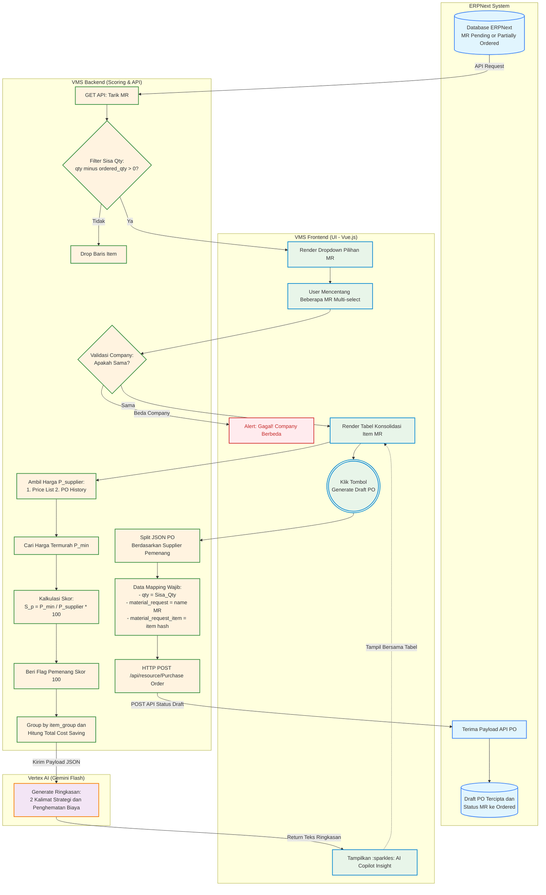

```mermaid

graph TD
    %% Pengaturan Gaya
    classDef erp fill:#e1f5fe,stroke:#3b82f6,stroke-width:2px;
    classDef vms_fe fill:#e8f5e9,stroke:#0288d1,stroke-width:2px;
    classDef vms_be fill:#fff3e0,stroke:#388e3c,stroke-width:2px;
    classDef ai fill:#f3e5f5,stroke:#f57c00,stroke-width:2px;
    classDef error fill:#ffebee,stroke:#d32f2f,stroke-width:2px,color:#c62828;

    subgraph ERPNext ["ERPNext System"]
        A1[("Database ERPNext\nMR Pending or Partially Ordered")]
        G1["Terima Payload API PO"]
        G2[("Draft PO Tercipta dan\nStatus MR ke Ordered")]
    end

    subgraph VMS_FE ["VMS Frontend (UI - Vue.js)"]
        B2["Render Dropdown Pilihan MR"]
        C1["User Mencentang Beberapa MR Multi-select"]
        C3["Alert: Gagal! Company Berbeda"]
        C4["Render Tabel Konsolidasi Item MR"]
        E3["Tampilkan :sparkles: AI Copilot Insight"]
        F1((("Klik Tombol\nGenerate Draft PO")))
    end

    subgraph VMS_BE ["VMS Backend (Scoring & API)"]
        B1["GET API: Tarik MR"]
        B3{"Filter Sisa Qty:\nqty minus ordered_qty > 0?"}
        B4["Drop Baris Item"]

        C2{"Validasi Company:\nApakah Sama?"}

        D1["Ambil Harga P_supplier:\n1. Price List 2. PO History"]
        D2["Cari Harga Termurah P_min"]
        D3["Kalkulasi Skor:\nS_p = P_min / P_supplier * 100"]
        D4["Beri Flag Pemenang Skor 100"]

        E1["Group by item_group dan\nHitung Total Cost Saving"]

        F2["Split JSON PO\nBerdasarkan Supplier Pemenang"]
        F3["Data Mapping Wajib:\n- qty = Sisa_Qty\n- material_request = name MR\n- material_request_item = item hash"]
        F4["HTTP POST /api/resource/Purchase Order"]
    end

    subgraph Gemini ["Vertex AI (Gemini Flash)"]
        E2["Generate Ringkasan:\n2 Kalimat Strategi dan Penghematan Biaya"]
    end

    %% TAHAP 1: Fetch & Filter
    A1 -->|API Request| B1
    B1 --> B3
    B3 -- "Tidak" --> B4
    B3 -- "Ya" --> B2

    %% TAHAP 2: Pemilihan & Konsolidasi
    B2 --> C1
    C1 --> C2
    C2 -- "Beda Company" --> C3:::error
    C2 -- "Sama" --> C4

    %% TAHAP 3: Scoring Engine
    C4 --> D1
    D1 --> D2
    D2 --> D3
    D3 --> D4

    %% TAHAP 4: Analitik AI Copilot
    D4 --> E1
    E1 -->|Kirim Payload JSON| E2
    E2 -->|Return Teks Ringkasan| E3
    E3 -. "Tampil Bersama Tabel" .-> C4

    %% TAHAP 5: Eksekusi PO & Write-Back
    C4 --> F1
    F1 --> F2
    F2 --> F3
    F3 --> F4
    F4 -->|POST API Status Draft| G1
    G1 --> G2

    %% Assign Class
    class A1,G1,G2 erp;
    class B2,C1,C4,E3,F1 vms_fe;
    class B1,B3,B4,C2,D1,D2,D3,D4,E1,F2,F3,F4 vms_be;
    class E2 ai;

```
